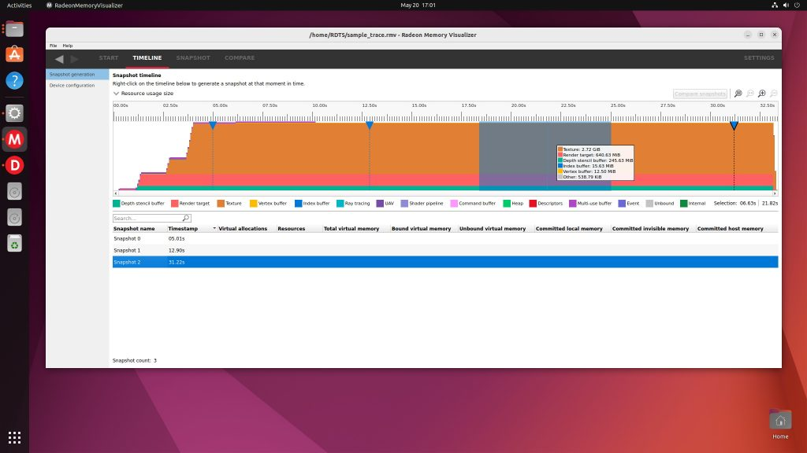
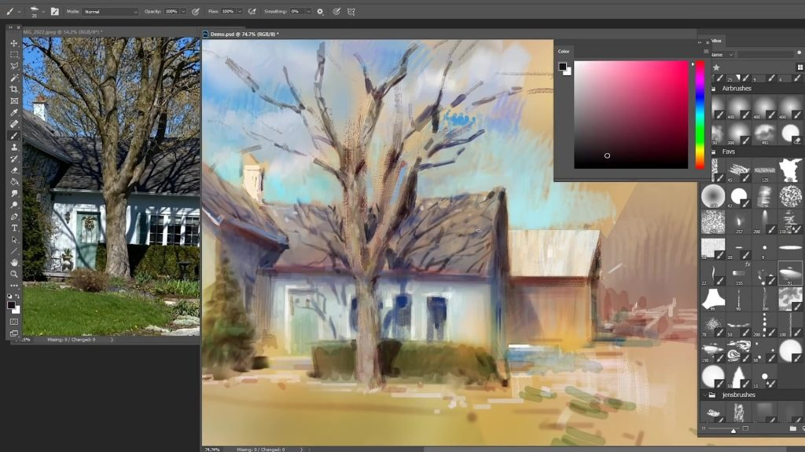
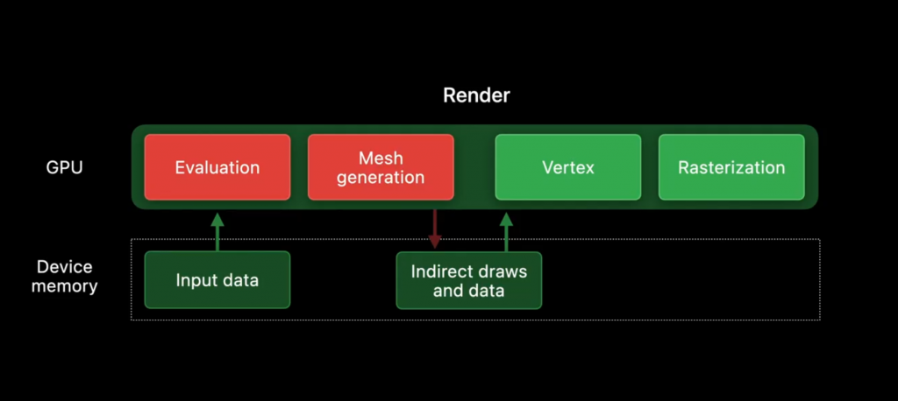
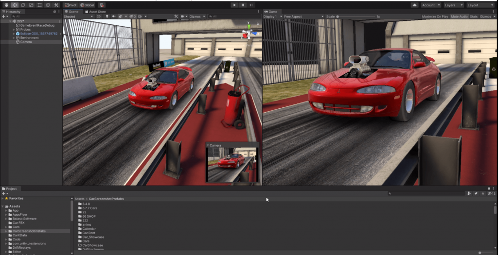
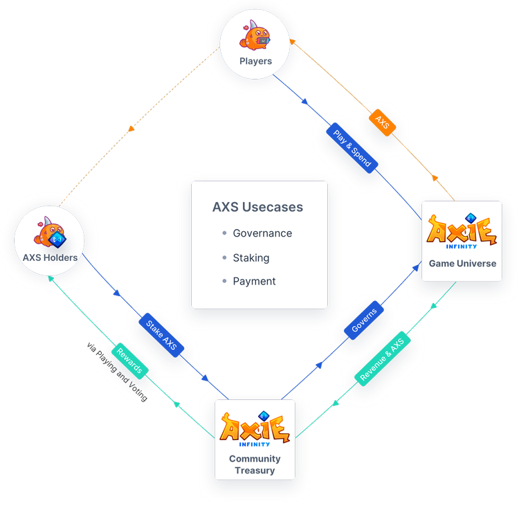
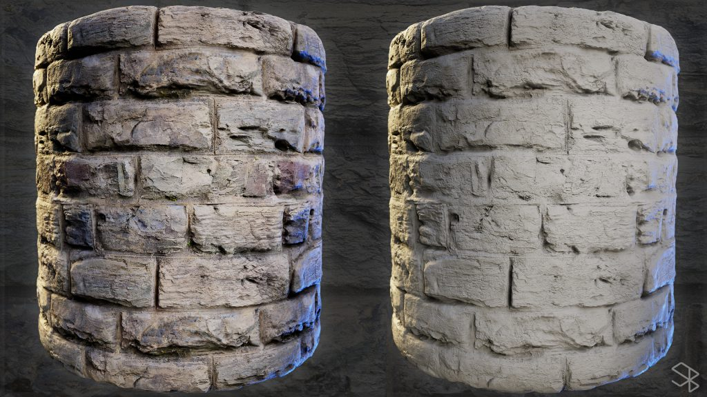
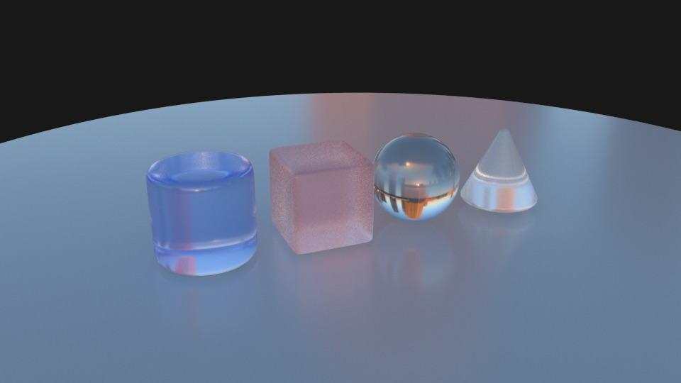
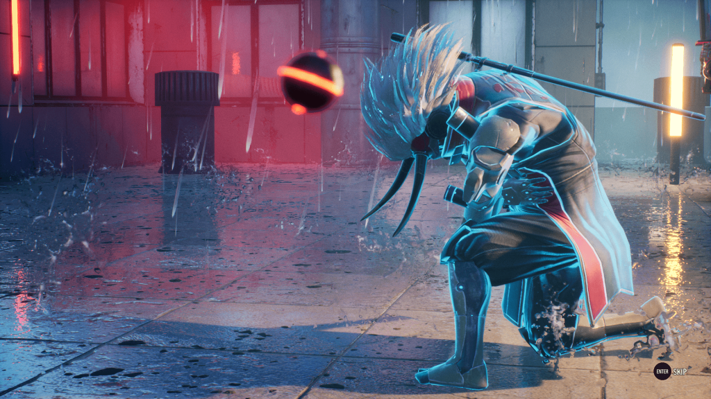
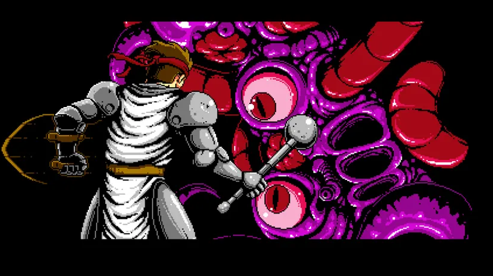

*The game development industry brings something new all the time. General Arcade shows the most interesting releases, updates and news of the past week, which are recommended reading for both industry veterans and novice developers.*

In the news: Epic Online Services now lets you add crossplay to your PC games, Epic Games helped archaeologists bring a 10,000-year-old shaman back to life with MetaHuman, Radeon Memory Visualizer now supports Linux.

Interesting things: a report from the GDC about creating cognitive maps and designing spaces in which the player does not get lost, an easy introduction to D3D12, and how light and different types of shadows work.

## Updates/releases/news

[Epic Online Services now lets you add crossplay to your PC games.](https://dev.epicgames.com/en-US/news/epic-online-services-release-free-pc-crossplay-tools)



Including between Steam and Epic Games. The service includes an overlay that combines friends from Steam and Epic Games into a single list, an interface for finding friends, sending and receiving add requests, and joining multiplayer game sessions across stores.

Adding support for macOS and Linux is in progress.

[Epic Games helped archaeologists bring a 10,000-year-old shaman back to life with MetaHuman.](https://www.unrealengine.com/en-US/spotlights/metahuman-technology-brings-a-10-000-year-old-shaman-back-to-life)



The tool, in addition to the appearance of a person, made it possible to recreate his or her facial expressions.

[Mark Brown releases tutorial video essay as a free game Platformer Toolkit.](https://gmtk.itch.io/platformer-toolkit)



You will be able to see for yourself how the characters in platform games are arranged, using a set of tools to change and adjust more than 30 variables that control the movement of the hero.

[Radeon Memory Visualizer now supports Linux.](https://gpuopen.com/radeon-memory-visualizer-on-linux/)

With the growing popularity of games on Linux, game developers are increasingly looking for tools that can help solve complex problems and improve performance on this platform.

AMD has announced the release of the Radeon Memory Visualizer (RMV) for Linux. RMV is a powerful tool that allows users to analyze video memory usage on AMD Radeon GPUs.

[Defold 1.3.3](https://defold.com//2022/06/14/Defold-1-3-3/)

This release has updated Java internals (11.0.15) due to SSL issues that some users have experienced. In addition, there are several innovations and fixes.

## Interesting articles/videos

In a talk from the 2021 GDC, Nicholas Oueijan of thatgamecompany (the developers of Journey and Sky: Children of the Light) talks about cognitive maps and how you can design space so that the player does not get lost.

[How to make drawings more interesting with contrasts and differences.](https://www.youtube.com/watch?v=mPMXYHVXYJo)

Disney illustrator Marco Bucci shows you how to create movement in your drawings and focus the viewer’s attention where you want it.

[Finding performance bottlenecks with the Unity Frame Timing Manager.](https://blog.unity.com/technology/detecting-performance-bottlenecks-with-unity-frame-timing-manager)

The Unity team continues to improve tools, such as the improved Frame Timing Manager, to optimize across the board. This article describes how the Unity 2022.1 update provides enhanced platform support for this feature, allowing more data to be collected.

[Dive into Metal 3](https://developer.apple.com/videos/play/wwdc2022/10066/)

The presentation provides a brief overview of the new features in Metal 3: API for direct loading from the file system into GPU buffers, generation of binary shaders at build time, and improved ray tracing.

[Improving Promo Art: Switching from Unity to Blender.](https://dtf.ru/gamedev/1216158-uluchshaem-promo-arty-perehod-iz-unity-v-blender)

Ramil Roosileht, who works as a senior technical artist at CM Games, in the article described how he updated the technical pipeline for creating promo art for the racing game Nitro Nation.

[Creating an Indiana Jones opening scene with YAHAHA Tools](https://80.lv/articles/creating-indiana-jones-intro-scene-with-yahaha-tools/).

Solarsheep talked about using the YAHAHA platform to create 3D graphics and showed how to use the company’s tools to recreate the opening scene from Raiders of the Lost Ark.

[Axie Infinity (Part 2): Redemption or Doom?](https://www.deconstructoroffun.com/blog/2022/6/17/axie-infinity-part-2-redemption-or-ruin)

Axie Infinity is of interest given its status as a flagship blockchain game and its close ties to top investors. Deconstructoroffun checked if there was enough effort from Sky Mavis in the last 6 months since the last article to overcome their problems.

[Four important takeaways from non-E3.](https://www.gamedeveloper.com/blogs/four-big-discovery-takeaways-from-not-e3-)

The GameDiscoverCo game discovery newsletter after watching the “world premieres” decided to learn from the dizzying array of game showcases over the past few days.

[Creating 3D Materials with DALL-E and Substance 3D.](https://www.artstation.com/artwork/Le94a5)

Senior Artist Stan Brown showed how the AI ​​toolbox can be used with the Substance 3D tools.

[How light and different types of shadows work.](https://80.lv/articles/tutorial-how-light-works-types-of-shadows/)

Carlos Lemos explained what light is, discussed what to consider when working with lighting, and talked about the characteristics of shadow.

[Blind Fate: Edo no Yami Introduces New Game Mechanics Using Unreal Engine.](https://www.unrealengine.com/en-US/developer-interviews/blind-fate-edo-no-yami-introduces-a-novel-gameplay-mechanic-using-unreal-engine)

Epic Games interviewed the lucky Epic MegaGrant recipient about their game and what inspired such a unique concept.

[Unity Shader Graph – Creating Full Screen Effects.](https://www.youtube.com/watch?v=mCpRxFP2J1c)



The tutorial shows how to apply effects to the entire screen. Can be used, for example, to warn of low health or taking damage.

[Postmortem: Infernax.](https://www.gamedeveloper.com/design/infernax-postmortem)

Lessons learned in 11 years, three generations of consoles, two engine changes, twenty-one Adam Sandler films, killer hornets, and a pandemic.

*We thank [Andrei Apanasik](https://suvitruf.ru) for writing the original post and allowing us to publish it on our blog in English.*
