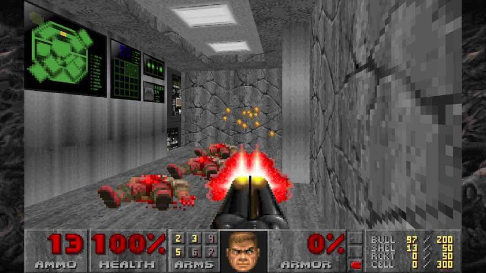
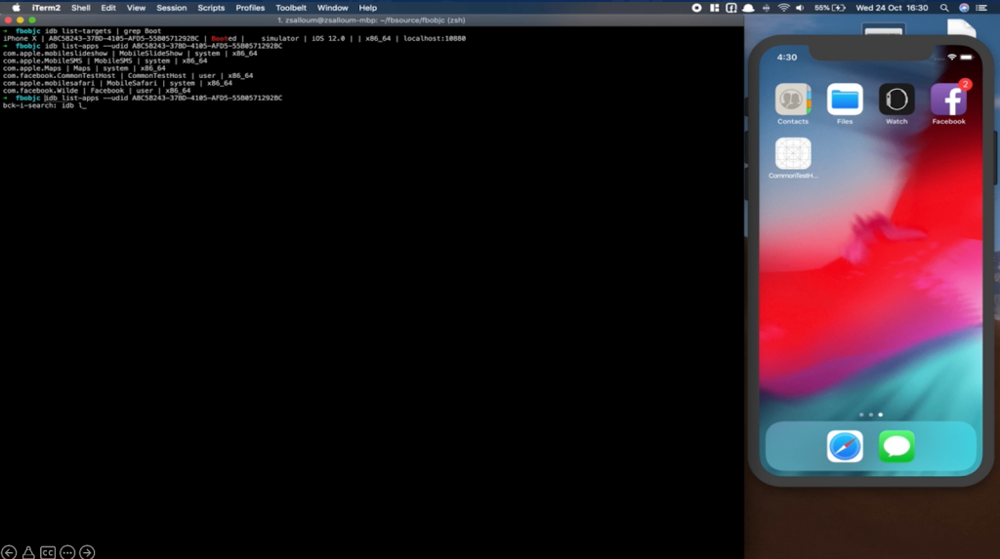
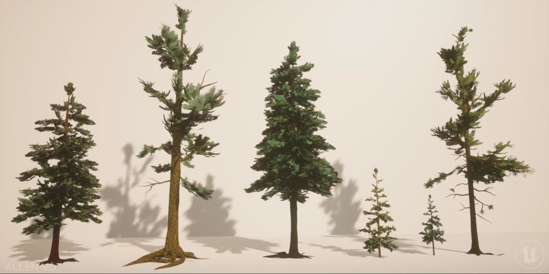

<em>The game development industry brings something new all the time. General Arcade shows the most interesting releases, updates and news of the past week, which are recommended reading for both industry veterans and novice developers.</em>

News: AMD has opened the sources of FSR 2.0, an up-to-date note from Forbes about the state of game development in the country and about layoffs of entire studios, Unity Gaming Services has left the beta.

Interesting things: artificial intelligence in DOOM, 100-day results in Blender 3D and error history, working on Horizon Forbidden West as a technical artist, anime-style attention in Blender.

<h2 id="h-updates-releases-news">Updates/releases/news</h2>

<a href="https://gpuopen.com/fsr2-source-available/">AMD open source FSR 2.0</a>

<figure class="aligncenter size-large"></figure>

And released a demo project that will allow you to study how the integration takes place.

<a href="https://blog.unity.com/games/build-your-live-game-in-a-single-modular-platform-with-unity-gaming-services">Unity Gaming Services is out of beta</a>

<figure class="aligncenter size-large"></figure>

This is a wide range of online components from Unity for grid, matchmaking, liveops, voice, monetization and more. All through a single admin panel.

<h2 id="h-interesting-articles-videos">Interesting articles/videos</h2>

<a href="https://www.gamedeveloper.com/blogs/the-ai-of-doom-1993">Artificial intelligence in DOOM</a>

<figure class="aligncenter size-large"><figcaption>DOOM 2_20190726194114</figcaption></figure>

DOOM is the forefather of first-person shooters and defined an entire generation of games in the 90s. The project is still being studied not only because of its fame, but also because it reached its heights under severe technical constraints, long before the advent of most modern tools and standards. Lightmap translated an article about how artificial intelligence works in Doom and the tricks that the developers used to create interesting combat situations.

<a href="https://dtf.ru/gamedev/1242269-rezultaty-za-100-dney-v-blender-3d-istoriya-moih-oshibok">Results for 100 days in Blender 3D. Mistakes History</a>

<figure class="aligncenter size-large"></figure>

The author talks about trying to work on his projects, and how he made so many mistakes that it was possible to release a multi-volume book on how not to do it.

<a href="https://80.lv/articles/working-on-horizon-zero-dawn-as-a-technical-artist/">Working on Horizon Forbidden West as a technical artist</a>

<figure class="aligncenter size-large"></figure>

Stefan Grunewud from Guerrilla Games told about working on the game, explained what it means to be a technical artist, and talked about the possibilities of games.

<a href="https://acko.net/blog/the-case-for-use-gpu/">The Case for Use.GPU – Reinventing rendering one shader at a time</a>

<figure class="aligncenter size-large"></figure>

This article describes the work done to make GPU operations reactive, declarative, and composable, and to remove a huge chunk of the boilerplate.

You can try the WebGL demo.

<a href="https://blog.magnum.graphics/backstage/pot-array-packing/">Single-pass power-of-two texture packing</a>

<figure class="aligncenter size-large"></figure>

This article presents a method for packing individual power-of-two textures into an array of textures and discusses the placement rules and how to pack them.

There is also a short example.

<a href="https://habr.com/ru/company/vk/blog/672708/">Mobile game testing automation with Airtest IDE and other solutions</a>

<figure class="aligncenter size-large"></figure>

Roman Melkumov, a tester at IT Territory, talked about automating mobile game testing using the Airtest IDE, as well as discussed other options that they used and what it led to.

<a href="https://80.lv/articles/creating-massive-middle-temple-with-garden-in-substance-3d-unreal-engine/">Creating a massive temple with a garden in Substance 3D and Unreal Engine</a>

<figure class="aligncenter size-large"></figure>

Saerom Yoon talked about working on the Middle Temple Lane project, explained how the vegetation was created, and showed how Smart Materials helped to get the desired texture.

<a href="https://www.gamedeveloper.com/design/the-design-and-philosophy-behind-ephemeral-video-game-exhibition-hyper-echo">Design and philosophy of the ephemeral HYPER//ECHO</a>

<figure class="aligncenter size-large"></figure>

HYPER//ECHO is a playable video game art exhibition that explores how our ever-changing relationship with technology intertwines with our natural human desire to create and communicate our own legacy. The article analyzes the project.

<a href="https://80.lv/articles/creating-a-weathered-car-in-zbrush-blender-marmoset-toolbag/">Creating a Weathered Car in ZBrush, Blender, and Marmoset Toolbag</a>

<figure class="aligncenter size-large"></figure>

François Larier talked about working on the Toyota FJ60 Offroad project, explained how rust was created, and showed the rendering setup in Marmoset Toolbag 4.

<a href="https://gpuopen.com/learn/ue-fsr2/">How to Use the AMD FidelityFX Super Resolution 2 (FSR 2) Plugin in Unreal Engine</a>

<figure class="aligncenter size-large"></figure>

The package also includes the FSR2MovieRenderPipeline plugin, which allows you to use FSR 2 to speed up rendering when using the Unreal Movie Render Queue.

<a href="https://youtu.be/IMj6x-2QcjE">Death of a Game: Elyon (Ascent: Infinite Realm)</a>

<iframe allow="accelerometer; autoplay; clipboard-write; encrypted-media; gyroscope; picture-in-picture" allowfullscreen="" frameborder="0" height="315" src="https://www.youtube.com/embed/IMj6x-2QcjE" title="YouTube video player" width="560"></iframe>

The video tells about the approach to Asian games, the delay in exits, and about errors specifically by Elyon.

<a href="https://80.lv/articles/creating-a-cedar-forest-in-zbrush-substance-3d-unreal-engine/">Creating a Cedar Forest in ZBrush, Substance 3D and Unreal Engine</a>

<figure class="aligncenter size-large"></figure>

Allen Wu talked about working on the Cedar Forest project, explained how the foliage textures were created and shared some tips for budding artists.

<a href="https://realtimevfx.com/t/sorangon-sketch-52-source-files-available/20095">Analysis of the VFX effect created as part of the VFX challenge</a>

A full analysis of the small effect that was made for the Level Up challenge can be found in the article.

<a href="https://youtu.be/DcxRUc092WY">How to make a game that was supposed to be small but ended up being huge</a>

<iframe allow="accelerometer; autoplay; clipboard-write; encrypted-media; gyroscope; picture-in-picture" allowfullscreen="" frameborder="0" height="315" src="https://www.youtube.com/embed/DcxRUc092WY" title="YouTube video player" width="560"></iframe>

Speaking at the 2022 GDC, Adam Alker of People Can Fly talks about the production history of Outriders, the studio’s massive growth, and the challenges that growth has brought with it.

<a href="https://youtu.be/T4KAHVEmGM0">Creating water ripples in Blender and UE5</a>

<iframe allow="accelerometer; autoplay; clipboard-write; encrypted-media; gyroscope; picture-in-picture" allowfullscreen="" frameborder="0" height="315" src="https://www.youtube.com/embed/T4KAHVEmGM0" title="YouTube video player" width="560"></iframe>

Leo Torres shared a method for creating realistic water ripples using Blender and Unreal Engine 5.

<a href="https://www.artstation.com/artwork/B3QeA8">Stylized 2D shader in Unreal Engine 5</a>

<figure class="aligncenter size-large"></figure>

Found on ArtStation. There you can also find a bunch of useful links on the topic.

<a href="https://aras-p.info/blog/2022/06/23/Comparing-BCn-texture-decoders/">Comparison of texture decoders</a>

<figure class="aligncenter size-large"></figure>

Aras Pranckevičius decided to explore the various BCn decoders available.

<em>We thank <a href="https://suvitruf.ru">Andrei Apanasik</a> for writing the original post and allowing us to publish it on our blog in English.</em>

