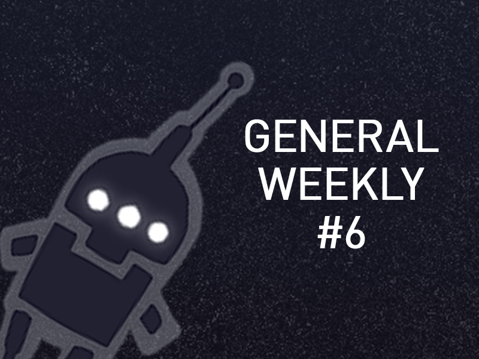
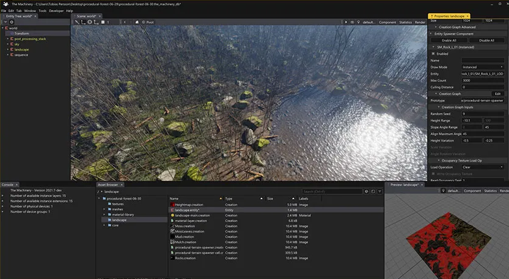
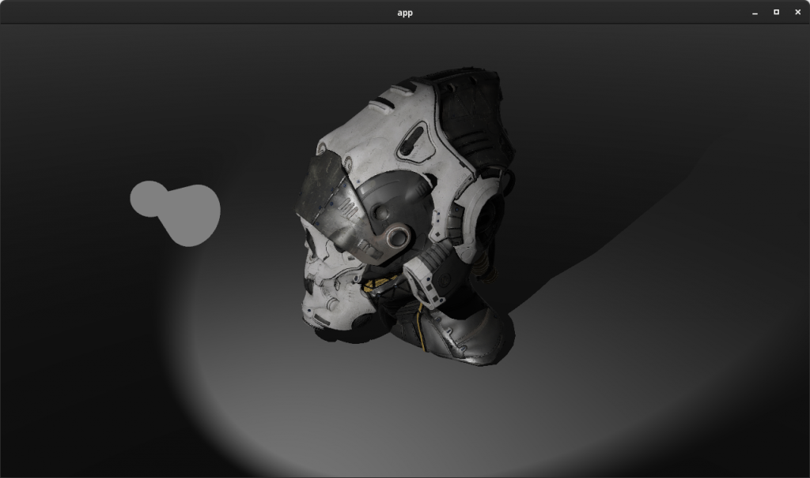
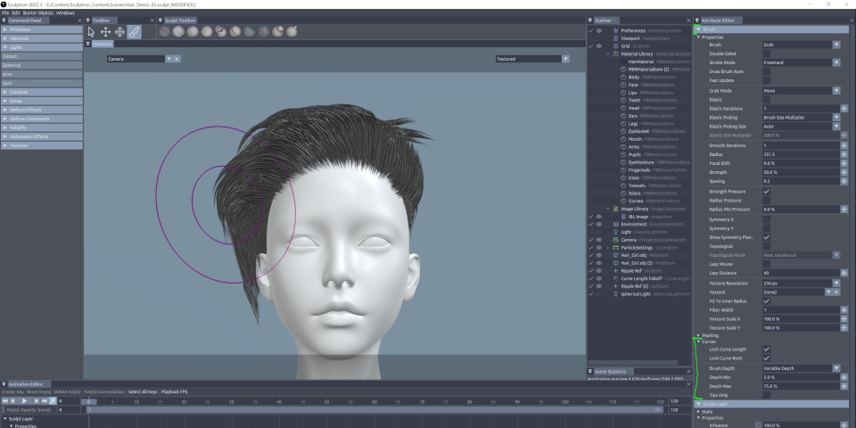
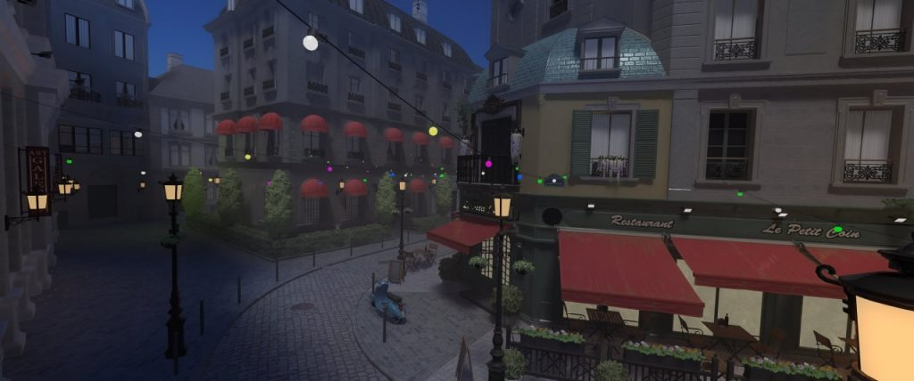
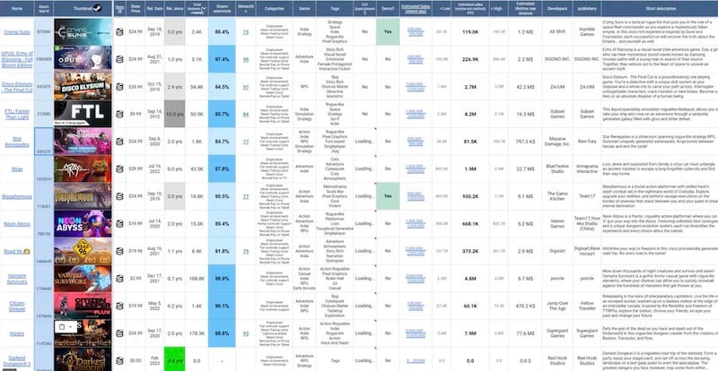

<em>The game development industry brings something new all the time. General Arcade shows the most interesting releases, updates and news of the past week, which are recommended reading for both industry veterans and novice developers.</em>

In the news: The Machinery game engine is no longer supported, and the developers ask customers to remove the sources and binaries, 9 months of development and now Godot 3.5 has been released, DreamWorks plans to release the MoonRay renderer under the Apache 2.0 license by the end of the year.

Of interest: from game developers to developers of the Balancy service for game developers, 5 hours of highly focused John Carmack having fun, GPU memory pools in D3D12, shader water in Unreal Engine.

<h2 id="h-updates-releases-news">Updates/releases/news</h2>

The Machinery game engine is no longer supported, and the developers are asking customers to remove the sources and binaries

<figure class="aligncenter size-large"></figure>

The engine is no longer supported. But the most interesting thing here is:

The developers say that clients must remove all source codes and binaries of the engine.

The information that they can request this has been added to the EULA very recently. Even in the May version of the user agreement, this clause was not there.

<a href="https://godotengine.org/article/godot-3-5-cant-stop-wont-stop">9 months of development and now Godot 3.5 is out</a>

<figure class="aligncenter size-large"></figure>

New navigation system

Physics interpolation

Improved animation

Singleton Time

Label3D and TextMesh

Asynchronous shader compilation

Native editor for Android

And much more.

<a href="https://openmoonray.org/MoonRayPressRelease.pdf">DreamWorks plans to release the MoonRay renderer under the Apache 2.0 license by the end of the year</a>

<figure class="aligncenter size-large"></figure>

Together with the Arras distributed rendering framework.

The renderer was used in production of, for example, The Bad Guys and Puss in Boots: The Last Wish.

<a href="https://www.khronos.org/news/press/khronos-gltf-2.0-released-as-an-iso-iec-international-standard">Khronos glTF 2.0 Released as International ISO/IEC Standard</a>

<figure class="wp-block-image size-large"></figure>

This will reinforce the global acceptance and acceptance of glTF as a 3D asset format.

<a href="https://bevyengine.org/news/bevy-0-8/">Bevy 0.8 released</a>

<figure class="aligncenter size-large"></figure>

The popular open-source Rust game engine has received an update that adds several new features, including a new material system, improvements to the ECS system, and a new much more flexible, and powerful camera system.

<a href="https://blog.unity.com/news/unity-and-microsoft-announce-cloud-partnership-for-game-developers-and-beyond">Microsoft and Unity have entered into a partnership – engine developers will use Azure cloud technologies</a>

<figure class="wp-block-image size-large"></figure>

Unity claims that working with Microsoft will allow them to improve their entire infrastructure, as well as develop the ecosystem of tools and services that the company provides to developers.

<a href="https://render.otoy.com/forum/viewtopic.php?f=33&amp;t=80203">Sculptron 2022.1 is out in Early Access</a>

<figure class="aligncenter size-large"></figure>

The update includes support for exporting hair grooming from other software, new brushes and modifiers, and dynamic sculpting capabilities for some brushes.

<a href="https://www.thegrove3d.com/releases/the-grove-release-11/">The Grove Release 11</a>

<figure class="aligncenter size-large"></figure>

The update adds a new Roots tool for creating outer roots, a Surround panel for simulating the shapes of trees growing in dense stands, and updates the software to use Blender’s geometry node system.

BagaPie V7 released

<iframe allow="accelerometer; autoplay; clipboard-write; encrypted-media; gyroscope; picture-in-picture" allowfullscreen="" frameborder="0" height="315" src="https://www.youtube.com/embed/uK7t_qDjm_0" title="YouTube video player" width="560"></iframe>

The update adds new procedural generators for fences, cables, tiles, and metal siding.

<h2 id="h-interesting-articles-videos">Interesting articles/videos</h2>

<a href="https://anki3d.org/porting-anki-to-android-again-after-8-years/">Porting AnKi to Android…again after ~8 years</a>

<figure class="aligncenter size-large"></figure>

The developer of the AnKi 3D engine decided to rewrite the port of it for Android and talked about the adventures he encountered along the way.

5 hours of enjoying concentrated John Carmack

<iframe allow="accelerometer; autoplay; clipboard-write; encrypted-media; gyroscope; picture-in-picture" allowfullscreen="" frameborder="0" height="315" src="https://www.youtube.com/embed/I845O57ZSy4" title="YouTube video player" width="560">The legendary programmer, co-founder of id Software, and the lead developer of many revolutionary video games including Wolfenstein 3D, Doom, Quake, and the Commander Keen series discussed many topics in the podcast.</iframe>

<a href="https://80.lv/articles/making-a-snow-dwarf-in-zbrush-maya-arnold/">Creating a Snow Gnome in ZBrush, Maya, and Arnold</a>

Enrique Mateo-Sagasta talked about the project, explained how to make believable skin in ZBrush, and shared some hair tips.

<a href="https://twitter.com/tom_forsyth/status/1555264293427326976">The game Urban Chaos for PS1 at one time was denied by the moderators because saves were running too fast</a>

<figure class="aligncenter size-large"></figure>

The player did not have time to read the message “Saving… please do not remove the memory card”.

What they did in the end:

Save progress

Showed a message

Paused

The message lied to the players.

<a href="https://blog.unity.com/technology/unlock-the-power-of-machine-learning-to-build-breathtaking-worlds">Gaia and the Intel Game Dev AI Toolkit</a>

<figure class="wp-block-image size-large"></figure>

Using AI, game developers can create hyper-realistic worlds filled with countless intricate adaptive NPCs. Now, most developers can effectively integrate AI capabilities with Unity features.

<a href="https://defold.com//2022/08/04/The-making-of-Boxrob/">Creation of BoxRob</a>

<figure class="wp-block-image size-large"></figure>

In a blog post, d954mas shared his experience of working on the game, from the initial idea to the finished product.

Material Options: A Solution for Managing Complex Material Libraries

<figure class="aligncenter size-large"></figure>

Ever wanted to automatically apply changes from one material to several others? Or reuse base material for local settings? Unity 2022.1 introduced a prefab-like concept, compatible with all render pipelines, to manage material options in the editor.

<a href="https://newsletter.gamediscover.co/p/sales-comps-for-your-game-how-not">Compensation for your game: what not to do</a>

<figure class="wp-block-image size-large"></figure>

For your game to come out and become successful, you need to properly budget the game. You may also need to estimate how many units you think will be sold.

<em>We thank <a href="https://suvitruf.ru">Andrei Apanasik</a> for writing the original post and allowing us to publish it on our blog in English.</em>

