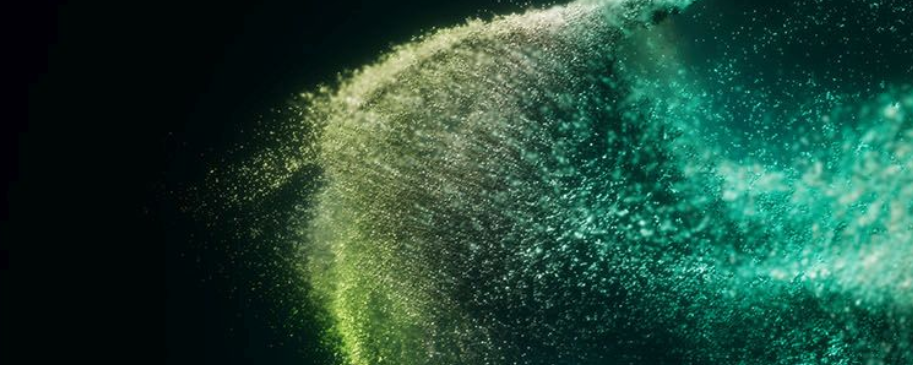
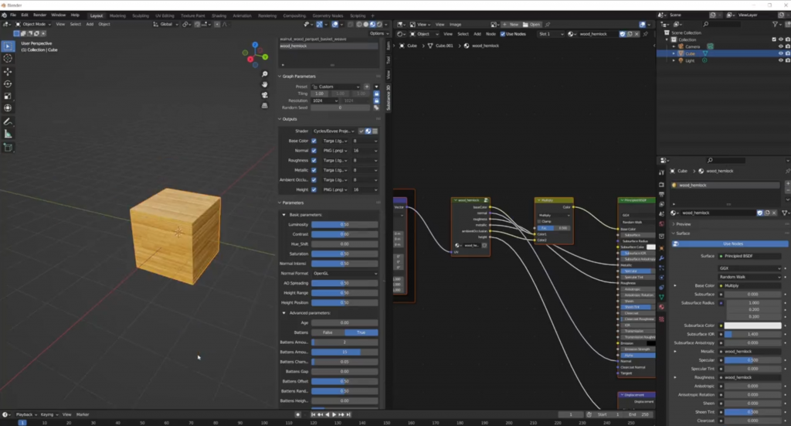
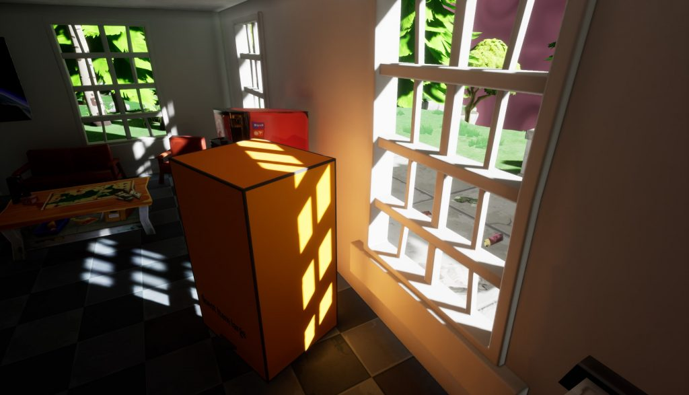
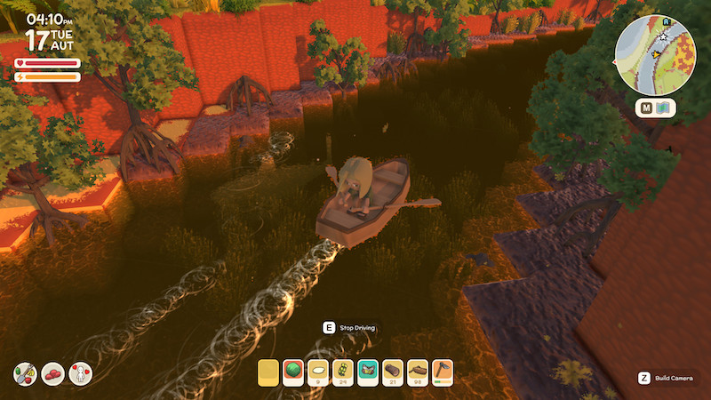
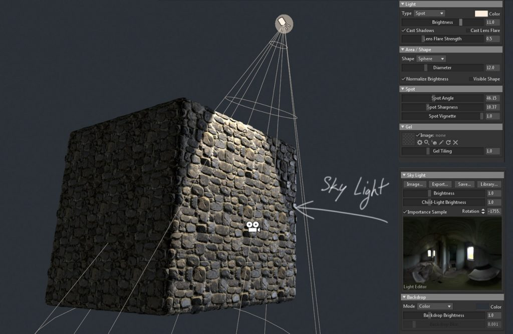

*The game development industry brings something new all the time. General Arcade shows the most interesting releases, updates and news of the past week, which are recommended reading for both industry veterans and novice developers.*

## Updates/releases/news

[Unity’s board of directors rejects AppLovin’s offer to buy](https://investors.unity.com/news/news-details/2022/Unity-Board-of-Directors-Reaffirms-Commitment-to-ironSource-Transaction-and-Rejects-Unsolicited-Proposal-from-AppLovin/default.aspx)

And they said that such a takeover “does not meet the interests of Unity’s shareholders.”

[Articy:Draft 3.2 and New Features for Interactive Storytelling](https://www.articy.com/en/whats-new-in-articydraft/)



The articy:draft narrative design tool has received an update that adds new features for faster and more productive interactive storytelling.

[FluidNinja LIVE for Unreal Engine added caustics](https://kynolin.itch.io/fluidninja-live-17-demo)



The new version adds caustics and a few minor improvements for Unreal Engine 5.

[Cocos Creator 3.6 released](https://www.cocos.com/en/major-improvements-in-development-come-with-cocos-creator-3-6)



There are several new graphical features, user interface improvements and the ability to test your game right in the editor.

[Marmoset has released Toolbag Drop 03](https://marmoset.co/posts/toolbag-library-drop-03/)

The update contains over 350 unique resources, high-quality and smart materials, and a new type of texture – Patterns.

[Fyrox 0.27 released](https://fyrox.rs/blog/post/feature-highlights-0-27/)



The open source game engine based on Rust has released a new version with many changes.

[Substance 3D beta for Blender is out](https://twitter.com/ymmanuel_who/status/1559195348555501575)

Now you can use Substance 3D materials directly in Blender.

## Interesting articles/videos

[Deconstructing bezier curves](http://blog.pkh.me/p/33-deconstructing-be%CC%81zier-curves.html)

Animators, programmers, designers, and other graphics professionals and enthusiasts often work with Bezier curves. They are popular, widely documented, and used almost everywhere. However, they are explained almost exclusively in 2 or 3 dimensions, which can be a source of confusion in various situations. The author tried to deconstruct them a little further in his article.

[The House of The Dev Podcast S2E2: Darren Korb – When a rock musician writes the soundtrack](https://youtu.be/nWtQxYVXQ8Q)



Rafael Colantonio and Petr Salnikov talk about music with Darren Korb, composer and director of audio at Supergiant Games (Hades, Transistor, Pyre, Bastion).

[Final Fantasy inspired dragon created in Maya, ZBrush and Substance 3D Painter](https://80.lv/articles/final-fantasy-inspired-dragon-made-in-maya-zbrush-substance-3d-painter/)

Elliott Wang talked about the Ebon Fang project, explained how the wings were created, and talked about texturing using the PBR approach.

[A retrospective of the museum scene in The Last of Us Part II](https://youtu.be/bE_WP56XUF4)



In a keynote from Game Narrative Summit 2022, Obsidian’s Evan Hill talked about creating a scene with dinosaurs that players will remember, talked about the pace and tricks in development.

[One of the Unreal Engine developers, who worked on Lumen, shed some light (no pun intended), on the work on this system](https://knarkowicz.wordpress.com/2022/08/18/journey-to-lumen/)

A post about failed attempts/methods and paths to solutions presented at SIGGRAPH 2022.

[Secrets of Great Controls for Platforming in Unity](https://youtu.be/KKGdDBFcu0Q)



Platformers are defined by their movement. Whether it’s the thrill of Super Meat Boy or the elegant combat of Hollow Knight. The author of the channel shared his approach to movement in platform games (in Unity 2D) and how it can be applied to improve your own games.

[350,000 sales of Dinkum in a month: an accident or a foregone conclusion?](https://newsletter.gamediscover.co/p/dinkums-350k-sales-in-a-month-serendipity)

What do successful games do differently? Thousands of games are released every year, and many of them are really high quality. But why do some games just shoot? Looking for an answer, GameDiscoverCo spoke to James Bandon about Dinkum, his Australian-themed Animal Crossing mix with Stardew Valley, one of Steam’s 2022 breakout games.

[Creating a stone wall material in ZBrush, Substance 3D Designer and Marmoset Toolbag](https://80.lv/articles/creating-a-stone-wall-material-in-zbrush-substance-3d-designer-marmoset-toolbag/)

Sergey Zlobin talked about the Stone Wall project, explained why he chose ZBrush with Substance 3D Designer, and talked about setting up lighting for rendering.

[Universal Render Pipeline in Unity with new extended guide](https://blog.unity.com/technology/move-on-over-to-the-universal-render-pipeline-with-our-advanced-guide)

The new book contains over 125 pages of in-depth knowledge about basic URP settings and features. Created by experienced internal and external Unity developers and technical artists, this guide reflects the latest features available in Unity 2021 LTS.

*We thank [Andrei Apanasik](https://suvitruf.ru) for writing the original post and allowing us to publish it on our blog in English.*
