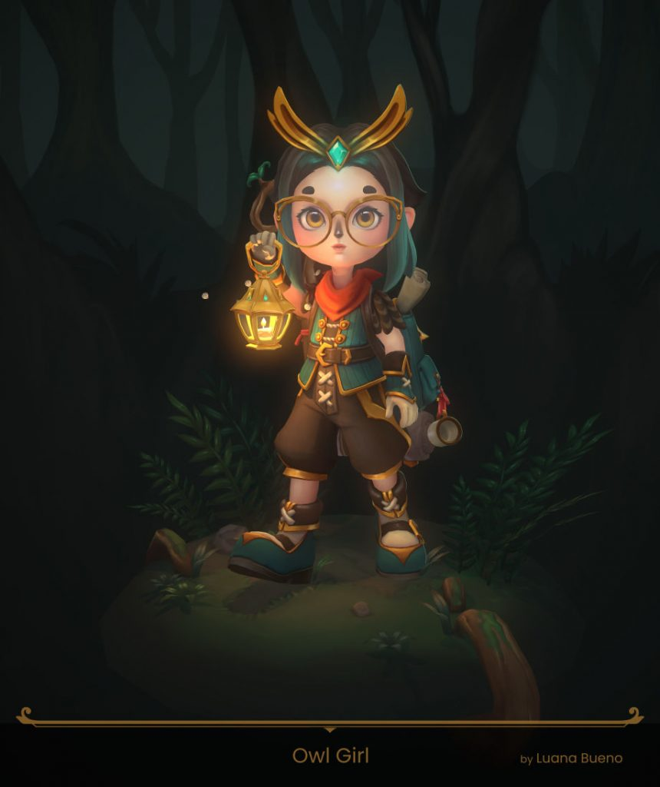

<em>The game development industry brings something new all the time. General Arcade shows the most interesting releases, updates and news of the past week, which are recommended reading for both industry veterans and novice developers.</em>

<h2 id="h-updates-releases-news">Updates/releases/news</h2>

<a href="https://blog.unity.com/games/multiplayer-networking-tools-launch-announcement">Unity announces new tools for developing multiplayer games</a>

Access to Netcode for GameObjects (NGO) 1.0, which goes hand in hand with new multiplayer solutions from Unity Gaming Services, including game server hosting (Multiplay) and Matchmaker. These tools, combined with examples and tutorials, will speed up the development of multiplayer games on Unity.

<figure class="aligncenter size-large"></figure>

<a href="https://developer.nvidia.com/blog/accelerating-ultrarealistic-game-development-with-nvidia-dlss-3-and-rtx-path-tracing/">NVIDIA Announces RTX Remix, Micromesh, DLSS 3 at GTC 2022</a>

<figure class="aligncenter size-large"></figure>

RTX Remix makes it easy to create graphics mods for Direct 3D 8 and D3D 9 games.

DLSS 3 combines DLSS Frame Generation with DLSS Super Resolution and NVIDIA Reflex. Provides up to 4x faster frame rate and up to 2x lower latency than native resolution rendering.

<a href="https://www.gamedeveloper.com/business/indie-storefront-voxpop-games-launches-indie-game-fund">The owners of the gaming platform VoxPop Games launched a fund for indie developers</a>

<figure class="aligncenter size-large"></figure>

Among the consultants is Geronimo Barrera, former vice president of Rockstar Games.

The new fund focuses on games with “interesting concepts”. Games created in partnership with the foundation will become temporary exclusives on the VoxPop platform.

<a href="https://cascadeur.com/help/category/193">Nekki releases Cascadeur 2022.2</a>

<iframe allow="accelerometer; autoplay; clipboard-write; encrypted-media; gyroscope; picture-in-picture" allowfullscreen="" frameborder="0" height="315" src="https://www.youtube.com/embed/4IQV_6rc3Q0" title="YouTube video player" width="560"></iframe>

The update adds a new type of global rotation kinematics, support for weapons in the Quick Rigging tool, and further expands the AutoPosing tool.

<a href="https://gamedev.rs/news/037/">Monthly Rust GameDev #37: August 2022</a>

A new pack of interesting things from the gamedev community.

<a href="https://bigmode.com/">Blogger Videogamedunkey founded his own publishing house BIGMODE – it will release “high-quality” indie games.</a>

<iframe allow="accelerometer; autoplay; clipboard-write; encrypted-media; gyroscope; picture-in-picture" allowfullscreen="" frameborder="0" height="315" src="https://www.youtube.com/embed/PEt27Jgp8gs" title="YouTube video player" width="560"></iframe>

Jason Gastrow and his wife Leah Gastrow, will “deep dive into projects” they want to work with within the BIGMODE publishing house.

BIGMODE will not cooperate with the authors who are engaged in games on the blockchain and with the introduction of NFT.

<a href="https://create.unity.com/multiplayer-report-2022">Unity released a report on multiplayer games and player preferences</a>

<figure class="aligncenter size-large"></figure>

77% of gamers play multiplayer games. The report also showed the importance of social factors in influencing purchase decisions.

<h2 id="h-interesting-articles-videos">Interesting articles/videos</h2>

<a href="https://www.deconstructoroffun.com/blog/2022/9/17/clash-quest-the-unofficial-postmortem">Clash Quest, unofficial postmortem</a>

<figure class="aligncenter size-large"></figure>

After 16 months of a soft launch, Supercell’s Clash Quest has not met its business objectives and will be shutting down. Ethan Levy discussed with the writers what was done right and what could be improved in Clash Quest.

<a href="https://docs.google.com/document/d/1SewltJLsZUYmd6nSrKoyYQhVyOpG5f8FqxMsy3Y9D4U">The best “worst” mechanics in games</a>

<iframe allow="accelerometer; autoplay; clipboard-write; encrypted-media; gyroscope; picture-in-picture" allowfullscreen="" frameborder="0" height="315" src="https://www.youtube.com/embed/lxwgQbtuD6U" title="YouTube video player" width="560"></iframe>

Yes, we are talking about timers. A document with links to materials used in the creation of the video.

<a href="https://80.lv/articles/creating-real-time-afro-in-fibershop-marmoset-toolbag/">Creating a Realtime Afro with FiberShop and Marmoset Toolbag</a>

<figure class="aligncenter size-large"></figure>

Hellor Maweja showed how to create a female afro in real time, demonstrated how FiberShop is used to create textures and explained how GS CurveTools helps with card placement.

<a href="https://advances.realtimerendering.com/s2022/index.html#Lumen">Slides from a huge presentation about Lumen from Siggraph 2022</a>

<figure class="aligncenter size-large"></figure>

The developers have presented all the work on Global Illumination in UE5 to date, with a lot of inside information from the “The Matrix Awakens” demo.

<a href="https://www.youtube.com/watch?v=c9rvKdQkAIk&amp;feature=emb_imp_woyt">Interview with the developer of Cult of the Lamb by Noclip</a>

<iframe allow="accelerometer; autoplay; clipboard-write; encrypted-media; gyroscope; picture-in-picture" allowfullscreen="" frameborder="0" height="315" src="https://www.youtube.com/embed/c9rvKdQkAIk" title="YouTube video player" width="560"></iframe>

Danny spoke to Massive Monsters’ Jay Armstrong about the history of the studio and the design behind their indie hit.

<a href="https://www.gamedeveloper.com/design/return-to-monkey-island-ron-gilbert-dave-grossman-writing-design">Navigating Seas of Change Return to Monkey Island</a>

<figure class="aligncenter size-large"></figure>

Interviews with the two creators of the game about what they brought from the original series to the modern era – and what they left behind.

<a href="https://newsletter.gamediscover.co/p/game-trailers-breaking-down-a-key">Game Trailers: Dealing with a Key Mistake</a>

<figure class="aligncenter size-large"></figure>

Gamediscover article talks about an important element of game research – game trailers.

Derek Lew, the author of game trailers for Psychonauts 2, Half-Life: Alyx, Among Us, and more, shared his thoughts on the topic.

<a href="https://80.lv/articles/creating-a-stylized-owl-girl-in-maya-zbrush-substance-3d-painter/">Creating a Stylized Owl Girl in Maya, ZBrush, and Substance 3D Painter</a>

<figure class="aligncenter size-large"></figure>

Luana Bueno talked about working on the Owl Girl project, shared some hand drawing tips for beginners, and explained the importance of recording your workflow.

<a href="https://thehouseofthedev.com/materials/allcorrect-denis-hamin-interview/">“Keep text separate from code”: an interview with Denis Khamin, co-founder of Allcorrect Games localization studio</a>

<figure class="aligncenter size-large"></figure>

In 2006, he founded the company with his friend Demid – a year after graduating from university. We started from scratch, and now there are 120 people working.

<a href="https://www.unrealengine.com/en-US/developer-interviews/soulstice-s-dark-fantasy-is-fueled-by-unreal-engine">Dark fantasy Soulstice and Unreal Engine</a>

<figure class="aligncenter size-large"></figure>

The Epic Games team spoke with Fabio Padgetti, the studio’s creative director, about how the team came up with Soulstice’s unique game mechanics, grew the studio during the pandemic, and how winning the Epic MegaGrant inspired and motivated them at the right time.

<a href="https://newsletter.gamediscover.co/p/publishers-and-their-hidden-steam">Publishers and their “hidden” advantage of Steam</a>

<figure class="aligncenter size-large"></figure>

When it comes to gaming platforms such as Steam, a reasonable question arises – what actually the status of a publisher gives you compared to the one of an individual developer?

Of course, publisher-specific annual sales and cross-promotion opportunities.

<a href="https://80.lv/articles/setting-up-graphical-improvements-in-world-of-tanks-blitz/">Setting up graphic improvements in World of Tanks Blitz</a>

<figure class="aligncenter size-large"></figure>

The developers of World of Tanks Blitz spoke about the major graphics update introduced in Update 9.0, explained how they redraw the game’s maps and discussed the updated physics.

<a href="https://premortem.games/2022/09/20/pitching-tips-from-rami-ismail-only-list-unique-selling-points-that-have-meaning/">Rami Ismail Presentation Tips: “Only list the unique benefits that make sense”</a>

<figure class="aligncenter size-large"></figure>

The author has focused on one particular thing he is always looking for in a customer presentation or sales page. Unique Selling Points (USP), which are not unique at all.

<a href="https://www.gamedeveloper.com/design/airdorf-interview">Dive into Low Poly Hatching and FAITH: Chapter III</a>

<figure class="wp-block-image size-large"></figure>

The indie developer talks about his latest game, how he got his start in development, and what to expect from FAITH: Chapter 3.

<em>We thank <a href="https://suvitruf.ru">Andrei Apanasik</a> for writing the original post and allowing us to publish it on our blog in English.</em>

