*The game development industry brings something new all the time. General Arcade shows the most interesting releases, updates and news of the past week, which are recommended reading for both industry veterans and novice developers.*

## Updates/releases/news

[Open 3D Engine 22.10](https://www.o3de.org/docs/release-notes/22-10-0/)

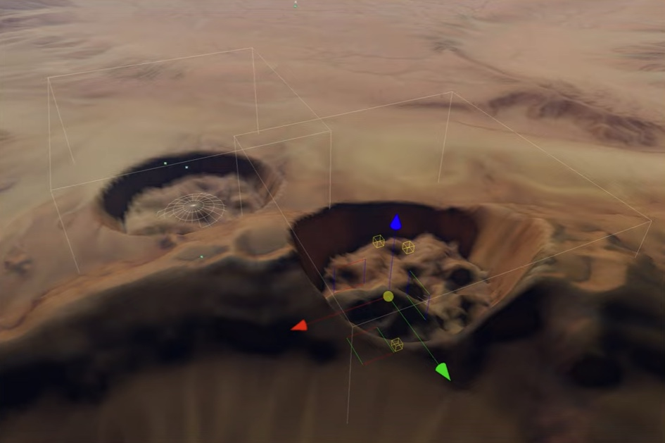

The update introduces a new terrain system, Sky Atmosphere and Stars components, and UI improvements.

[Adobe releases Substance 3D Modeler](https://www.adobe.com/products/substance3d-modeler.html)

The much anticipated new VR sculpting app.

## 

## Interesting articles/videos

[Post-processing effects: color models and color correction](https://blog.en.uwa4d.com/2022/09/29/screen-post-processing-effects-color-models-and-color-grading/)

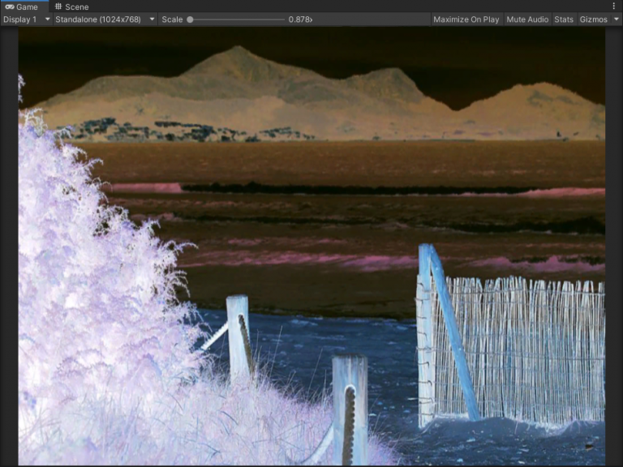

This article discusses the RGB and HSV color spaces and how to convert between them.

[Porting DOS games](https://habr.com/ru/post/693660/)

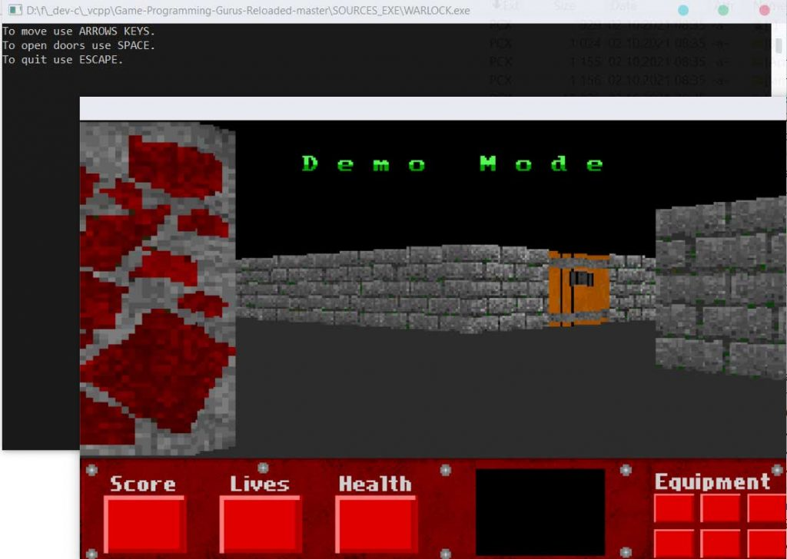

In the article, the author decided to show the methods of porting programs between hardware and software platforms, and draw attention to the book “Secrets of Game Programming” by Andre Lamothe, 1995, which many computer game developers will remember with a kind word, and other equally useful books by this author.

[Art Style and Player Motivation in Metroidvania Mandragora by Primal Game Studio](https://80.lv/articles/art-style-player-motivation-in-primal-game-studio-s-metroidvania-mandragora/)

István Zsuffa and Ildiko Toth talked about the art and balance of Mandragora, gave advice to aspiring designers, and discussed what attracts players.

[Call of Duty: Online is dead. Long live Call of Duty: Online!](https://www.deconstructoroffun.com/blog/callofdutyonline)

Activision shut down the Call of Duty: Online servers at the end of August 2021. Enrico D’Angelo, Vice President of Product at Activision Publishing, decided to look back on the history of this project and its legacy of arguably one of the most influential Call of Duty products ever made.

[Making a Single Player MMO: The Elder Scrolls Online Experience](https://www.gamesindustry.biz/building-an-mmo-for-solo-players-in-the-elder-scrolls-online-1)

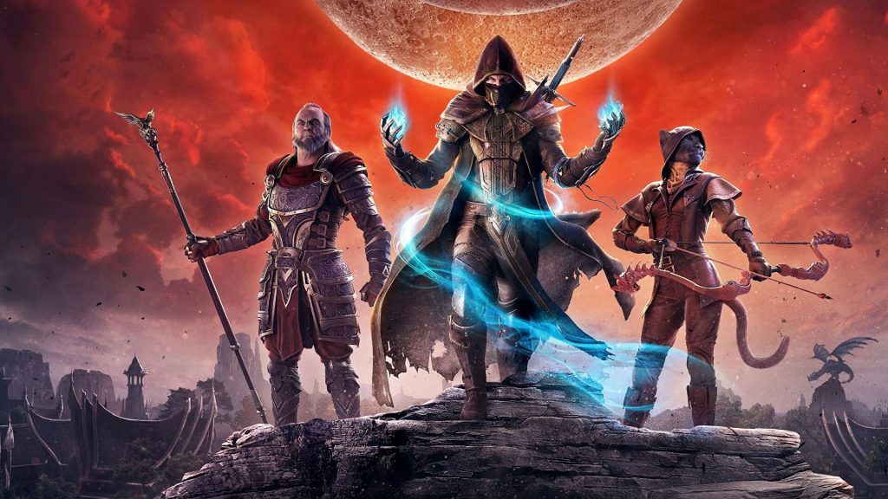

Rich Lambert, creative director of ZeniMax Online, spoke about eight years of trying to capture the attention of both longtime fans of the series and voracious MMO veterans.

[About the success of ARK: Survival Evolved](https://newsletter.gamediscover.co/p/deep-dive-inside-ark-survival-evolveds)

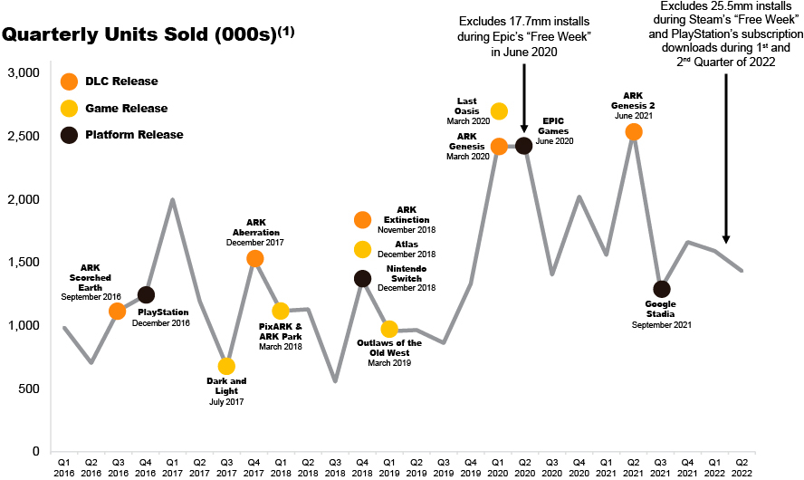

Some sales analytics from gamediscover.

[Recreating a Gold Encrusted Revolver in 3ds Max and Substance 3D Painter](https://80.lv/articles/recreating-a-gold-inlaid-revolver-in-3ds-max-substance-3d-painter/)

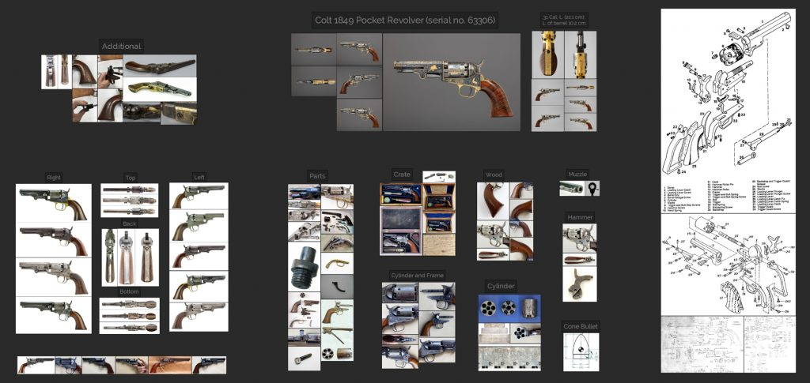

Maria Savelyeva spoke about the creation of the Colt 1849 revolver with gold inlay, told how complex engravings were created, and discussed the texturing process.

[Indie developer Brian Clark of The Mortuary Assistant: “The game is part of who you are”](https://premortem.games/2022/10/19/solo-dev-brian-clarke-of-the-mortuary-assistant-the-game-is-a-piece-of-yourself/)

Brian Clark worked for over 13 years at various studios such as EA Mythic, Trion and Disney before “wanting to do something really stupid” and becoming an independent game developer. Since 2018, he has been constantly working on a portfolio of horror games under the name Darkstone Digital. His latest game, The Mortuary Assistant, came out in August and terrified players and critics alike.

[Why does Batman’s Arkham Series have one of the greatest combat systems?](https://youtu.be/Guz0DEWI6nM)



There’s a nice video on the IGN channel about how the developers at Rocksteady Studios created one of the best gaming systems of all time.

[Scripting hacks for working with the Unity editor to save you time, part 1](https://blog.unity.com/technology/advanced-editor-scripting-hacks-to-save-you-time-part-1)

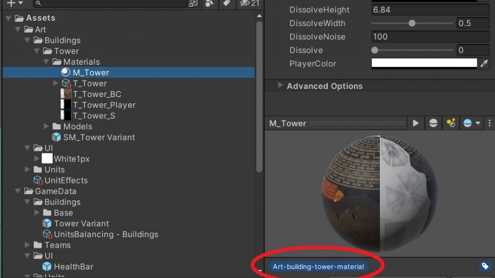

In the first article of the series, the author talked about tricks that can help improve working with assets in the editor.

[Creating huge stone pillars in Blender, Unreal Engine and Substance 3D](https://80.lv/articles/creating-huge-stone-pillars-in-blender-unreal-engine-substance-3d/)

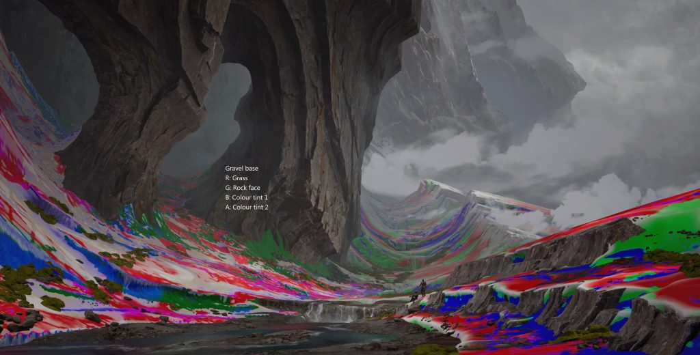

Toivo Huhtaniska talked about working on the Pillars project, explained how he modeled extremely detailed mountains, and showed how rock and grass surfaces were created.

[What is Path Tracing?](https://blogs.nvidia.com/blog/2022/03/23/what-is-path-tracing/)

Nvidia’s blog explains the technology.

[Tips for more immersive sound design](https://www.gamesindustry.biz/tips-for-more-immersive-sound-design)

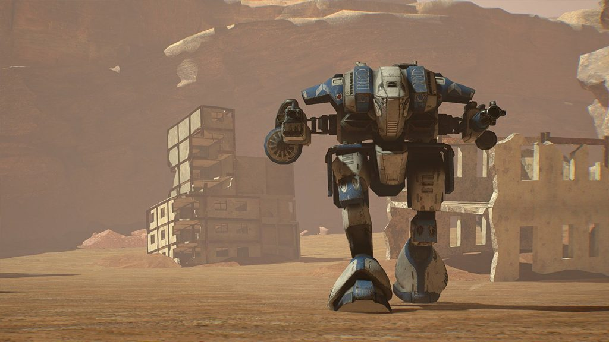

A few principles used in World of Mechs (by Studio369) that all developers and sound engineers can apply for better sonic immersion when building worlds.

[A series of articles from AMD on working with FSR 2.1 in UE](https://gpuopen.com/learn/fsr-2-1-unreal-engine-plugin-part1/)

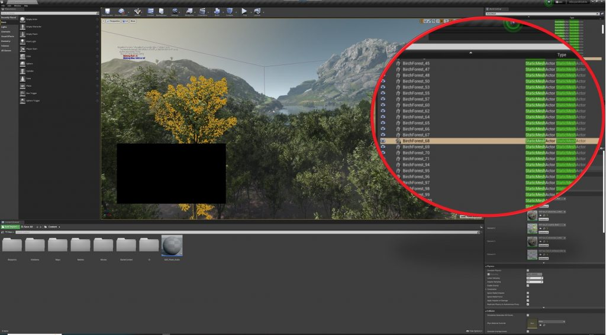

During the recent plugin update for UE, 5 articles about FSR technology were also published.

[Recreating Soul of Cinder from Dark Souls in ZBrush, UE5 and Sunstance 3D Painter](https://80.lv/articles/recreating-dark-souls-soul-of-cider-in-zbrush-ue5-sunstance-3d/)

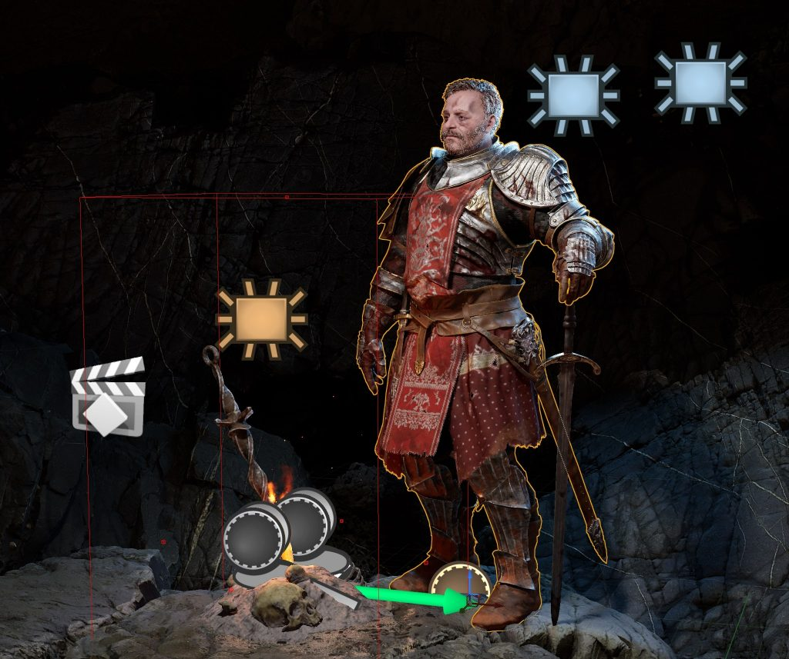

Davi Amancio Sousa shared the details of the project, explained why he decided to recreate the character as a real person, and talked about working with the face, hair, armor and weapons of the character.

[Advertising as your asset: improving the gaming experience](https://blog.unity.com/games/improve-player-retention-with-in-game-ads)

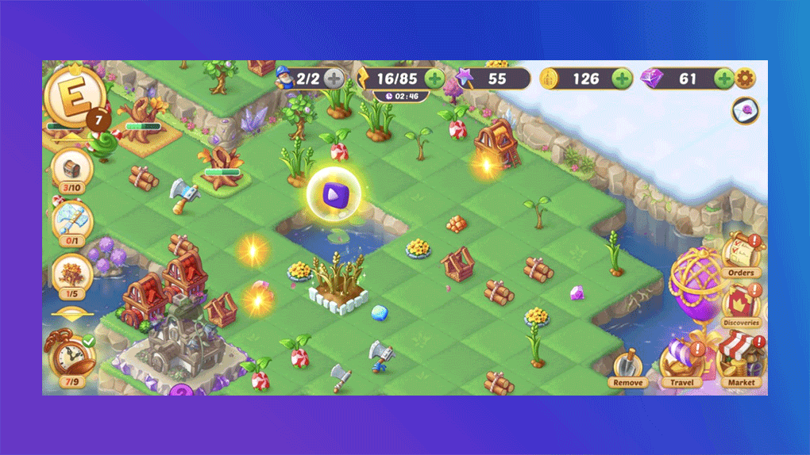

In this article, you’ll learn about the main components of in-game ad design and how Unity worked with Pixel United to improve their EverMerge monetization strategy.

[Creating fluffy stylized pine trees in Maya, ZBrush and Unreal](https://youtu.be/LbEv4CGz7LE)



Victoria Zavgorodnyaya presented a new master class on creating stylized trees.

[Behind the scenes NVIDIA Racer RTX](https://80.lv/articles/a-behind-the-scenes-look-at-nvidia-s-racer-rtx/)

Gabriele Leone, creative director at NVIDIA, spoke about the NVIDIA Racer RTX tech demo, explained how cars and interiors were created, and discussed lighting setup.

[Long-term career in design for non-leaders](https://youtu.be/Lf7aFknlO2U)



In a GDC 2021 keynote, Cryptic Studios’ Brett Norton talks about the traditional “become a lead” career path, but then moves away from that form and offers some proven non-lead career paths.

[How Monomi Park managed to create an indie sequel to Slime Rancher 2](https://www.gamesindustry.biz/how-monomi-park-nailed-the-indie-sequel-with-slime-rancher-2)

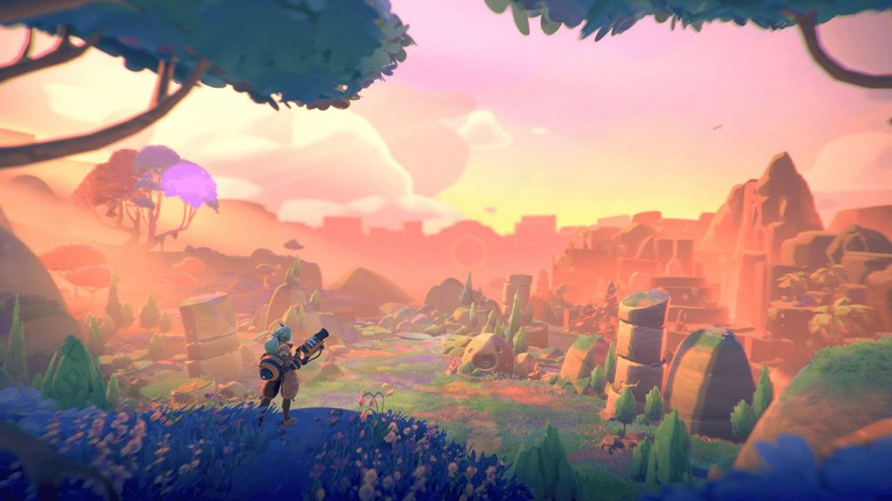

Studio founder Nick Popovich talks about self-paced Unity and the importance of continuing a debut project that has sold six million copies.

[How Legend Of Keepers Succeeded On PC](https://newsletter.gamediscover.co/p/in-depth-how-legend-of-keepers-hit)

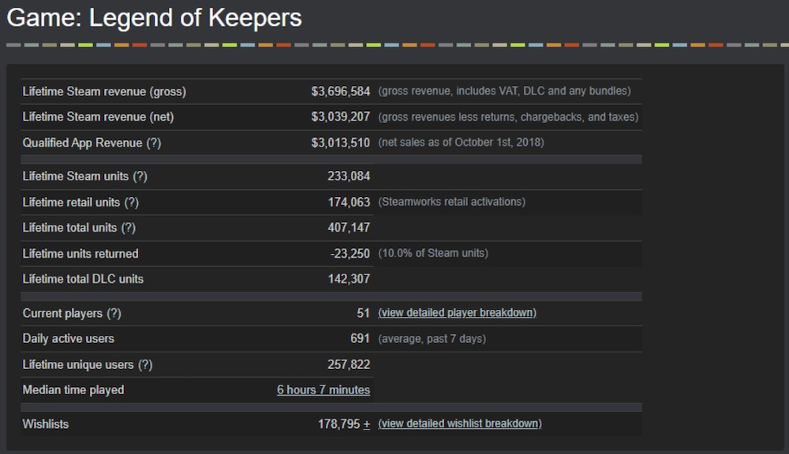

Johann Werbrucht shared the details. It sold 233,000 base game units and 142,000 DLC units, generating just over $3 million (after Steam commission).

[Unreal Engine made it easy for New Tales from the Borderlands to switch to a new engine](https://www.unrealengine.com/en-US/developer-interviews/unreal-engine-streamlined-the-transition-to-a-new-engine-for-new-tales-from-the-borderlands)

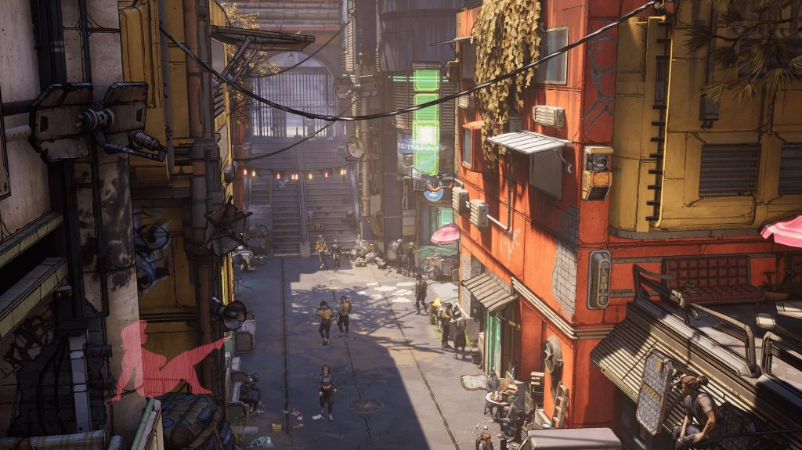

The Unreal Engine team spoke with a game producer Frederic Scheubel about the change in design, the new, tougher look, and how the transition to Unreal Engine was relatively smooth and also helped keep the team healthy.

*We thank [Andrei Apanasik](https://suvitruf.ru) for writing the original post and allowing us to publish it on our blog in English.*
