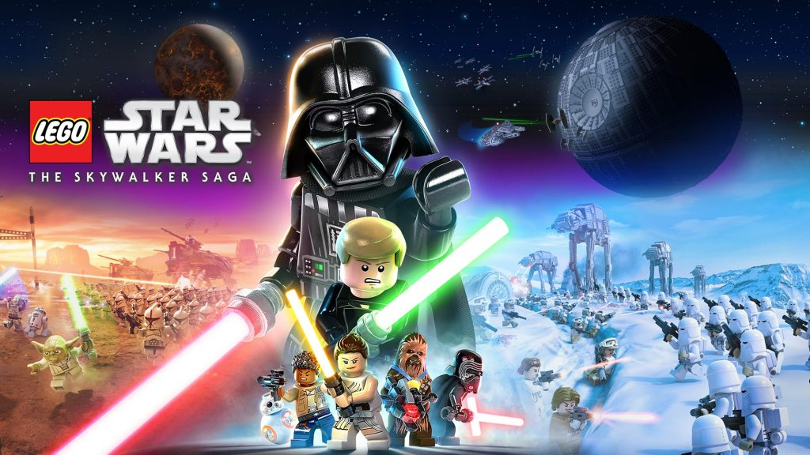
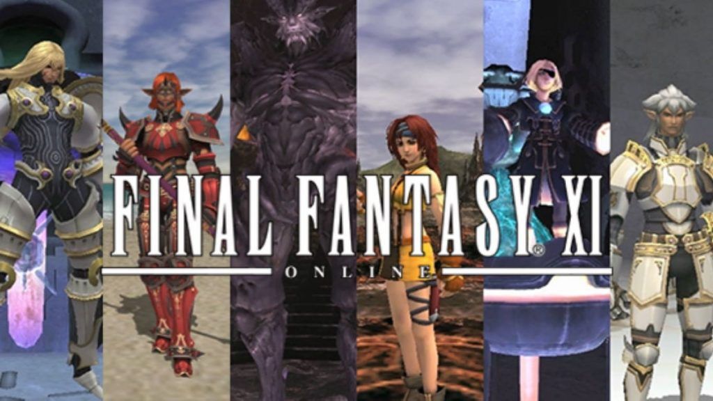
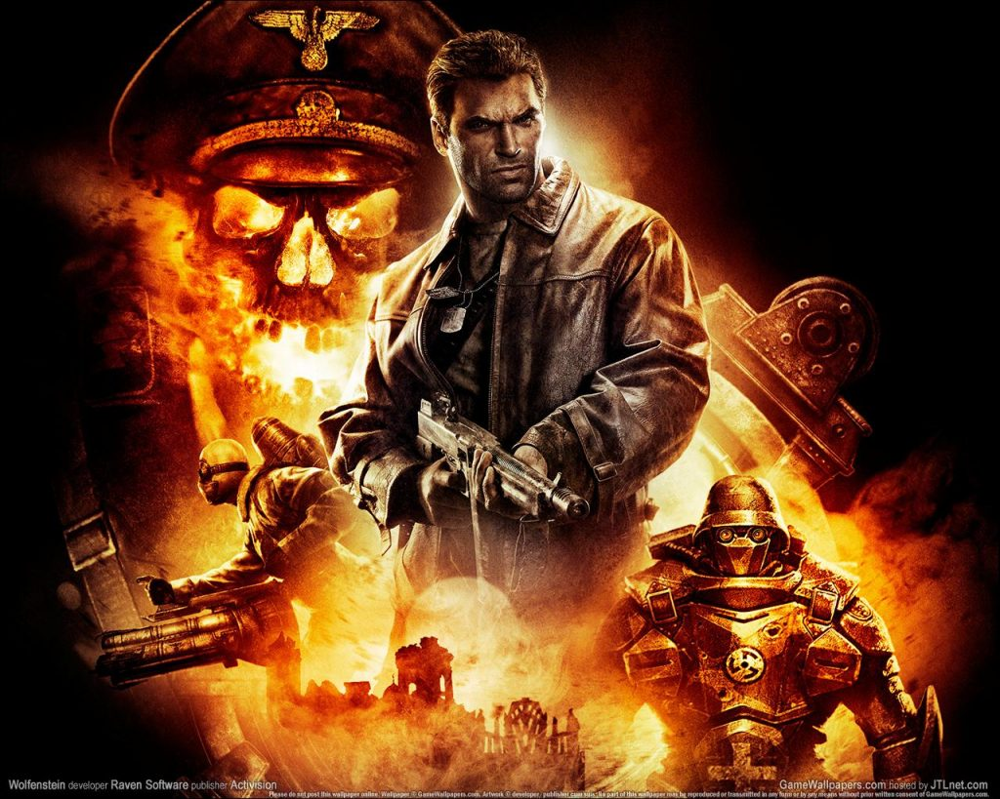
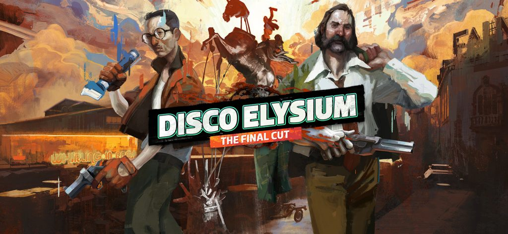
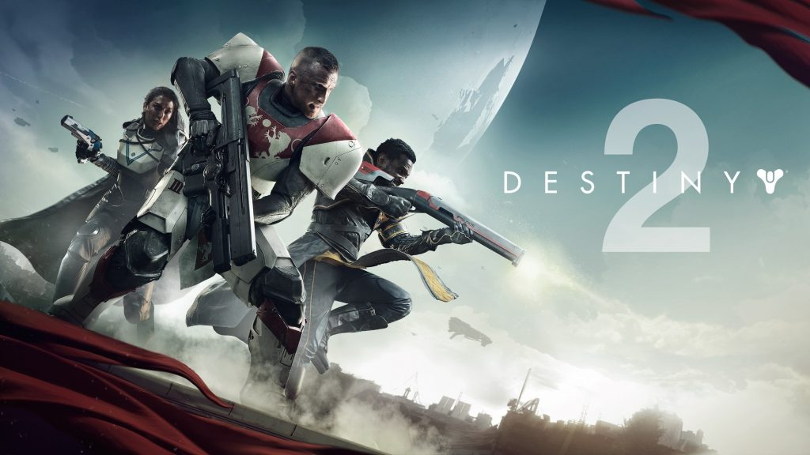

<em>Games surround our company every day. It is impossible to develop games without playing in your free time. There are many experienced gamers in our team who will tell you what they are playing right now. We would also like to make a point that the opinion of an employee does not represent the position of the company.</em>

<strong>Gennadi (CEO) plays Lego Star Wars: The Skywalker Saga (PC).</strong>

<figure class="wp-block-image size-large"></figure>

I’ve been playing Lego Star Wars: The Skywalker Saga for the past few days. I remember playing Lego Star Wars II: The Original Trilogy, which came out 17 (!) years ago, with my brother. I guess nostalgic feelings made me buy The Skywalker Saga.

Overall the gameplay stayed the same. It’s a pretty straightforward, easy-going game but has more features and is a big game overall, which is a bit overwhelming at first. Visually it looks fantastic, with a mix of realistic and blocky environments and great cartoony animation. Humor is childish but fits the game nicely. You can access dozens of planets from the Star Wars universe and play as one of a hundred characters. The best part of the game, that despite being quite cheesy, it manages to capture the feel of Star Wars. Even though I still have two-thirds of the story to play, I already plan to come back to it after the first playthrough and play in a free roam mode to unlock more characters and see all the gags.

<strong>Mikhail (Marketing Specialist) plays Final Fantasy XI (PC).</strong>

<figure class="wp-block-image size-large"></figure>

Even though there is a hugely popular Final Fantasy XIV (which I also play a little bit), my heart belongs to the eleventh part. In May of this year, she turned twenty years old, an unthinkable result for an MMORPG of the PS2 era (by the way, this is the first cross-play game in the world). Despite its advanced age, there are still a lot of people in this game. It is very easy to make new friends here who will always help a newbie. I go through the story quests very slowly and grow my chocobo (a yellow bird that you can ride on). Now I’m trying to figure out how to play a paladin, because tanks and healers are always interesting to play (because they are always wanted in almost any MMO). The game is currently hosting festive events, where everyone who plays the game will receive a lot of rewards. Unfortunately, there were no big content updates for the anniversary of the game, but I hope that we will get something else in the future. It’s a big miracle that this game is still alive. I hope that we will celebrate Final Fantasy XI’s 30th anniversary in the future.

<strong>Alexei (Software Engineer) plays Wolfenstein (PC).</strong>

<figure class="wp-block-image size-large"></figure>

I decided to remember the old days and play Wolfenstein. But not at all The New Order or its sequel, but 2009 Wolfenstein. Why did I choose this particular game? I have warm memories of buying a new PC in 2009 and dashing joy paired with pleasure when I bought the coveted licensed version of the game. This game is the purest arcade shooter that, in my humble opinion, is the spiritual successor to Return to Castle Wolfenstein. The game stands out with a good soundtrack, graphics that are pleasant for its time, and a level of detail. The gameplay is very dynamic, it’s nice to shoot at enemies, the physics are at a good level. I sincerely hope that someday there will be a direct sequel from Raven Software.

<strong>Alex (Unity Developer) plays Disco Elysium (PC).</strong>

<figure class="aligncenter size-large"></figure>

The first time I played Disco Elysium was right after it came out, and I went through it with the original English text. Of course, quite a lot of the plot passed me by. Now, after the release of the full version in Russian, I decided to finally dive in and try the game again. Initially, the game attracted me with its appearance: an interesting visual and an RPG component. However, after playing through, I can say that the best aspect of the game is the storytelling and literary language of the game. By the amount of text, this game resembles a book. I immediately remembered one such book from childhood, in which there was a non-linear plot (you were told which page to turn to).

This game has a very interesting role-playing component: where else can you play a feminist, or a disco cop? Where else can you pump not strength and dexterity, but the traits of your hero, such as self-control, conceptualization?

To sum it up, I play it because it’s a hell of a storytelling game, and it has slow, effortless gameplay – perfect to pass the evening. I really want to choose a path that is different from the first time, and see what comes of it.

<strong>Oleg (QA Engineer) plays Destiny 2 (PC).</strong>

<figure class="aligncenter size-large"></figure>

For many years I have been looking for a game in which you can stay for a long time. I like the mechanics that are built into the MMORPGs. This is interaction between players in any form, be it trading, gatherings in local hubs, or passing activities. Therefore, I looked for a long time and searched the MMORPG market for a game in which to take root. But I didn’t like any of them. And in the already distant 2017, Destiny 2 came out. I knew that there was the first part, which was always a console exclusive and I knew almost nothing about it. I am a big fan of shooters and after seeing the stream of this game, I realized that it is worth at least trying. And I liked it.

Bungie was able to implement really great shooting in the game. It is worth paying tribute to the artists and modelers of this game – the visual part is done perfectly. After all, when you come to a new raid for the first time, the locations there are so huge and stylistically diverse that you just want to walk around and look at the marvelous landscapes. It can be a laboratory of a brilliant scientist hidden in the ice of Antarctica, a huge pyramid of an extraterrestrial civilization that looks more like a museum where the remains of creatures are collected, or a ship made of gold with many corridors and branches, where you still need to contrive to come to the right room.

What makes this game stand out to me is the mechanics of raids or other activities. You don’t just have to “Bring 10 wolf skins”. These are always different puzzles, where without communication between the players, the activity is simply impossible to pass.

I would also like to emphasize to the community built around the game. It is quite active and friendly to newcomers. You can find a lot of servers on Discord where people are looking for groups or going on a raid. With all this, they do not turn away from those who have installed the game recently. You will be shown and explained how the raid works and what you need to do in it. As for me, no matter how good the game is, if it has a bad or inactive community, then the game begins to move inexorably towards its end.

