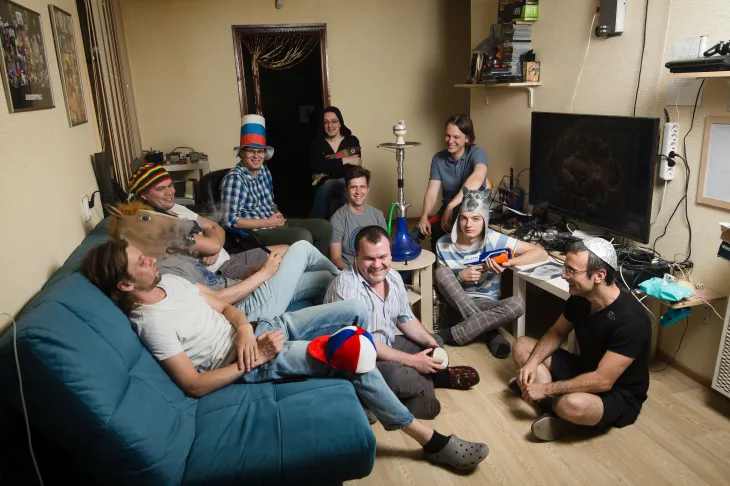

People often hear about games being ported to other consoles or older games being remastered for newer platforms, but what does it take to be a company that specialises in the porting of games?

Since 2013, General Arcade has been passionately pursuing the dream of helping game developers improve their titles and increase their audience. The team has also resurrected game classics that had not been available for modern consoles.

Guys from Red Hare Studios talked to Gennadii Potapov, General Arcade CEO, to find out about how the company does business and some of the unique challenges that the company faces. Check out the full text on [Red Hare website](https://redharegames.wordpress.com/2019/11/01/spotlight-interview-gennadii-potapov-from-general-arcade/)!

