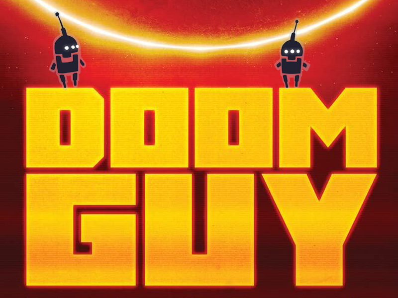

For our company, DOOM is more than just a game and its creators are more than just another bunch of talented people. John Romero and John Carmack have entered the history of video games as and will remain so forever.

John Romero loves to share memories and his <a href="https://rome.ro">Blog</a> and <a href="https://twitter.com/romero">Twitter</a> are always a pleasure to read. But posts and tweets are sometimes not enough to get into a person’s story. That’s why John Romero has written an autobiography.

<strong>Doom Guy: Life in First Person</strong> to be published on January on January 10, 2023, by Abrams Press in digital and paperback (hardcover) formats. <a href="https://www.amazon.com/dp/141975811X/ref=as_li_ss_tl?ie=UTF8&amp;smid=ATVPDKIKX0DER&amp;th=1&amp;linkCode=sl1&amp;tag=sec2002-20">Pre-orders are already open!</a>

What the book (and John) promises us:

<em>The inspiring, long-awaited autobiography of video game designer and DOOM co-creator John Romero</em>

<em>DOOM Guy: Life in First Person is the long-awaited autobiography of John Romero, gaming’s original rock star and the cocreator of DOOM, Quake, and Wolfenstein—some of the most recognizable and important titles in video game history. Credited with the invention of the first-person shooter, a genre that continues to dominate the market today, he is gaming royalty.</em>

<em>Told in remarkable detail, a byproduct of his hyperthymesia, Romero recounts his storied career—from his early days submitting Apple II code to computer magazines and sneaking computers out of the back door of his day job to do programming projects at night in his garage to a high-profile falling out with his id Software cofounder John Carmack, as well as his continued role in the gaming industry today as the managing director of Romero Games Ltd.</em>

<em>His story is truly one of a self-made man, founding multiple companies after a childhood filled with violence and abuse drove him to video game design, where he could create new worlds and places to escape to. An alcoholic father, a racist grandfather who did not approve of Romero’s parents’ mixed-race coupling, and a grandmother who once ran a brothel in Mexico combine for an illuminating story his youth—a story that has never before been revealed. </em>

<em>After years in the gaming spotlight, Romero is now telling his story—THE WHOLE STORY—in his own words.</em>

