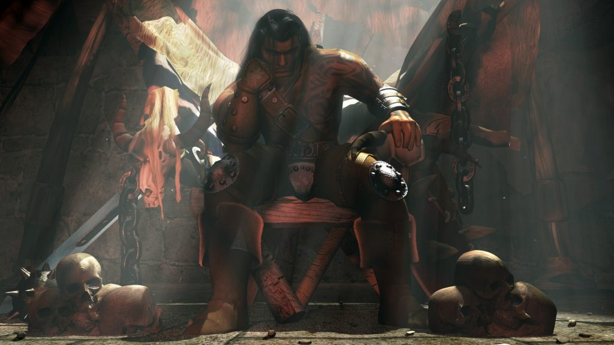
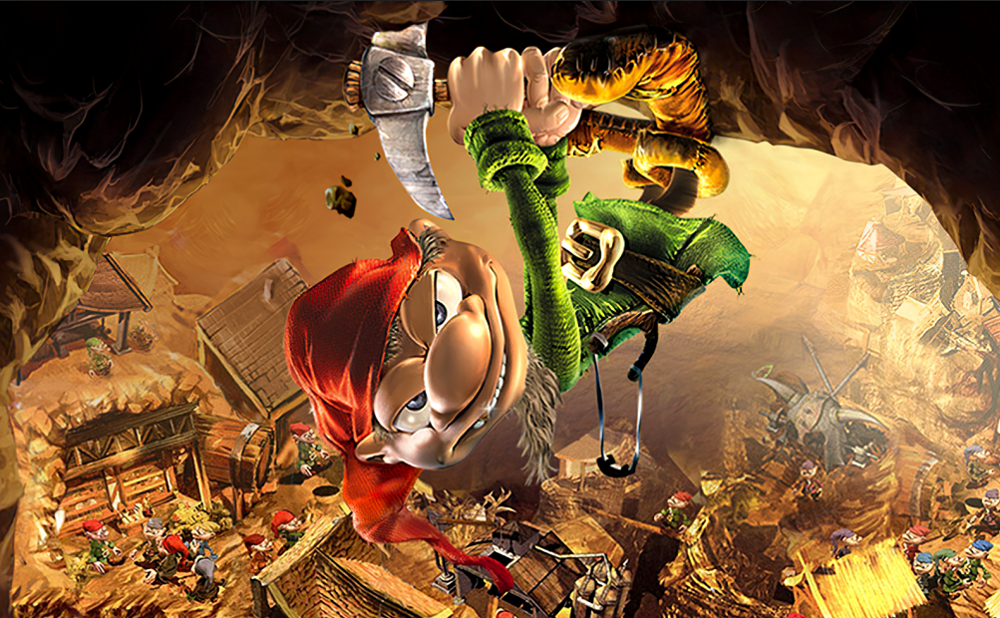
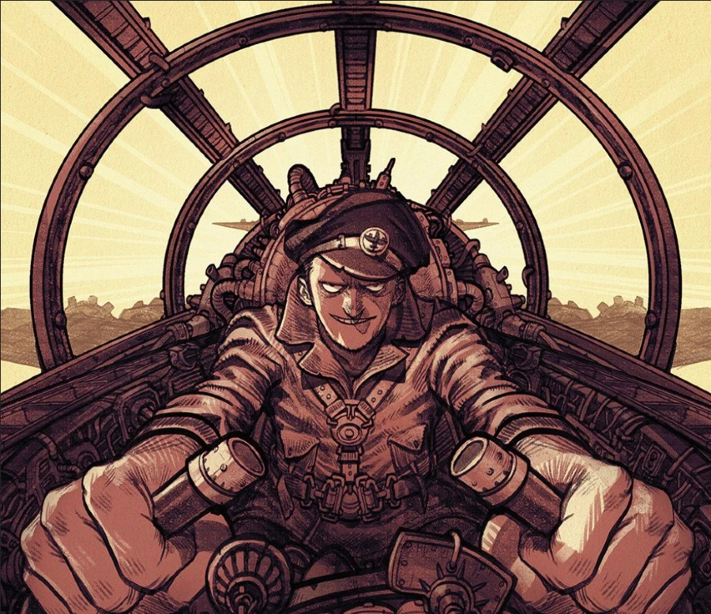
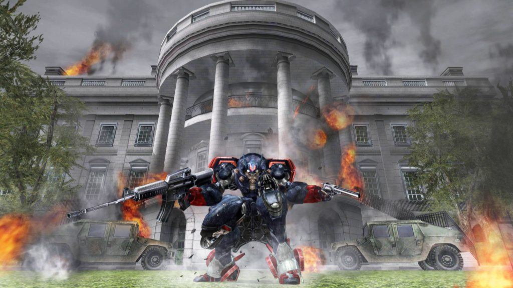
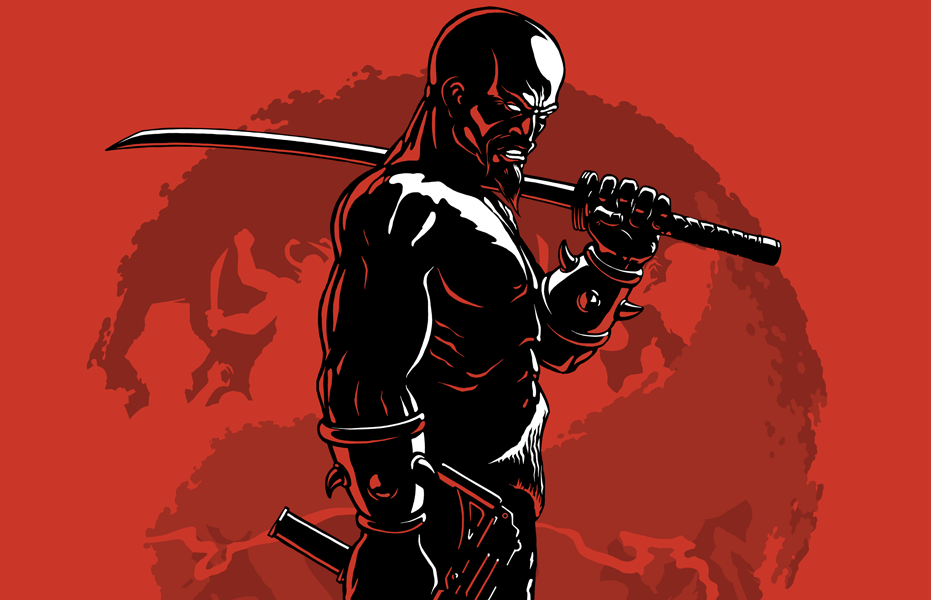
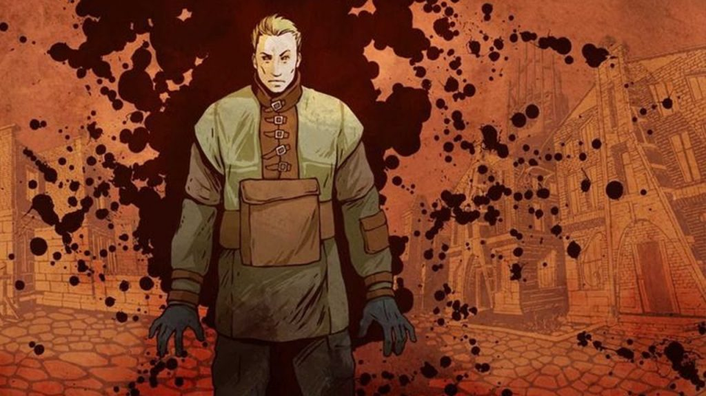
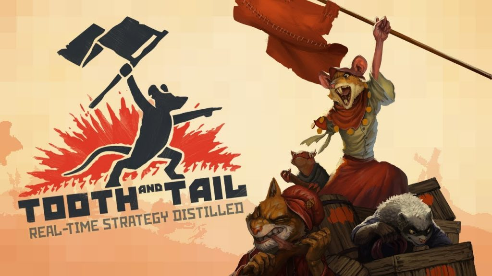
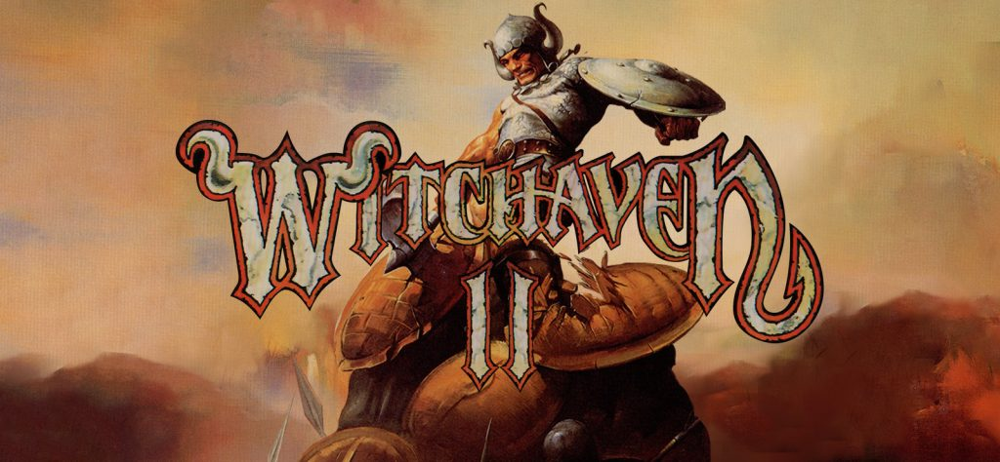

Steam Lunar New Year Sale 2022 is in full swing until February 3rd, giving everyone the opportunity to purchase a variety of games at incredible discounts! Many games that were ported and optimized by the General Arcade team also made it to the list…

A little tour of Steam low price territory during the Lunar New Year Sale 2022! After all, saving is not superfluous, right?

And the first game on the list is Blade of Darkness, a hardcore fantasy action-adventure game with unique combat mechanics and RPG elements that pioneered the Soulsborne genre. Choose one of four characters to slash and destroy the creatures of Chaos, now [33% cheaper](https://store.steampowered.com/app/1710170/Blade_of_Darkness/).

Back in the day, four people from General Arcade spent four months to help in bringing the legend back and let the people play it via Steam and GOG. [C++ and custom engine were used](https://generalarcade.com/project/blade-of-darkness/).

Blade of Darkness

Next on the list is [Diggles: The Myth of Fenris](https://store.steampowered.com/app/1478650/_/). This unique mix of strategy and adventure, based on Scandinavian mythology, woun’t leave anyone who appreciates everything fabulous and otherworldly, apathetic. And now you can help the Dwarves fulfill Odin’s request in the world of intricate dungeons for 50% cheaper.

Before the release of the game, our two software engineers, two QA engineers and a producer [worked tirelessly to prepare versions for Steam and GOG](https://generalarcade.com/project/diggles-the-myth-of-fenris/) using a custom engine, C++, TCL and Direct 11.

Diggles: The Myth of Fenris

And LUFTRAUSERS is now available on Steam with a 75% discount! Set the skies on fire and fill the seas with the wreckage of enemy ships! You can choose from over 125 combinations of weapons, aircraft hulls and engines, but you have one task — take to the skies and sow the death, [destroying enemy fighters, battleships and submarines](https://store.steampowered.com/app/233150/LUFTRAUSERS/).

During the game development, General Arcade [was working on Android version of LUFTRAUSERS](https://generalarcade.com/project/luftrausers/). Our software engineer spent two months working with the custom engine, C++ and OpenGL/OpenGLES2.

LUFTRAUSERS

US is in danger: Vice President Richard Hawke and his robotic squads have unleashed a full-blown revolution, and only President Michael Wilson can stand up for the country… This is the world of Metal Wolf Chaos XD, which is [up to 50% off during the sale](https://store.steampowered.com/app/820630/Metal_Wolf_Chaos_XD/).

It was our guys who made a [new, modified version of the game](https://generalarcade.com/project/metal-wolf-chaos-xd/). And it was really hard to do it… It took five software engineers, two QA engineers, a producer, an artist and two 3D modelers who worked for sixteen months! Modified PhyreEngine, C++ and FMOD were used, as well as Direct3D 11 for Xbox One and GNM for PlayStation 4.

Metal Wolf Chaos XD

[OlliOlli](https://store.steampowered.com/app/274250/OlliOlli/), the next game on the list, is already something completely different. It’s a unique mix of quirky gameplay, stylish graphics, over 120 tricks and 250 challenges to complete in different modes across 50 well thought out maps. The discount on the game during the sale is 80%!

The game was originally made for PlayStation Vita, and it was General Arcade that was responsible for [porting it to personal computers](https://generalarcade.com/project/olliolli/). We share the recipe – two software engineers, three months, own engine, C ++ and OpenGL.

The next game is known to all fans of first-person shooters! [Shadow Warrior Classic Redux](https://store.steampowered.com/app/225160/Shadow_Warrior_Classic_Redux/), the final version of the cult classic! Classic Redux features updated graphics and two massive story additions. And now it’s also a 90% discount.

We must repent: [it was us](https://generalarcade.com/project/shadow-warrior-classic-redux/) who helped the corporations consolidate their authority over all areas of life in Japan, and it was us who advised them to hire “shadow warriors”, each of which, in fact, is a one-man army. Two General Arcade software engineers and an artist developed a modern port with improvements for PC and mobile devices using BUILD, C, C++ and OpenGL/OpenGLES.

Shadow Warrior Classic Redux

Next is Siege of Avalon: Anthology. Explore the Citadel of Avalon, the last remnant of the former glory of the Seven Kingdoms, in this isometric, story-driven fantasy RPG. The enemies have blockaded Avalon, and its few defenders are preparing for the final assault. And you will find out about all this [with 50% discount](https://store.steampowered.com/app/1558990/_/).

We worked with the [GOG and Steam versions of Siege of Avalon: Anthology](https://generalarcade.com/project/siege-of-avalon-anthology/). Two software engineers, QA engineer, producer and artist worked with Delphi, DirectX 11 and DirecDraw for two and a half months.

Ever thought about becoming the “King of the City”? The protagonist of the action game Marc Eckō’s Getting Up: Contents Under Pressure dreams about it relentlessly. But actually, for him this “title” means recognition as the most respected graffiti artist of his hometown. And as is usually the case, along the way, you will have to uncover the dark secret of the mayor and expose the corrupt government. Now you can do all this [at 90%(!) cheaper](https://store.steampowered.com/app/260190/Marc_Ecks_Getting_Up_Contents_Under_Pressure/).

Two General Arcade software engineers [helped to start this revolution](https://generalarcade.com/project/marc-eckos-getting-up-contents-under-pressure/). The guys spent two weeks working with the custom engine and C++ to get the game ready for release. In addition, support for modern resolutions, including widescreen, was added in the process.

Marc Eckō’s Getting Up: Contents Under Pressure

Another game that can now be bought for 90% cheaper is [Pathologic Classic HD](https://store.steampowered.com/app/384110/Pathologic_Classic_HD/), the final version of the original horror game. But to be honest, no discounts will help you survive in a plague-ridden steppe town… Try to take on the role of one of three healers trying to resolve an unresolvable conflict. Think you can do it? Oh, and follow the quarantine!

Two of our software engineers [worked on Pathologic Classic HD for three months](https://generalarcade.com/project/pathologic-classic-hd/) using custom engine, C++ and Direct3D9. Result: improved visual effects (added DOF, SSAO, bloom, motion blur, FXAA); integrated Steamworks features (achievements, steam cloud, trading cards); integrated GOG Galaxy features (achievements, overlay); added support for modern resolutions (including widescreen) and gamepad support.

Pathologic Classic HD

In strategy game Tooth and Tail, everything is not so gloomy, but you woun’t be allowed to live in peace here either. Assemble an army of flame boars, toxic skunks and trooper owls, build a base, raise an army and devour your enemies! It’s time to lead the revolution. [Now it is cheaper to do it by 70%](https://store.steampowered.com/app/286000/Tooth_and_Tail/).

Our software engineers (two of them, to be exact) have integrated Galaxy features (achievements, leaderboards, cloud saves) and Galaxy Crossplay (online multiplayer between GOG, Steam, PS4) into Tooth and Tail. [MonoGame, C# and Galaxy Crossplay were used](https://generalarcade.com/project/tooth-and-tail/).

Tooth and Tail

Impressed with variety of offered discounts already? There is more! Pacific General is a strategy game dedicated to the events on the Pacific front during World War II. Control the battle strategy, playing as a Nazi bloc or as the Allies, command the ground forces, air force and navy. [With a 50% discount, of course](https://store.steampowered.com/app/1741130/Pacific_General/).

And if World War II is not to your liking, then we offer Fantasy General from the same developers. You will find yourself in a world of heroes, swords, magic and amazing creatures. Fight the army of the Lord of Shadows and win on each of the many battlefields; gather your army, strengthen it, replenish it with warriors and equipment. [The game is now also 50% off](https://store.steampowered.com/app/1741120/Fantasy_General/).

For those who prefer real-time games to turn-based, we recommend War Wind II: Human Onslaught, where you will find many motorized, mechanized and other special units, interesting and thoughtful maps, and of course, the most balanced battles. [And also 50% cheaper](https://store.steampowered.com/app/1741150/War_Wind_II_Human_Onslaught/).

Finally, we have two role-playing slashers of Witchaven series. Take on the role of the knight Grondoval and prepare for bloody encounters with vile creatures and vicious warriors. Dare to plunge into the depths of Hell [in the first part](https://store.steampowered.com/app/1655410/Witchaven/) and stop the evil witch from committing a blood feud [in the second](https://store.steampowered.com/app/1655430/Witchaven_II_Blood_Vengeance/). Both Witchaven games are 60% off!

Witchaven II: Blood Vengeance

*Alexander Kurikh*
