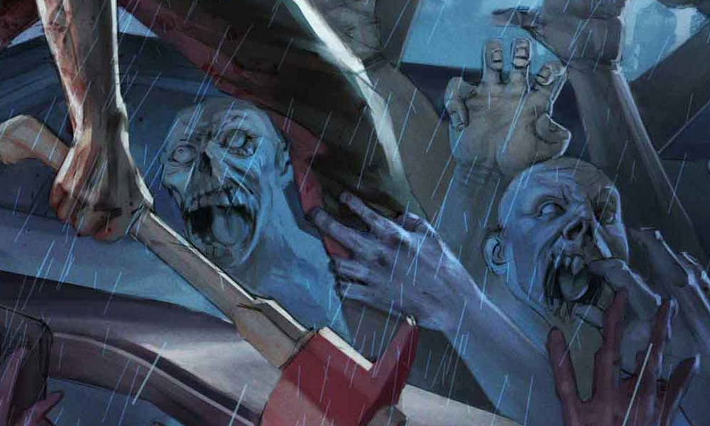

Great news for Project Zomboid fans! B41 MP Test 41.60 is released, and means that you can now try 16 player multiplayer, dedicated server, co-op game and lots of other delicious novelties.

We worked with The Indie Stone very closely for quite sometime to deliver multiplayer for Project Zomboid, and we are very happy that B41 MP Test 41.60 is finally here to make it possible to get all the very positive feedback from the players!

<figure class="aligncenter size-large"></figure>

You can read more about the new release on <a href="https://projectzomboid.com/blog/news/2021/12/b41-mp-test-41-60-branch-released/" rel="noreferrer noopener" target="_blank">official Project Zomboid website</a>. And we’re joining The Indie Stone in hoping you all have fun with the new version of the game!

