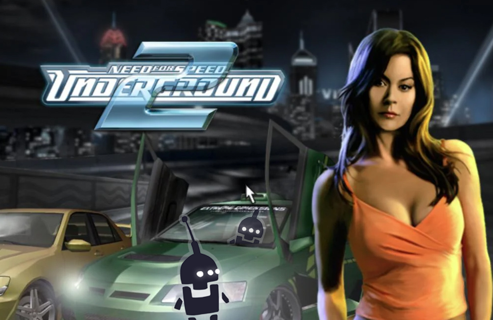

Need for Speed: Underground 2 needs no introduction. Even 18 (!) years later, this game is admired for its design, music, and gameplay. If you don’t think about the game’s unavailability in stores and potential problems with launching on modern systems, it’s still a good game. In the comments below the videos about the game people often dream of a remake. Each person imagines a remake of such a game quite differently, but one of the opinions deserves a separate blog post.

Russian programmer Ivan Novozhilov from Uglich town likes Underground 2 so much that he is developing the game’s remake himself. Here it should be clarified that Ivan is generally fond of programming, and in particular working on programming related to cars in video games.

Ivan has a <a href="https://www.youtube.com/channel/UC2iKJPXiC7vFyBsynfd_XNg/videos">YouTube channel</a> where he gives detailed tutorials on Unreal Engine 4 related to car programming. All the videos are subtitled in Russian and English.

<iframe allowfullscreen="allowfullscreen" frameborder="0" height="315" src="https://www.youtube.com/embed/ubi3ZsjPMpc" title="YouTube video player" width="560"></iframe>

Ivan’s assistant runs a second channel, which will attract the attention of not only those who are interested in game development. The 2Unreal4Underground project has already received twelve thousand subscribers and hundreds of thousands of views. The remake of Underground 2 on Unreal Engine 4 looks so good that there’s simply nothing to talk about, you need to see it for yourself.

<iframe allowfullscreen="allowfullscreen" frameborder="0" height="315" src="https://www.youtube.com/embed/Htf_YEFWfrE" title="YouTube video player" width="560"></iframe>

