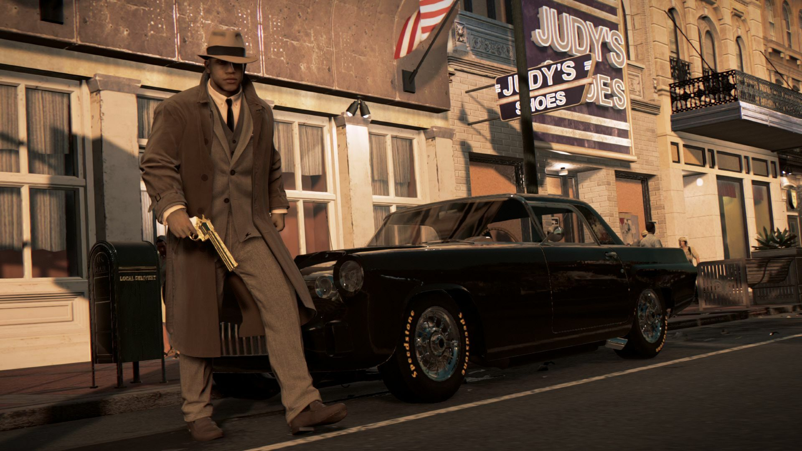

**Mafia: Definitive Edition**  
Re-made from the ground up, rise through the ranks of the mafia during the Prohibition-era. After an inadvertent brush with the mob, Tommy Angelo is reluctantly thrust into the world of organized crime. Initially uneasy about falling in with the Salieri family, the rewards become too big to ignore.

**Mafia III: Definitive Edition**  
After years of combat in Vietnam, Lincoln Clay’s surrogate family, the black mob, is betrayed and killed by the Italian Mafia. Lincoln builds a new family on the ashes of the old, blazing a path of revenge through the Mafioso responsible.



General Arcade specialists have spent approximately 3 weeks to complete the full Galaxy integration and perform a fine QA job.


  
  
  
  


