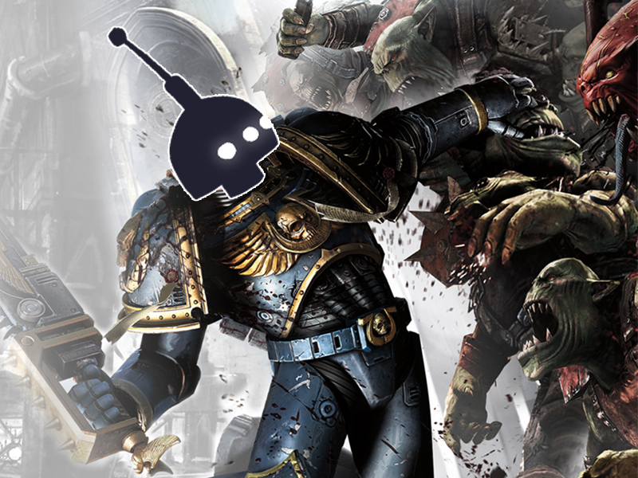
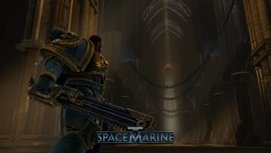

In Warhammer 40,000: Space Marine you are Captain Titus, a Space Marine of the Ultramarines chapter and a seasoned veteran of countless battles.

A millions-strong Ork horde has invaded an Imperial Forge World, one of the planet-sized factories where the war machines for humanity’s never ending battle for survival are created. Losing this planet is not an option and be aware of the far more evil threat lurking large in the shadows of this world.

DEVASTATING WEAPONRY 
Experience 40,000 years of combat, evolved. Enhance your vast arsenal as you unlock new weapons, upgrades, armor &amp; abilities through an accessible progression system. This devastating weaponry empowers players to deliver bone crushing violence and dismemberment to their enemies.

BLOCKBUSTER ENTERTAINMENT 
With an Imperial liberation fleet en-route, the Ultramarines are sent in to hold key locations until reinforcements arrive. Captain Titus and a squad of Ultramarine veterans use the bolter and chainsword to take the fight to the enemies of mankind.

<iframe allowfullscreen="allowfullscreen" frameborder="0" height="315" src="https://www.youtube.com/embed/EZ-4wt5SZ9A" title="YouTube video player" width="560"></iframe>

General Arcade specialists have spent approximately 1 month to complete the full Galaxy integration and perform a fine QA job. The game uses a custom proprietary engine, but our team has a lot of experience with this type of work, so we did it in the shortest possible time (one and a half month).

<figure class="gallery-item">

<figcaption class="wp-caption-text gallery-caption" id="gallery-1-1716">
				Warhammer 40,000: Space Marine
				</figcaption></figure><figure class="gallery-item">

<figcaption class="wp-caption-text gallery-caption" id="gallery-1-1717">
				Warhammer 40,000: Space Marine
				</figcaption></figure><figure class="gallery-item">

<figcaption class="wp-caption-text gallery-caption" id="gallery-1-1718">
				Warhammer 40,000: Space Marine
				</figcaption></figure><figure class="gallery-item">

<figcaption class="wp-caption-text gallery-caption" id="gallery-1-1719">
				Warhammer 40,000: Space Marine
				</figcaption></figure><figure class="gallery-item">

<figcaption class="wp-caption-text gallery-caption" id="gallery-1-1720">
				Warhammer 40,000: Space Marine
				</figcaption></figure><figure class="gallery-item">

<figcaption class="wp-caption-text gallery-caption" id="gallery-1-1721">
				Warhammer 40,000: Space Marine
				</figcaption></figure>

 

 

