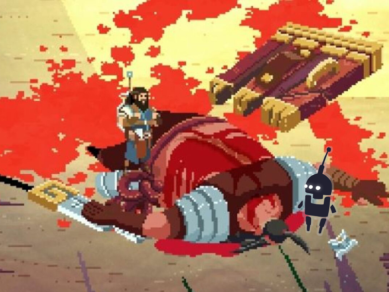

We are very happy to announce that our team is working on the Switch port! <a href="https://twitter.com/GlitchFTY">Glitch Factory</a> and <a href="https://twitter.com/YsbrydGames">Ysbryd Games</a> have made an amazing game and we can’t wait to bring it to your consoles.

<iframe allow="accelerometer; autoplay; clipboard-write; encrypted-media; gyroscope; picture-in-picture" allowfullscreen="" frameborder="0" height="315" src="https://www.youtube.com/embed/QP1fpfRPIFA" title="YouTube video player" width="560">No Place for Bravery is a 2D top-down action RPG which weaves together high-quality visuals, a stirring soundtrack and intense combat moments into a deep and affecting tale of moral dilemmas and personal reflection of choices. YOUR choices.</iframe>

<em>No Place for Bravery is a 2D top-down action RPG which weaves together high-quality visuals, a stirring soundtrack and intense combat moments into a deep and affecting tale of moral dilemmas and personal reflection of choices. YOUR choices.</em>

<em>The game will focus on parries and fast-paced combat. Making mistakes will be punishing and you’ll experience a lingering sense of fragility while facing the dangers of Bravery’s world.</em>

<em>Thorn, a retired warrior plagued by nightmares, stumbles on an opportunity for redemption after finding clues to his daughter’s disappearance from long ago. With the company of his disabled foster son, Phid, it will be up to the player to decide how far Thorn will go, not only to rescue his daughter but also to fulfill his ambitions.</em>

<em>The story of Bravery carries a strong message on the role of parental figures and the consequences of their choices in a troubled world. This message is informed by the developers’ personal life experiences, and the game aims to impart these real, resonant feelings with competence and depth.</em>

<em>Thorn is a competent warrior in a world where people like him perish all the time. Under your control, Thorn will have the capacity to kill and survive from the word go, but you should expect to find Thorn’s fragility starkly reflected in your own series of likely defeats.</em>

<em>A captivating blend of the low fantasy setting, highly detailed pixel art, and beautiful hand-painted textures makes this decrepit world croak with breathtaking life, as Thorn carves his path through it. Every second that passes in No Place for Bravery pulses with an immersive, intense atmosphere that you’ll feel in your veins.</em>

