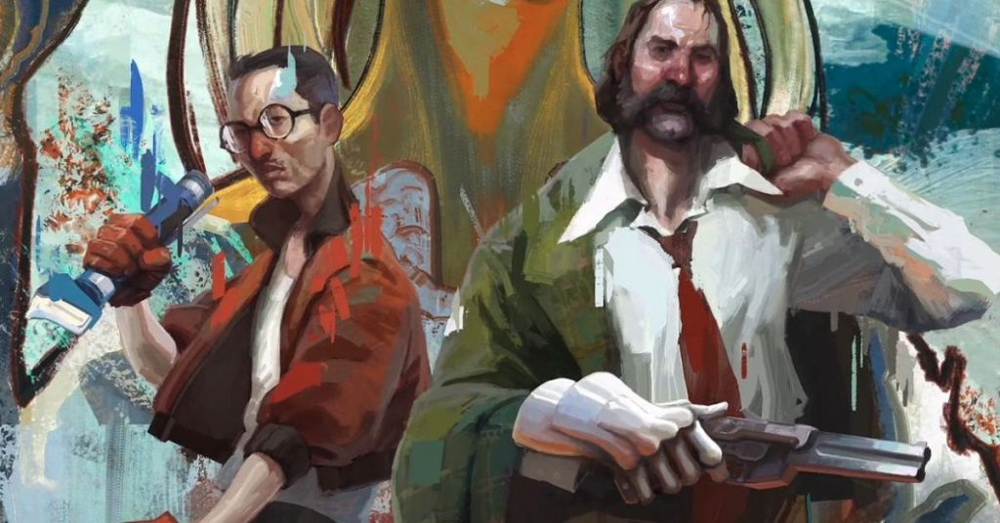
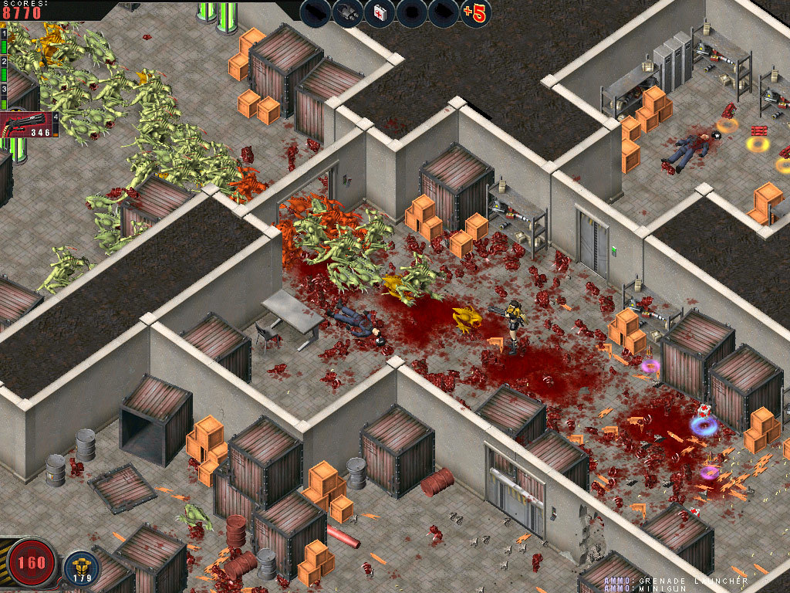
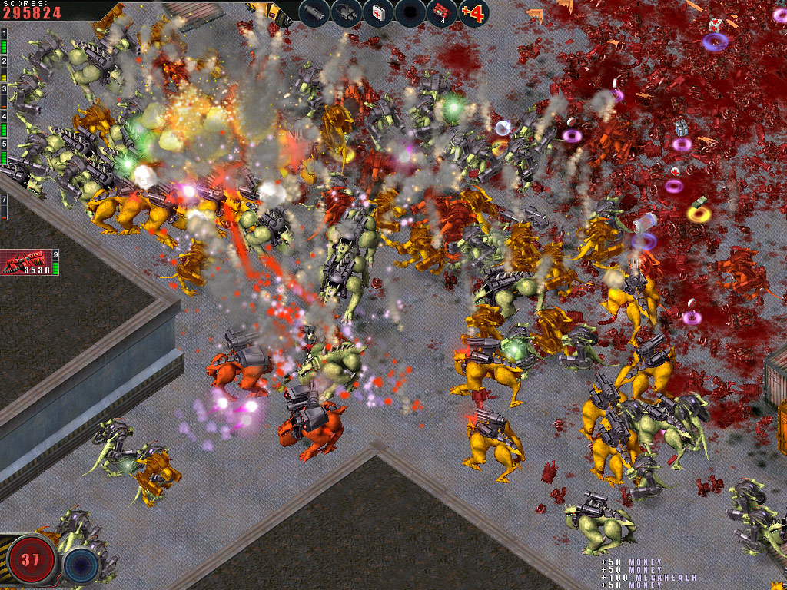
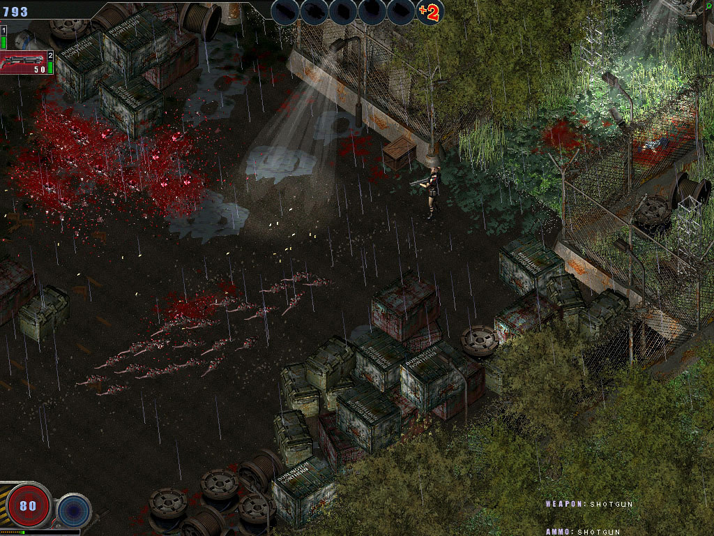

We are very glad that the articles on our website don’t go missing, and the fact that we get feedback from our readers is always a pleasure. This is the fifth time that we look at the most notable games created in the territory of the former Soviet Union, and this article is slightly different from those before.

The fact is that all the games included in this part of our anthology are those about which our readers asked, “Why did you forget about this game?” Of course, we would have remembered about some of them ourselves, but it’s not in our rules to appropriate other people’s merits. So this article was written entirely “at your requests”!

The first game that we couldn’t miss in any way is Disco Elysium. This RPG was developed and released by the Estonian studio ZA/UM and was released in October 2019. The creation of the Estonian programmers received extremely high marks from both critics and players – the RPG fans especially noted the narrative and dialogues.

<iframe allow="accelerometer; autoplay; clipboard-write; encrypted-media; gyroscope; picture-in-picture" allowfullscreen="" frameborder="0" height="315" src="https://www.youtube.com/embed/UWWA1jnI5N4" title="YouTube video player" width="560"></iframe>

Disco Elysium also got several very prestigious awards from various organizations and publications, which looks quite logical once you take a look at the general reaction of the gaming community around the world, and was even named the best game of 2019. Another thing that ZA/UM could never complain about is the sales, since a little more than a year after release, the number of sold copies reached a million.

The lead author of Disco Elysium was writer named Robert Kurvitz, who said that the main source of inspiration for him was the classic games made on Infinity Engine – Planescape: Torment, for example. In 2016, he founded ZA/UM studio to work on a game based on a tabletop RPG setting he created. And as a result, the world hit of video games appeared.

And by the way, in 2020 the development of a TV series based on the game was announced, so the work of the amnesic alcoholic cop you control in Disco Elysium will live on!

<figure class="wp-block-image size-large"></figure>

The second game on today’s list is Loop Hero, an incredible retro game from the Russian studio Four Quarters, which was released as recently as March 2021. The main feature of the game is its incredible style, since the developers managed to create an absolutely incredible and trully unique mix of the most modern trends in the gaming industry and visual studies that make you believe that you’ve returned 35-40 years back.

An unusual mix turned out in terms of genre as well: Loop Hero is a roguelike game that managed to organically accommodate various elements of RPG, collectible card game and even a city-planning simulator. The game world is a looped path on which there is a bonfire, and the protagonist walks along this path completely independently, fighting against monsters that come his way.

<iframe allow="accelerometer; autoplay; clipboard-write; encrypted-media; gyroscope; picture-in-picture" allowfullscreen="" frameborder="0" height="315" src="https://www.youtube.com/embed/G37bO9vg8RY" title="YouTube video player" width="560"></iframe>

The developers also approached the role of the player in an original way. The fact is that you cannot influence the actions of the hero, but you can change the world around him, making the life of protagonist easier or throwing him new tests to make him stronger. In general, the game received positive reviews from critics, but they were far from the audience’s reaction – players who needed something non-standard showered the Four Quarters and their creation with flowers and laudatory odes.

Actually, all of this is perfectly reflected by the statistics – on the very first day after release, 32 thousand players simultaneously played the game, and in just a day the game was played by 150 thousand people.

<figure class="wp-block-image size-large"></figure>

Another game that should never be overlooked is Planet Alcatraz, released by 1C studio in 2006. The game was based on Dmitry Puchkov’s book “Dungeon orderlies”, which, in turn, is fanfiction based on the cult shooter Quake from id Software.

The protagonist of Planet Alcatraz is a fighter of the “Ghoul” reconnaissance and sabotage group, a Space Marine named Boar. The game takes place on the prison-type planet Matrosskaya Tishina, all the inhabitants of which are criminals who were exiled there for life for grave crimes. The goal is to control a sabotage group, consisting at the beginning of one, and then of several characters, to complete the task given at the beginning of the game – to find and destroy the spaceship under construction, on which the convicts want to escape from the planet.

<iframe allow="accelerometer; autoplay; clipboard-write; encrypted-media; gyroscope; picture-in-picture" allowfullscreen="" frameborder="0" height="315" src="https://www.youtube.com/embed/ULog4APcoSc" title="YouTube video player" width="560"></iframe>

By the way, there is one very interesting fact about this game. As we have already noted, Planet Alcatraz was based on the book “Dungeon orderlies”, the first version of which was released back in 1999. And one of the episodic characters of this very book (Grand Admiral Cookie, to be more precise) was written off from <strong>Alexander “Cookie” Kurikh</strong>, who was a professional Quake player back in the days, and now, by the will of fate, works for <strong>General Arcade</strong>, and also writes this article… And at the same time he also loves to brag.

However, you can’t boast forever, so let’s drive further – in every sense of the word. Released in April 2001, the truck driver simulator “Truckers 2” from the Novosibirsk studio SoftLab-NSK has swept the game charts quite loudly for twenty years, having received many laudatory reviews. Critics especially noted the open world, the game’s soundtrack and the very concept that the developers used – including such an element of the game as the fragility of the cargo and all kinds of surprises like accidents, sudden quests or road bandits.

The meaning of the second “Truckers” game is the player’s development of his own cargo transportation company and the employment of truckers under his leadership. The gameplay is completely continuous, without interruption for individual missions or any plot pauses. The game has a change of day and night, and it is also possible to set the probability of rain and wind.

<figure class="wp-block-image size-large"></figure>

It all starts when the player doesn’t have a single employee and has to do everything with his own hands. You have only $40,000 at your disposal, of which you need to create serious capital, making your own “transportation empire”. In each settlement there are bases from where it is required to transport goods to other settlements in the same area, but at the same time you need to bypass all competitors in which you will not have a shortage.

Curiously, “Truckers 2”, one might say, was released twice. After the original release, a seriously updated version went on sale, in which the developers corrected many points, taking into account the wishes of the players themselves. For example, a fundamentally new realistic refueling system appeared, it became more convenient to repair cars and buy improvements for the trucks, several new cars appeared, and so on. Many fans of the car simulator genre consider the second part of “Truckers” to be the best in this series.

Well, since we are talking about auto-simulators, let’s continue. Next in line is UAZ Racing 4×4, a sporty off-road vehicle driving simulator on rough terrain from Avalon Style Entertainment. In fact, the game has a fairly simple arcade physics, which almost doesn’t reflect the real behavior of the car, but the players didn’t like it less because of this – although the critics, in turn, drove through the realism of UAZ more than once.

<iframe allow="accelerometer; autoplay; clipboard-write; encrypted-media; gyroscope; picture-in-picture" allowfullscreen="" frameborder="0" height="315" src="https://www.youtube.com/embed/2dLDOVwvVxE" title="YouTube video player" width="560"></iframe>

Talking about the pluses, many noted how the car damage model and the financial scheme used by the authors were implemented. Money to repair your steel horse can be earned in races, and in addition to repairing this same money is spent on installing additional equipment and improving the engine, transmission, roll cages, winches and other things.

As you might guess from the name, in UAZ Racing 4×4 there are only UAZ cars, but the game doesn’t suffer from a lack of choice. As, by the way, it doesn’t suffer from the lack of choice of the type of competition: you can try trial, trophy-raid, orienteering or off-road sprint. Perhaps, the majority of UAZ Racing 4×4 fans love this game precisely for the opportunity to choose.

And the ending of our today’s story will be “paired”. The games Alien Shooter and Zombie Shooter from the Tyumen company Sigma Team really stand together – especially since one is made on the engine of the other, although the developers had the opportunity to use more modern version. But let’s talk about everything in order.

<figure class="wp-block-image size-large"></figure>

In September 2003, Alien Shooter came out, an arcade action game with RPG elements. In the annotation, the players were promised to get “endless darkness, gloomy long passages of the military complex, which became a place of residence of evil, thousands of bloodthirsty monsters that fill its offices, as well as warehouses and research laboratories” – which, in general, is not so different from the promises, which are given by the makers of almost all action games.

The players were asked to take on the role of a space paratrooper, but the game itself basically boiled down to the destruction of hordes of monsters attacking him by all possible means. In the course of the game, you also had to perform simple missions to find explosives, turn on electricity, mine various objects and the like, but the main feature of the game was still a huge amount of blood and gore of aliens that you had to destroy.

<figure class="wp-block-image size-large"></figure>

Although the game is a two-dimensional arcade, the player can still directly interact with the material world around him, in particular, the player can move various objects (chairs, barrels, explode gas cylinders) and break monitor screens. In addition, as a result of being hit by shells when fired, for example, into a wall, marks remain on it. Also, the graphical characteristics of the game create dynamic lighting. But the main thing, after all, was the already mentioned cruelty, with which it was necessary to destroy the opponents!

Alien Shooter has three add-ons, and in addition, there is Alien Shooter 2, which used an improved engine, role-playing elements and a full-fledged storyline. However, we would like to recall not a direct sequel, but another action game from Sigma Team, Zombie Shooter. The fact is that this 2007 game used the engine of the first part of Alien Shooter, although Alien Shooter 2 was already out. According to the developers, this move was made because Zombie Shooter was originally created for shareware sales, and the authors themselves never considered this game a particularly large project. Therefore, for the most part, we are also talking about these games “in pairs”.

<figure class="wp-block-image size-large"></figure>

There was no plot as such in Zombie Shooter, and the players had to be content with what was written on the official page of the game – humanity is in danger again, because scientists screwed up again and created zombies. Who, of course, definitely want to take over the whole world!

The game has four characteristics of the hero: health, strength, speed and accuracy. These stats can be augmented with experience points given for killing zombies, and they brought a small RPG element to Zombie Shooter. But the main thing that brought fans to the shooter was the same as in Alien Shooter. Gore! Gore, blood, cruelty and a variety of ways to destroy everyone. This is what helped the game stay afloat in the sea of ​​much more serious competitors. And this is precisely the reason that we are talking about these two shooters together.

Perhaps for today this is all that we would like to talk about. And to be honest, we would be really glad if another article appeared in this series, which would again be written based on your questions 😉

<em>Alexander Kurikh</em>

