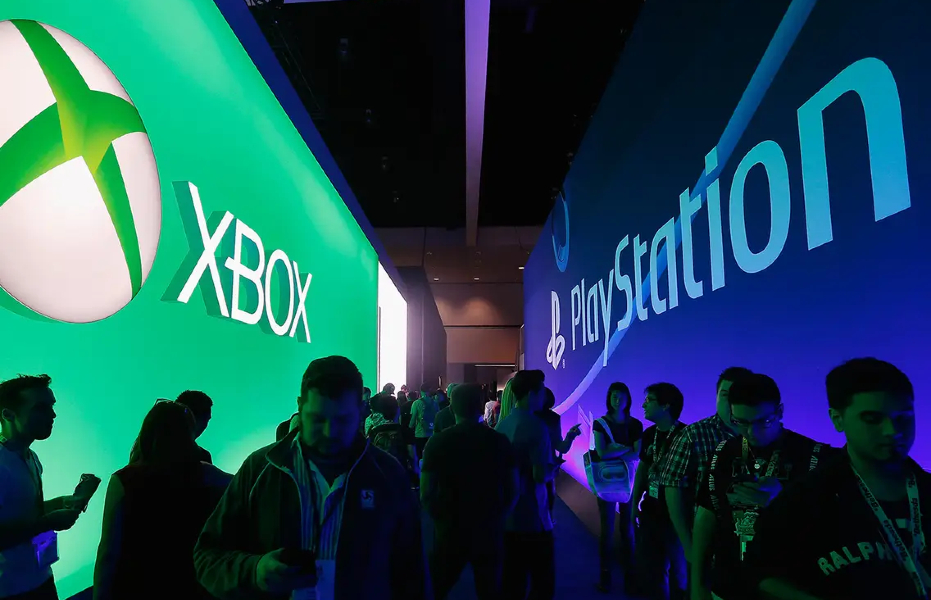
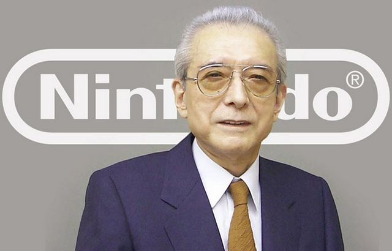
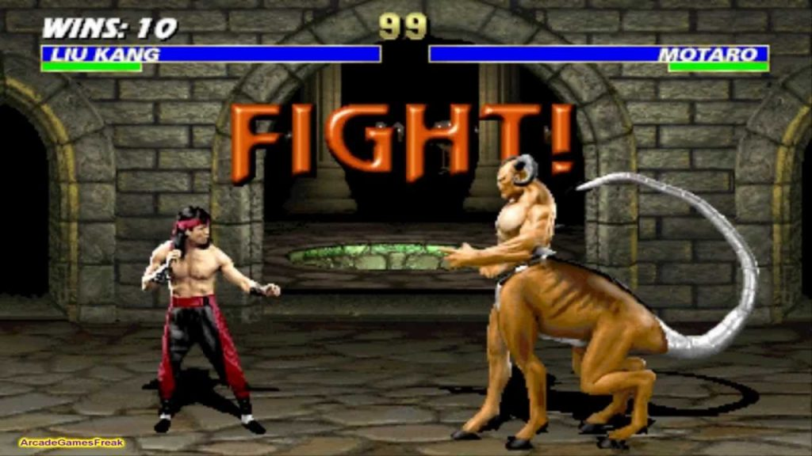

Nowadays, the “war” between game consoles from Sony and Microsoft became common thing for everyone, and fans of this or that company are eagerly awaiting what exclusives will be announced in new season. But let’s figure out, how did it all start.

The first Sony PlayStation was introduced in Japan on December 3, 1994, but Sony’s journey into the game console world began several years earlier. Super Nintendo Entertainment System, which appeared in November 1990, used Sony SPC700 sound processor. By the way, it was originally an initiative from Sony, or more precisely, Ken Kutaragi, founder of Sony Computer Entertainment and then CEO of the company.

It was thanks to the efforts of Kutaragi that Sony’s board of directors approved the development of the PlayStation a couple of years later, but let’s not get ahead of ourselves.

At the turn of the eighties and nineties of the last century, the CD-ROM standard developed by Sony in cooperation with the Dutch company Philips was becoming more and more popular, and Sony was not going to stop there. As an extension of the format, the CD-ROM XA technology was created, which the company suggested to Nintendo to use in the console SNES-CD, which never seen the light. The signing of a new contract between Nintendo and Sony was supposed to be announced at Consumer Electronics Show 1989, but couple of weeks before the show, Nintendo “backed down”.

The reason for this was that Sony turned into better position – for example, the company received complete control over the licensing of SNES-CD products, which didn’t suit the president of Nintendo Hiroshi Yamauchi at all. In addition, Nintendo, which at that time was tightly holding the leadership in the game consoles market, would get a competitor, because Sony was going to launch its own console as part of the collaboration. And let’s be honest – partnership is partnership, but keeping a monopoly is always more pleasant and profitable.

So on the opening day of CES 1989, Howard Lincoln, the director of Nintendo of America, announced not a common initiative with Sony, but the fact that the company wants to terminate all cooperation with Sony! All existing joint projects were also closed, and Philips became the new partner of Nintendo on the field of game consoles.

According to the official comments of Sony, Lincoln’s loud announcement came as a surprise not only to the public and the media, but also to the company itself – especially since the day before it had announced the start of work on the PlayStation console. And this work, according to Sony’s ideas, was to take place in close cooperation with Nintendo. In particular, Sony seriously hoped for games that were originally developed for the SNES – after all, a console for which no one ever made a single game will clearly not be the best-selling product…

After the unpleasant news from Nintendo, Sony decided to completely terminate the work in the gaming market, since the costs of the calculations did not justify the possible profit. And then the aforementioned Ken Kutaragi came into play again: according to the information published after, it was he who convinced the Sony board of directors to take the risk of entering the world of computer games. And it was decided to start work on the first version of the PlayStation without any help from Nintendo.

It is curious that the originally created Sony PlayStation console has almost nothing in common with Sony PlayStation that was released as a result. The first console was ready for release in 1991, but Nintendo completely banned the licensing of its games through the court. The litigation lasted more than a year, and the former partners came to an agreement only at the end of 1992 – Sony still received the rights to use SNES games, and Nintendo received a percentage of the profits for this, and could also continue to use the Sony SPC700 as a sound chip for SNES.

But a spoon is dear when lunchtime is near, and while the companies were suing and sorting out the rights to the games, Sony decided that SNES was already out of date. So in 1993, development began on a completely new console that used the original PlayStation only as “the base”. Marketing specialists didn’t sit around all this time: negotiations with various development studios were carried out without interruption, and as a result, the new console received many “own” games, which were not ported versions of games for the console from Nintendo.

According to media reports, by 1995, when the first PlayStation went on sale in the US and Europe, Sony signed contracts with more than 250 developers, from big companies like Midway Games, Williams, Namco or Konami, to small indie studios (however, this number never was officially confirmed). As a result, the new console received a solid set of games at release, from Mortal Kombat III and Doom to Ridge Racer and Battle Arena Toshinden. In addition, Sony bought European company Psygnosis, which was renamed Sony Interactive Entertainment and began work on WipEout and Destruction Derby.

The purchase of Psygnosis, by the way, was a very important moment for the development of Sony consoles. This company worked with SN Systems to publish a development software called PSY-Q. While Sony originally planned to use its own R4000 based game development kit, PSY-Q became an alternative after partnering with it. An agreement with SN Systems owners Andy Beveridge and Martin Day was signed at Winter Consumer Electronics Show 1994.

The main competitors for PlayStation were Sega Saturn, which was released around the same time as the Sega Genesis successor, and Nintendo 64, which went on sale in July 1996. But neither Sega nor Nintendo managed to surpass Sony in terms of sales and popularity, not even in Japan. Microsoft, which is now considered the main – yes, in fact, the only! – competitor to Sony in the field of game consoles, didn’t even start to think about this market.

For the first time, Microsoft thought about game consoles at the end of the nineties, but initially the ideas in this area were far from creating their own console. In 1999, the company came up with a proposal to install Windows operating system on the leading consoles of that time, and the first developer to agree to such experiment was Sega. A redesigned version of Windows CE was delivered to the Dreamcast, released a year earlier (in 1998), but the innovation didn’t get much response, so it was decided to close the project.

However, it was something that gave rise to the next idea, console games using DirectX. The fact is that the Dreamcast with Windows allowed to run some of these games, and after evaluating the possible advantages, the development team decided to turn to Bill Gates with a project to create their own game console – DirectX Box.

Not everything, however, went smoothly, and one of the creators of the original Xbox, Ed Fries, even said in an interview to IGN that the head of Microsoft took this idea with skepticism. Moreover, according to Fries, the owner of the corporation literally yelled at the team that prepared the materials for the project, unflatteringly going through their mental abilities and benefits for the company! However, after much debate, Bill decided to take the risk, and the Xbox developers received his blessing and an impressive budget. Apparently, after all, the opportunity to break into a new market seemed much more important than the possible risks to him…

It took less than a year to create the console, and in March 2000 Bill Gates personally presented the new Microsoft project to the public at the Game Developers Conference. By the way, did you know that “Xbox” is just a working title for the project? Initially, the new console was planned to be called completely differently, but in the end, they couldn’t choose anything out of several dozen options – for example, MAX (Microsoft Action Experience) or MIND (Microsoft Interactive Network Device) – and it was decided that “Xbox” sounds good enough.

The presented novelty looked very promising, and its insides (Intel Pentium III 733MHz, 64Mb DDR, NVIDIA NV20A) seriously bypassed the PlayStation 2 released a year earlier. But the real “console war” was still very far away, and Sony’s success remained a pipe dream for Microdoft. The reason for this was the game list. Sony PlayStation 2 boasted a substantial roster of high-profile titles and was also backward compatible with the first PlayStation, giving players even more choice!

And besides, the second PlayStation came out on March 4, 2000, and the “final” version of Xbox appeared in the US only on November 15, 2001, and in the rest of the world it was in 2002. So the new console from the American company still remained in the role of “catch-up” – classical psychology, if you already have an excellent console, why spend money on the new one? Especially one that cannot boast of a large selection of exclusive products – only ones of the “cult” franchises in the initial Xbox lineup were Halo and Project Gotham Racing.

As a result, the first version of the Xbox was sold in a circulation of 24 million units: it didn’t bring Microsoft close to 155.1 million sold Sony PlayStation 2, but allowed the Americans to bypass Nintendo with their GameCube (or GCN, as the console was called on West) and 21.74 million sales “from the first move”.

Well, the main thing was that Microsoft’s management was firmly convinced that the idea of ​​working with game consoles was damn profitable, and it was Xbox that started many initiatives, which Sony had to adopt later. It was decided to focus on the social component, since it was much more difficult to catch up with its main competitors precisely due to the list of games. As a result, the Xbox Live service was created, which made it easy to organize an online match with a live opponent, and then the Xbox Arcade store appeared, in which new games could be bought directly on the network – with this idea Microsoft even surpassed Steam.

And of course, quality. We already mentioned the serious superiority of Xbox over PS2 in technical terms, and it was Xbox that could display real Full HD on the TV screen. So multiplatform games looked much nicer on Microsoft consoles, which, of course, also became a significant plus in the brewing conflict between developers. And the Americans were already 100% ready for the next “round” (Xbox 360 vs. PlayStation 3).

*Alexander Kurikh*
