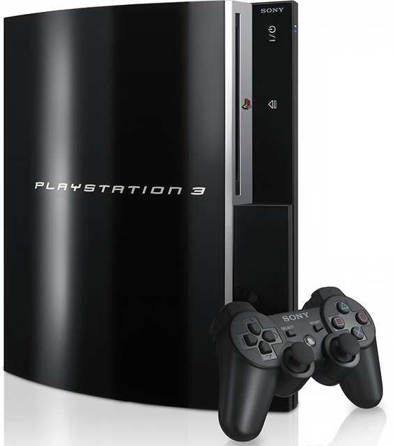
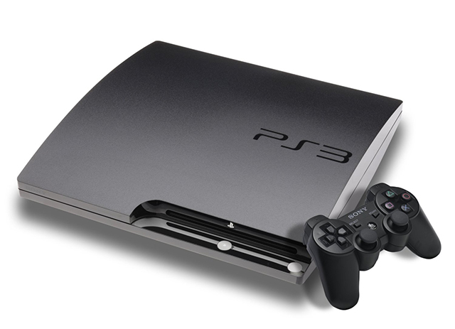

The beginning of the second stage of the confrontation between Sony and Microsoft on the game consoles market can be roughly called 2005, when Xbox 360 was presented on MTV. And if the previous generation, along with Bill Gates, was represented by Dwayne “The Rock” Johnson, this time Microsoft attracted the famous Hollywood actor Elijah Wood. And shortly after that, major presentation of the new console took place at E3.

Many experts are sure that it was this move by Microsoft that forced Sony to start developing PlayStation 3. PS2 was still selling well at that time, and it would seem that nothing boded ill, but the announcement of the imminent release of Xbox 360 was also a signal that Microsoft can get around them.

PlayStaion 2 is the best-selling video game console in the industry to this day (over 158 million consoles sold!), but no fan base would have helped Sony stay afloat if the company hadn’t responded to Xbox 360 release. If before that Microsoft was in the role of “catching up”, this time it was already 100% ready to “fight”. Moreover, considering that Xbox 360 was released almost a year earlier than the PlayStation 3, in November 2005.

During the already mentioned Xbox presentation at E3, Microsoft representatives stated that if their past consoles were something like “PC with console sauce”, this time they decided to move away from these canons. The x86 architecture gave way to PowerPC, and IBM triple-core processor, codenamed Xenon, was a major step – each core could handle two worker threads, so performance increased dramatically. In addition, an ATI video chip with a powerful Xenos solution with 512Mb of video memory was used.

By the way, PlayStaion 3 was first presented at the same E3 exhibition. Only a layout was shown, the company presented a preliminary working version only after, during Tokyo Game Show 2005. And only the next year at E3 2006 Sony held a big conference where they talked about the prices of new consoles, the estimated time of the start of sales, the Sixaxis controller, and so on. The players were able to test PS3 on TGS 2006.

Work on the next-generation console, of course, has been going on for some time, but an unexpected announcement from Microsoft clearly forced Sony to significantly speed up this process by allocating much more resources to the development department. They couldn’t catch up with the main competitor for sure, but Microsoft’s desire to be first played a rather cruel joke on them.

Early versions of Xbox 360 had terrible cooling problems, which inevitably led to overheating of the processor and GPU. So the number of complaints about burned out consoles was off the charts! Microsoft was able to finally solve this problem only with the release of the Xbox 360 Slim in 2010(!) — the console began to turn off automatically when the temperature approached critical. Which is also not the best option when you are about to send the main boss to the world of dead in another action game…

In addition, despite Full HD support, initially Xbox 360 didn’t even have HDMI port, and only the Pro version could boast of a hard drive, and even then it was only a modest 20Gb.

The rush was not the best for the consoles from Sony, but the problems weren’t so global. In Japan, the PlayStation 3 was released on November 11, 2006, a few days later (November 17), the console appeared in North America, and already in March 2007 it became possible to buy it in Europe — according to Sony representatives, the delays were associated with a lack of production capacity. The main problem for users was that some of the games of the first two versions of PlayStation didn’t work correctly on the new PS3, which is not nearly as bad as the regularly burning Xbox 360. The problem was eventually solved by updating the console software.

Initially, two versions of PS3 went on sale, and their main difference from each other was hard disk space: 20Gb in the cheaper version and 60Gb in complete set. The cheap version was popular in Japan for some time, but in Europe and North America it didn’t take root at all, so its sales were stopped on April 11, 2007. In the summer, Sony announced the start of sales of a new, improved model, the hard drive of which was already 80Gb. After that other modifications began to appear, allowing everyone to choose the most convenient option for themselves in terms of price and quality (40Gb HDD without support for PlayStation 2 games and without a built-in card reader, advanced version with 80Gb HDD with a DualShock 3 gamepad, and so on).

Microsoft also appreciated the PlaySation 3’s merits: Microsoft’s MSN portal, for example, wrote that “the PS3 is a versatile multimedia ‘harvester’ for the home that lives up to expectations”, and that the new console is “well worth the money spent on it”. Another popular portal CNET gave the new PlayStation an 8.8 out of 10 points and designated it as “the number one must-buy device”. In fact, even with the seemingly belated release of PS3, Sony has bypassed Microsoft again. Which, by the way, was also aided by the launch of the online PlayStation Store.

Microsoft, on the other hand, went all out, trying to bypass competitors — if not in terms of technical characteristics, then at least with various innovations. The creators of Xbox 360 were never afraid to experiment, and the release of the Kinect controller is a prime example of this. The general interest in wireless control in the market was largely driven by the overwhelming success of the Nintendo Wii, so everyone was looking that way. But if Sony with its Move almost completely copied the idea of a controller from Wii Nunchuk, Microsoft decided to go further, and there was no need to hold the Kinect at all! That basicaly started the idea of sensor controller as such.

This was a rather unexpected, but very successful step from Microfost: Kinect became the most popular gadget in the console industry, its sales by October 2017 exceeded 35 million, which is officially recorded in the Guinness Book of Records. And Kinect Adventures eventually became the best-selling Xbox 360 game, surpassing Forza and even Halo.

Another good idea from Microsoft was the development of the social dimension. The launched Live service collected game statistics, helped with the organization of joint matches, allowed to communicate with other gamers, and so on. But with what Microsoft miscalculated, it was trying to move away from console exclusives. Most of the games for Xbox 360 were either multiplatform initially, or became so over time, and in fact, one can name only one serious series that started on Xbox 360 — Gears of War (the second and third parts as well as Judgment were released only on Xbox 360, not a single game in the series ever came out on any Sony consoles).

It is believed that the Xbox 360 became a successful launching pad for many popular franchises (the first game of beloved by many to this day Mass Effect series, for example, was released on this console in 2007, reaching PlayStation 3 only in 2012), but for Microsoft this is rather weak consolation.

As a result, Microsoft still lost to the masters from Sony in their competition, although the PS3 started quite poorly and one year later. But at least the difference was no longer as noticeable as at the beginning of this war: 85.5 million Xbox 360 sales, just a couple of million less than Sony). By the way, Japan played a significant role in this, since PS3 was the best choice for most gamers over there. Microsoft has been very active in trying to break into this market by ordering two jRPGs (Lost Odyssey and Blue Dragon) from Final Fantasy creator Hironobu Sakaguchi. But even though both games received top ratings and great reviews, that didn’t help: only 1.6 million of Xbox 360 were sold in the Land of the Rising Sun.

The main result of the ongoing console carnage for the players themselves was a significant leap in attempts to overtake a competitor. No matter what anyone says, the engine of progress is not laziness, but the desire to become the best, bypassing all others both in quality of the products offered and in resulting profit (which is probably still the main thing). It was the showdown between Xbox 360 and PlayStation 3 that set the tone for the whole further struggle between Sony and Microsoft.

*Alexander Kurikh*
