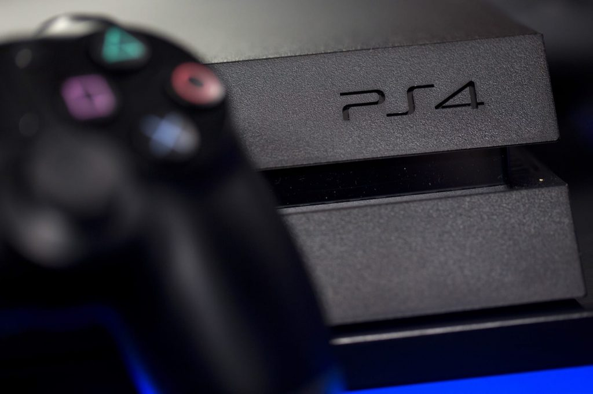
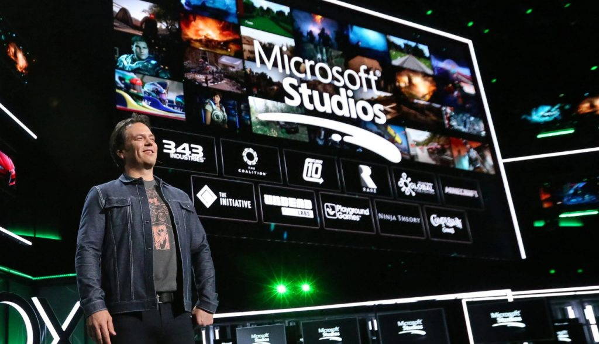
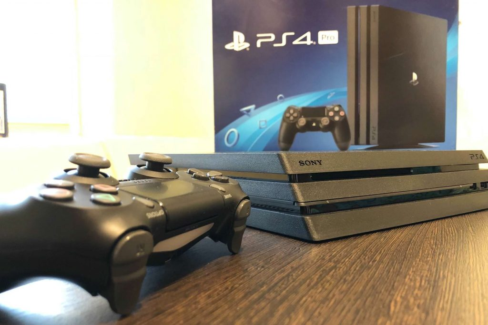

Once again, the third wave of the console war started in unusual way, but this time it was not about the release date. Xbox One and PlayStation 4 appeared on the market at about the same time (in the USA, for example, the difference in the time of the consoles sale start was only a week!), but the approach of the companies was different once again. Let’s start from the beginning.

The Xbox One was first introduced to the world at Microsoft’s own conference in 2013, and the developers had a lot of news for players. But the thing was that they weren’t really optimistic about that news… In the last article of this series, we already mentioned that Microsoft has never shied away from innovations, and this time the company also decided to try an innovative approach. Which consisted in the fact that Xbox One was announced not as an ordinary game console, but as a real media center, which, among other things, also made it possible to play the games.



Generally, the idea is very good, because it is much more convenient to bring all the entertainment together so that you don’t have to get confused in the countless number of devices and wires. Therefore, although most of the users were surprised by the announced news, it was by no means a failure. But the start of the actual game console that everyone was waiting for could be called a failure for sure. The original game lineup was downright sparse — Call of Duty: Ghosts, the Quantum Break teaser (the game itself was only released in April 2016!) and the EA Sports lineup.

The technical characteristics weren’t very impressive as well, the Xbox 360 looked much stronger at the time. The Xbox One, in turn, was inferior to the PlayStation 4 in performance, and besides, the Kinect version 2.0 also cut this performance by another 10% — and this is if you don’t pay attention to the fact that due to Kinect 2.0 the cost of the console has risen by $100. And finally, the Xbox One required a constant Internet connection to work, which in 2013 was also far from being as common as it is now.

All this together gave the expected result: a frankly weak start for the Xbox One. Even a gorgeous advertising campaign with the participation of Steven Spielberg, who promised to make a series based on Halo, didn’t help — we are talking not about the low-budget Halo 4: Forward Unto Dawn and Halo: Nightfall, of course, but about the one in which the main role was given to the star of “American Gods” Pablo Schreiber in 2019. And which has not yet been filmed (the last time they promised that everything will be ready by 2022, but it is far from the fact that there will be no more delays).

Sony, in turn, behaved as usual: their “calling card” was exclusively “solid quality”, and not any unexpected decisions. And if Microsoft’s path in the game console market has always been florid and interesting, with all sorts of attempts to surprise the whole world and with a wide variety of stars to attract attention, then Sony has simply always been a tank moving forward, and their only goal has always been to satisfy the needs of their customers.

Unlike the PlayStation 3, which was based on the Cell microprocessor architecture, the fourth console in this series used an AMD x86-64 APU with a peak performance of 1.84 teraflops. The included DualShock 4 game controller featured an integrated touchpad. In addition, the PS4 used the Orbis operating system, which is a modified version of FreeBSD 9.0. And most importantly, at the presentation that took place a little later than the presentation of the Xbox One, Sony separately focused on the fact that their new game console is just a game console, and not some kind of “home media center”.

Sony’s PlayStation Meeting 2013 event took place in New York on February 20, 2013, when the company announced the specifications of the new console and talked about the planned social features, which this time got quite a lot of attention. At the same time, the PlayStation 4 itself wasn’t shown to the public, and the exact release dates weren’t called, but the gamers didn’t have to wait for very long. By the way, the PlayStation 4 was the first console from Sony, which initially went on sale in the US and Canada, and not in Japan, as usual.

In the fall of 2016, Sony also released two new hardware versions of the console: the PlayStation 4 Slim with a much smaller size and the PlayStation 4 Pro, equipped with a more powerful processor and GPU with the expectation of the ability to display images and streaming video in 4K resolution. Considering all PS4 variants, 106 million consoles and 1.15 billion copies of games for them were sold worldwide by January 2020 — Sony more than doubled its main competitors result!

The reason for this is not difficult to find. During the development of the PlayStation 4, Sony worked very closely with a variety of game development studios. One of the most striking examples is perhaps Bungie. As the community manager of this company Eric Osborne later said, the main aspect of cooperation was the main systems of the console, its social functions, and, first of all, the controller, which the manufacturers wanted to make as convenient as possible for playing shooters. All for the sake of games!

But Microsoft, on the contrary, split production resources into several fronts. After all, they wanted to replace all the equipment in the house with their own Xbox One! And in the end they suffered a fiasco, since it is impossible to be everywhere at the same time. And most importantly, while chased the other tasks, Microsoft forgot about the main thing — to create a high-quality game console!

Essentially, the Xbox One had to get out of the hole, which began when Phil Spencer replaced Don Mattrick as Microsoft’s head of gaming. And the first step on the way up was the announcement of the backward compatibility of the console, made during the E3 2015 conference. After it became known that it will be possible to play games for the Xbox 360 and the original Xbox on the Xbox One, optimism among fans of consoles from Microsoft really increased — the library of available projects has expanded significantly! Even the almost complete rejection of exclusives (after all, the vast majority of Xbox One games were also released on personal computers, albeit some with a delay) was no longer so frightening.

The next move was the introduction of ID@Xbox, aimed at supporting humble indie studios. According to the information published afterwards, about 1,500 games from authors from seventy countries appeared on the Xbox One thanks to this program.

And finally, after sorting out the problems, Microsoft released the Xbox One S consoles to the market (the release took place in 2016, and the main differences from the original Xbox One were smaller dimensions and slight increase in performance, as well as support for HDR and higher resolutions that appeared) and the more powerful, yet more compact and quieter Xbox One X, presented during E3 2017 and capable of 4K@60fps for graphically advanced projects like Gears 5 and Forza Motorsport 7.

Microsoft’s decisions to develop the Xbox One turned out to be incredibly correct to capture the market, but one serious problem still remained… And the problem was that Sony did it all at the beginning! The Japanese corporation didn’t have to correct the mistakes made at the start of the console, they didn’t have to redo anything, their console met all the requirements of the players from the moment of the start. All this applies to working with game studios, socializing the console, and backward compatibility.

It is clear that the war of the consoles is primarily in the minds of users, and fans of Microsoft and its consoles will always remain. They usually use the claims that Microsoft is always looking for unusual solutions and tries to please everyone, over and over again, looking for non-standard approaches to players as the main arguments in favor of their chosen series. But whatever you say, the numbers always remain unforgiving. During the confrontation between the eighth generation consoles, or, if you prefer, the third wave of console wars, Microsoft sold only 50 million Xbox One consoles against 110 million PlayStation 4 (as of July 2020).

So it’s probably worth giving credit to Sony’s approach, whose representatives have always preferred clear, well-trodden paths along which you can go without turning anywhere. And while this option leaves journalists with a hell of a low amount of content to voice in a review article, the profits are clearly reassuring the company itself. Well, the victory this time, as you see, went to Sony. Moreover, it was a clear and completely unconditional victory!

By the way, much later one of the then leaders of Microsoft said that the company had absolutely no profit from the sale of game consoles. It was said as part of the trial in the case of Epic Games against Apple, which began in 2020. This statement, however, was rather strange…

A Microfost spokesman said that during Xbox One and PlayStation 4 sales, the company didn’t make any profit at all!

It sounds rather strange, of course, but the gaming industry quite often surprises the players… According to the announced statement, Microsoft didn’t earn a cent on Xbox One! According to Microsoft representative, the gaming business as such was quite a profitable and rapidly developing direction for Microsoft, but not its own consoles. This business option is quite often unprofitable and pays off through additional income and attracting new customers.

*Alexander Kurikh*
