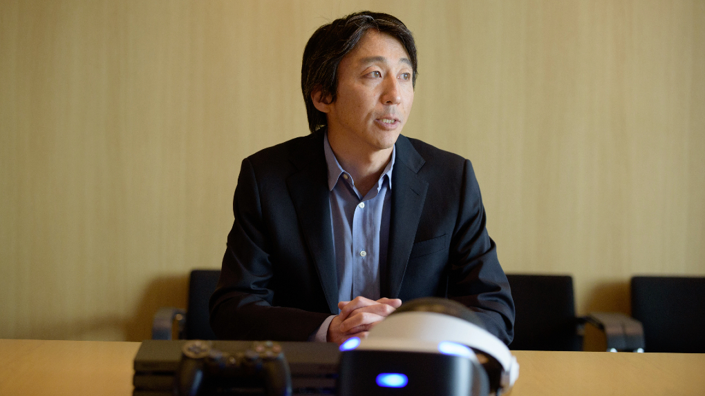
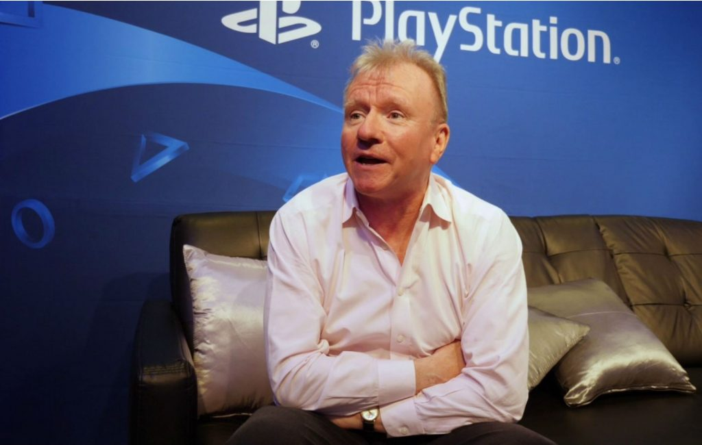
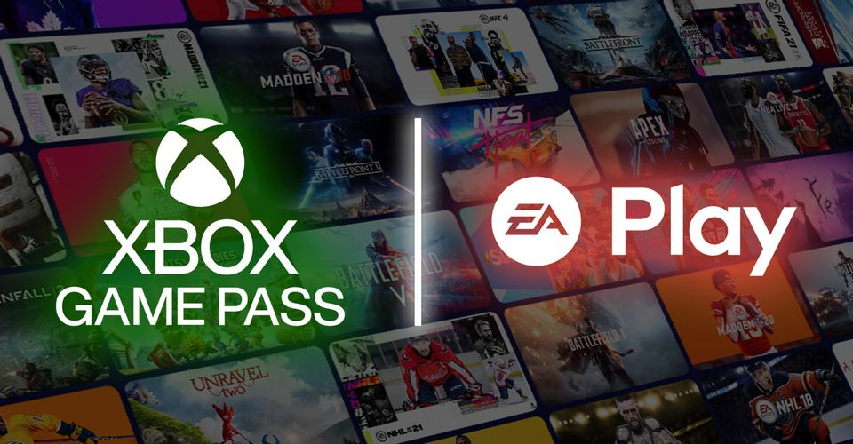
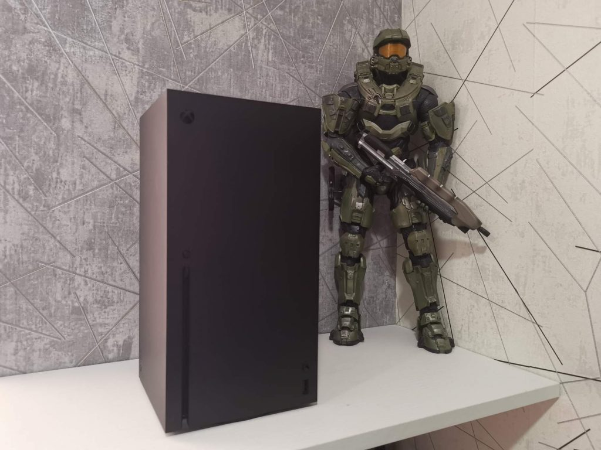
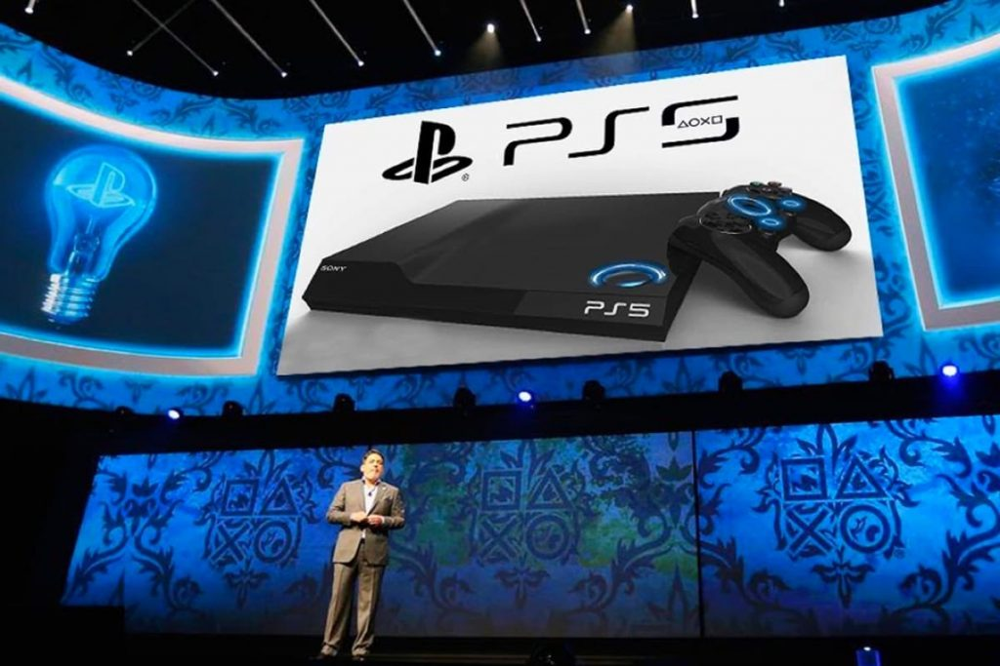

For 2021, the current (but clearly not the last!) stage of the Console Wars can be considered the confrontation between the PlayStation 5 from Sony and the tandem of Xbox Series X and Xbox Series S from Microsoft, which were presented to the public in November 2020.

An interesting fact is that there is a huge possibility that it was Microsoft who made Sony to rush with the new version of PlayStation. The fact is that on May 22, 2018, John Kodera, who at that time was the president and CEO of Sony Interactive Entertainment, in an interview with The Wall Street Journal during an official Sony event for investors said that «the next big leap for the brand PlayStation will take place no earlier than March 2021».

John Kodera

That is, work on the PlayStation 5 was already underway (as confirmed by the president of Sony Corporation Kenichiro Yoshida in an interview for the British newspaper Financial Times in October of the same 2018), but the developers weren’t going to rush. And in fact, if it were not for active development in the Microsoft laboratories , it is quite possible that Sony PlayStation 5 would have seen the light of day a year later.

But the ground is full of rumors, and talk about new variations of the Xbox has become much more active — and what Sony doesn’t like most is being on the sidelines. And to release the PlayStation 5 later than the consoles of its main competitors would be a catastrophic failure in the market! Sony couldn’t allow something like this, and the first official news about PS5 appeared on April 16, 2019 — a couple of months earlier, by the way, than the announcements from Microsoft. Sony Lead Architect Mark Cerny gave an exclusive interview to the American magazine Wired and revealed the first details about the new generation of consoles. By the way, according to Mark, by that time work on PS5 was already in its fourth year!

The next announcements about new PlayStation weren’t long in coming: In June 2019, Sony Interactive Entertainment CEO Jim Ryan gave a long interview to CNET. Interesting thing that it was done right after Microsoft’s press conference at E3 2019, which took place on June 10, and where people were told about a new gaming platform codenamed «Project Scarlett» for the first time (Xbox Series X and Xbox Series S got their names only in December, at the official presentation at the annual The Game Awards).

Actually, the competition between Xbox and PlayStation clearly demonstrates to us how useful this process is for the users themselves. So, the release of Xbox Series X|S took place on November 10, 2020. And two days later, on November 12, PlayStation 5 went on sale! It is far from certain that without the continuous race of consoles, players wouldn’t have to wait much longer…

Unlike its predecessor, PlayStation 5 uses a modified solid state drive (SSD) instead of a hard drive, incorporating the Oodle Kraken compression and decompression algorithm and the Oodle Texture coding system. According to published statistics, the new I/O subsystem significantly improves overall console performance. Plus, the SSD can now be used as virtual RAM. The device also includes a custom APU from AMD that supports ray tracing technology, 4K resolution and frame rates up to 120Hz.

The APU in Xbox Series X, in turn, is powered by a modified 3rd Gen AMD Ryzen 8-core/16-thread (SMT) CPU. The graphics processor of the new consoles from Microsoft is based on a modified chip of the new Radeon Navi family with RDNA 2 architecture (second generation) and a performance of 12.2 TFLOPS. When rendering ray traced and hardware accelerated game scenes, the Xbox Series X graphics power is 25 TFLOPS. Modified NVMe SSD with a volume of 1 terabyte is used as a storage device, and a similar external SSD for another 1 TB in the form of a plug-in memory card is also provided.

However, one of the most important points for players is backward compatibility with earlier generation consoles. It’s rather unpleasant to buy a toy for $ 499, and then sit and wait for new releases, whiling away the time with only couple of games released, right? So the backward compatibility with PlayStation 4 announced for PlayStation 5 has become a pleasant bonus for those who prefer consoles from Sony.

On September 2020, the head of Sony Interactive Entertainment Jim Ryan said that «of the several thousand games that have been tested for backward compatibility with the PlayStation 4, 99% will work on the PS5». According to Sony technicians, this level of compatibility was achieved due to the relative similarity in the architecture of consoles of different generations and the addition of additional logic elements to the GPU. The PS5’s CPU has algorithms that simulate the PS4’s Jaguar CPU. According to Mark Cerny, the difficulty in this case wasn’t the logic of the games, but the synchronization of commands in time: in order to achieve high-quality emulation, Sony technical team worked closely with AMD.

Jim Ryan

Another rather important point is that PS4 games run on PS5 at an increased speed of operations, which provides them with a more stable frame rate, and in some cases even higher screen resolution than what was offered to users initially.

Official statistics or any list of compatible and incompatible games, however, has never been published anywhere, so the loud statements from Sony about the «vast majority of games» and «99% of products» have to be taken on faith. The main thing is not to become a victim of the law of meanness, when the only game that you dream of launching on a new console falls into the 1% that Sony left for itself, making promises…

Microsoft, in turn, never announced which of the games for their consoles can be tried on Xbox Series X|S — the official Xbox website only says «supported games», but how many of the games will be supported is not indicated. But the bonus at Xbox over competitors from Sony is that the new generation supports Xbox One as well as Xbox 360 and even the Original Xbox games! Whereas in the case of PlayStation 5 we are talking exclusively about PlayStation 4, while PS3, PS2 and the first console of the series were left behind. This approach allows Microsoft to maintain a wider range of supported games, although there are no loud shouts about this from them.

Sony, in turn, is trying to play back with exclusives that the new Xbox cannot boast of. This is answered by Game Pass with Xbox Live Gold included. This service offers unlimited access to a significant number of games. Game Pass also includes EA Play membership — a paid subscription service from Electronic Arts.

Despite all sorts of small details that influenced the minds of potential buyers when choosing between the new Xbox and PlayStation (the number of FPS, exclusive games, or that very backward compatibility), the defining moment at the beginning of this stage of the war was that Microsoft seemed to underestimate its new creation. Let’s talk about everything in order.

The release of new Xbox allowed the corporation to set several previously unseen records at once. So, over the past fiscal year, revenue from sales of games for new consoles amounted to about $5 billion, which was an unprecedented figure for Xbox before. Microsoft’s gaming division’s revenue grew 51%, which raised the company’s total revenue by as much as 17% (to $43.1 billion!), and revenue from sales of hardware grew 86%. At the same time, net profit reached $15.5 billion.

However, even despite the fact that 31% of all revenue of the Microsoft gaming division went to the sale of consoles (that is, to their production and marketing), Microsoft still didn’t manage to cope with the requests of users. In simple terms, the huge demand for Xbox Series X and S is being constrained by the supply. The manufacturer simply cannot give users as many consoles as they want!

During a conference with investors about Microsoft’s quarterly report, the company’s CFO Amy Hood said that this situation will continue until at least July, but this seems to be a very optimistic forecast. Microsoft is partnering with Taiwan’s Foxconn, which manufactures the semiconductors used in Xbox Series consoles, and Foxconn chairman Liu Yan recently said that critical parts will remain in short supply until at least mid-2022.

But you can’t call it Microsoft’s defeat anyway. The fact is that another of Foxconn’s main customers is… Sony! So the amount of PlayStation 5 that the consumer requires is not supplied to the market either.

Another thing is that Sony was initially more ready for incredible requests, so the company faced the problem of scarcity later than its competitor. That, by the way, allowed the corporation to set several financial records, in many ways even surpassing Microsoft with their seemingly cosmic figures.

In fiscal 2020, thanks to PlayStation 5, Sony earned $25.04 billion, which was an absolute record for the industry (the previous record was fiscal 2018, $20.84 billion). A new quarterly industry record was also set — for the fourth quarter of 2020, the company reached a profit of $6.24 billion, surpassing the previous record by about half a billion.

PS5 became the best-selling console in its first fiscal year, with copies sold reaching 7.8 million (PS4 had 7.6 million), and another important thing is that the release of PS5 spurred sales of the previous version of the console as well — total sales of PlayStation 4 reached 115.9 million, and in addition, the number games sold for it exceeded 1.577 billion, making PS4 the console with the largest number of copies sold (from which it replaced PlayStation 2).

With the release of PlayStation 5 and the new Xbox, the war between Sony and Microsoft has reached a new level. And if earlier these corporations for the most part tried to sell their consoles to someone, now it is more about being able to produce enough consoles to saturate the market that requires more and more copies!

The struggle for a buyer who painfully chooses whether to take an Xbox or PlayStation has faded into the background: according to research published in 2020, compared to 2017, the number of people who take both consoles for themselves has almost tripled. And the main reason for this, perhaps, wasn’t even an increase in the purchasing power of the population. It’s just that generations are changing, and more and more paying consumers consider game consoles a serious purchase, and not something insignificant.

To put it bluntly, video games are getting more and more into our lives. And now the main task of any large manufacturer is not to discourage rare customers from competitors, but to be able to provide customers with as many products as they want.

*Alexander Kurikh*
