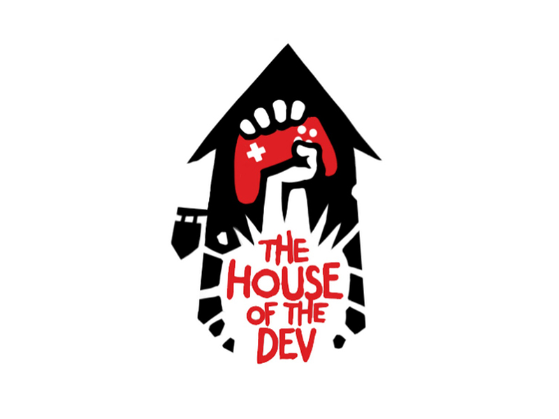

There are so many podcasts that it’s easy to miss an amazing but unpopular podcast. The General Arcade team encourages you to check out <a href="https://www.youtube.com/c/TheHouseofTheDev">The House of the Dev</a> podcast.

<iframe allow="accelerometer; autoplay; clipboard-write; encrypted-media; gyroscope; picture-in-picture" allowfullscreen="" frameborder="0" height="315" src="https://www.youtube.com/embed/-jyLT-3MlDI" title="YouTube video player" width="560"></iframe>

House of the Dev is a podcast hosted by developer Petr Salnikov and former head of Arkane Studios Rafael Colantonio. The podcast’s first season contains 9 episodes, eight of which have very interesting guests: Warren Spector, Harvey Smith, Viktor Antonov, Ken Levin, Matt Pearsall, Julia Cherenko, Jason Schreier, and Alexey Savchenko.

<iframe allow="accelerometer; autoplay; clipboard-write; encrypted-media; gyroscope; picture-in-picture" allowfullscreen="" frameborder="0" height="315" src="https://www.youtube.com/embed/03P4Y8qYj2U" title="YouTube video player" width="560"></iframe>

Behind each guest, there are years of work and dozens of stories. Add to that the charming and smart hosts, and you have a podcast that should never be missed (but for some reason it could happen).

<a href="https://thehouseofthedev.podbean.com/">Podbean</a>

<a href="https://open.spotify.com/show/3BRad6ckhGiOZ13VgEISnK">Spotify</a>

<a href="https://podcasts.apple.com/ru/podcast/the-house-of-the-dev/id1573401071">Apple Podcasts</a>

