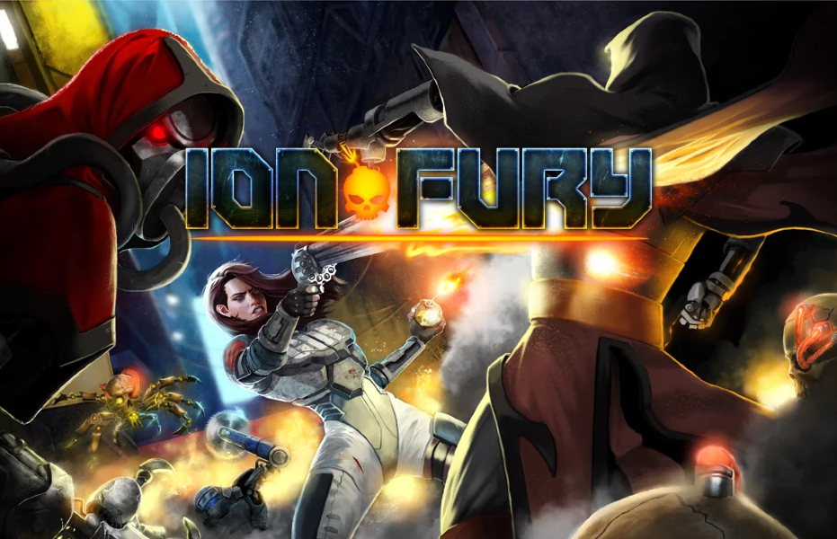
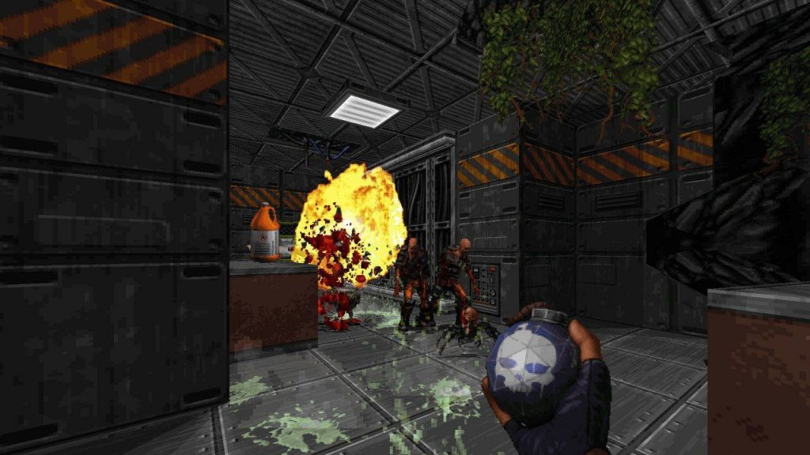
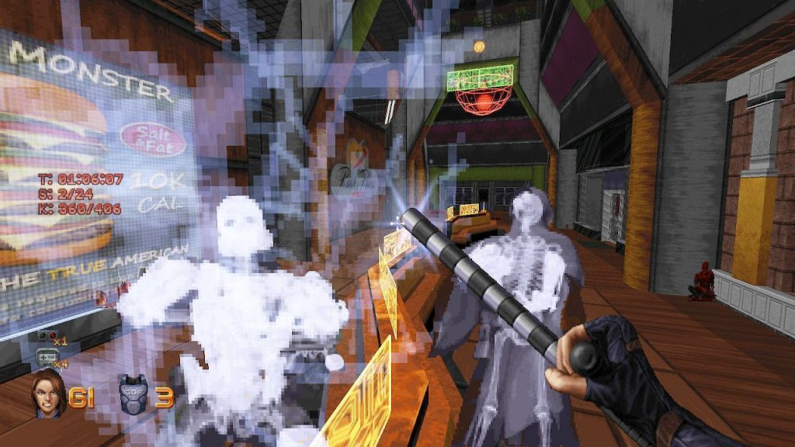
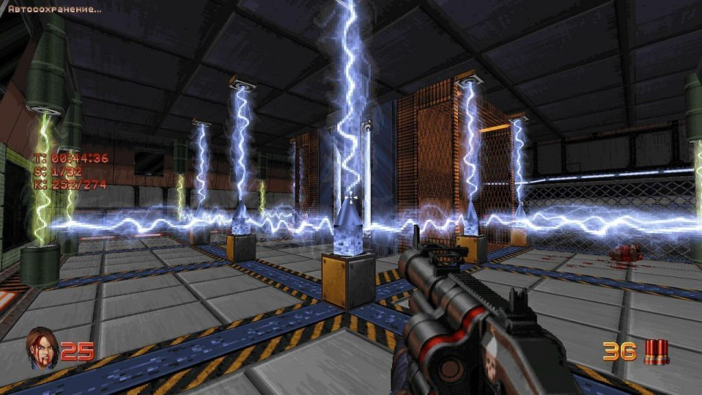
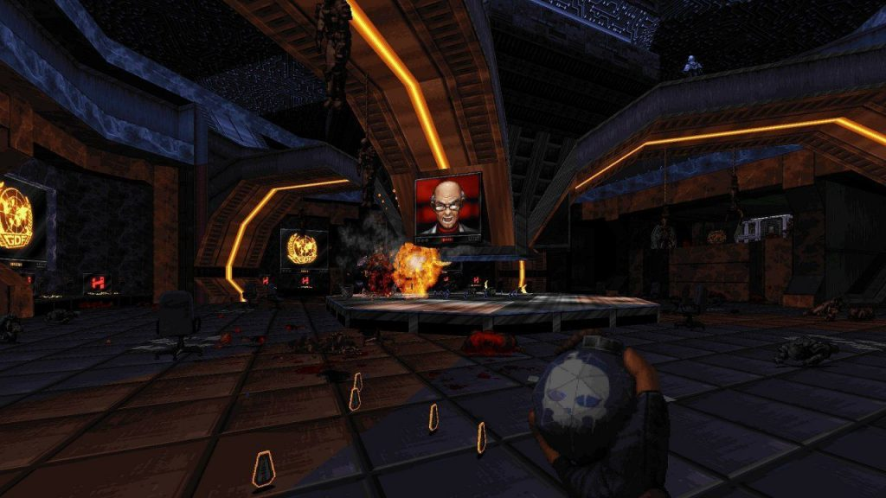
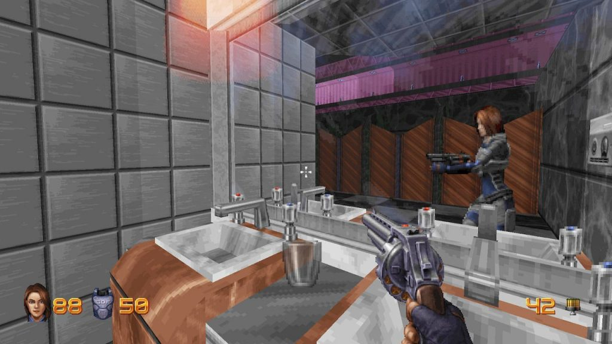
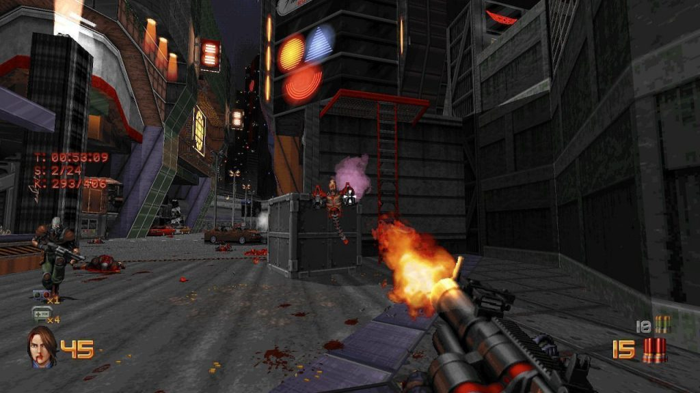

When guys from 3D Realms contacted us back in 2019 and offered to work with Ion Fury, it didn’t take much time from us to agree. The game is really great, so we got extremely excited after their proposition! We worked with BUILD engine before (Shadow Warrior port to iOS in 2012 and Duke Nukem 3D: Megaton Edition along with Shadow Warrior Classic Redux in 2013), so we expected quite clear and straightforward work. Looks like we really underestimated the project…

Several points made everything much harder than we thought: Eduke32 specific features like limit removal, true room over room, CON scripting, etc. Levels in the game have much more detailed geometry than any other BUILD game.

The one to start with was version for Switch, since the game is built on OpenGL and uses SDL and both libraries are available on Switch. However, initial conversion showed horrible performance – it was something like 6 FPS even with scripts disabled.

The main two obvious bottlenecks we found after profiling sessions were the thing that the engine was doing too many draw calls and rendering state changes and CON scripts processing. Basically, most of the game logic is implemented as interpreted scripts, and that’s definitely not the best thing for good performance as CPU load become extremely high.

Part of Eduke32 engine which is responsible for hardware-accelerated rendering is called Polymost, and from the modern point of view, its architecture is not so effective. Polymost produces very high amount of draw calls and rendering state changes, and all of this work is done from the game main thread synchronously.

Each draw call has its constant cost, which does not depend on the geometry complexity. So, when you’ve got too many of such draw calls, the cost is way too high – that’s the main problem you gotta solve.

The common approach to overcome this is batching, when you combine as many draw calls as possible into one single call. This technique requires the geometry of every batch drawn using the same texture, same shader, same blending mode, and so on. While worked on Ion Fury we found a good way to pack all the game sprites and textures into a single texture atlas, so whole game world with the exception of voxels was rendered using a single texture and single shader.

That took us to a point where we went from 3,500 calls to 100 calls and got about 10 FPS boost. The other thing with implementing batching was the possibility to turn Polymost into something like a vertex processor, which generates geometry data for each frame and passes it to different rendering backends on platforms like Direct3D11 for Xbox One, GNM for PS4, and OpenGL for Switch.

In the original Duke Nukem 3D for DOS, the CON scripting language was relatively limited, and was mainly used to code simple AI routines for monsters and manipulate the player’s inventory amounts. Most aspects of the game (weapon firing rates, camera positioning, physics, etc.) couldn’t be altered. But in EDuke32 virtually all aspects of the game can be accessed and manipulated via events, structures, and variables.

Ion Fury relies on those features to implement all of the game logic, which allows developers to make fast iterations during development. The bad thing about it is that this kind of approach has huge performance penalty, therefore you can either find a way to neutralize it or deal with it. Which is not such an easy thing, by the way, since the script execution could take up to 50% of CPU time.

The way we picked wasn’t an easy or expected one – after few unsuccessful attempts to speed up the CON interpreter, we agreed on converting all scripts to C++ code. It took us one month to implement a basic translator using a parser generator called ANTLR4 and another month to debug and optimize it. But achieved result showed that this time wasn’t wasted: after translating all of the game scripts we were able to get an average 10-15 FPS increase.

Anyway, performance problems weren’t the only thing we had to face. And even after all the improvements we manage to achieve, we were still suffering from poor performance during more complicated scenes and had some minor graphical glitches. So we had to come back to looking into the renderer.

As the matter of fact, we had to rework the renderer to accurately keep the rendering order to get rid of those glitches. Due to a fully single-threaded nature of the engine, the CPU was busy with GPU synchronization (20-25%), so we decided to find some way to move all the graphics calls to separate thread to off-load the main thread. The renderer we had at that moment was still tightly bound to the main thread and to unbind it we had to largely redesign the renderer.

The new architecture relied on generating a list of draw commands instead of calling graphics API directly and sending it to another thread for actual execution, and it allowed us to take better control over the rendering order and helped us to deal with the glitches.

Batching got worse but due to the fact that all GPU work was already on a dedicated CPU core, it didn’t matter since overall performance significantly improved. The only scene where the rendering thread wasn’t performing good enough had too many voxel objects around, so we simply replaced distant voxels with their sprite counterparts to solve this problem. Luckily, the game has both types of assets.

Next thing to work with was the speed of Polymost itself. It goes without saying that our main task throughout whole development process was work on speeding everything up – on this level of geometry complexity it took way too much of CPU resources. Our task was improving algorithms or run on multiple CPU cores, but gotta confess, we fail and couldn’t find an easy solution. All of possible options would require rewriting the whole Polymost, but it didn’t suit us for sure.

During the work we discovered that Polymost does the double work due to specifics of TROR (True Room Over Room) implementation. TROR is EDuke32 feature which allows the construction of sectors in a vertical arrangement. The implementation of the feature caused double-processing of world geometry: the first pass to determine level order – back to front, and the second pass to actually render them.

The first pass was also causing the same amount of vertex processing as rendering does. And that was a great opportunity to eliminate the double work by new renderer architecture which was mentioned earlier. We slightly improved it by adding a feature to record command lists and execute them later. Using this feature, we modified the first pass to produce a command list for rendering for each vertical level and on the second pass, we replayed those command lists in the right order. Guess we could call is a great decision – it gave us a significant performance boost (at least 15 FPS in complicated scenes on PS4).

The last, but not the least was sound playback. Surprisingly, it caused performance issues as well – most of the sound effects were vorbis-encoded and once again it caused high CPU load when lots of them were played simultaneously. Some might say that decoding compressed sound is not a difficult task, but when you’ve got several dozens of effects at the same time, it really makes a difference – especially on consoles. Big number of small files caused long startup time as well.



The way to solve both problems was uncompressing all the vorbis files and merging them into one big file, which was loading at the same time with other game initialization procedures.

Despite the complexity and amount of work required to make Ion Fury ports, we believe that EDuke32 was the right choice for the game. Furthermore, the engine limitations promoted developers’ creativity and now we have the best BUILD game ever.
