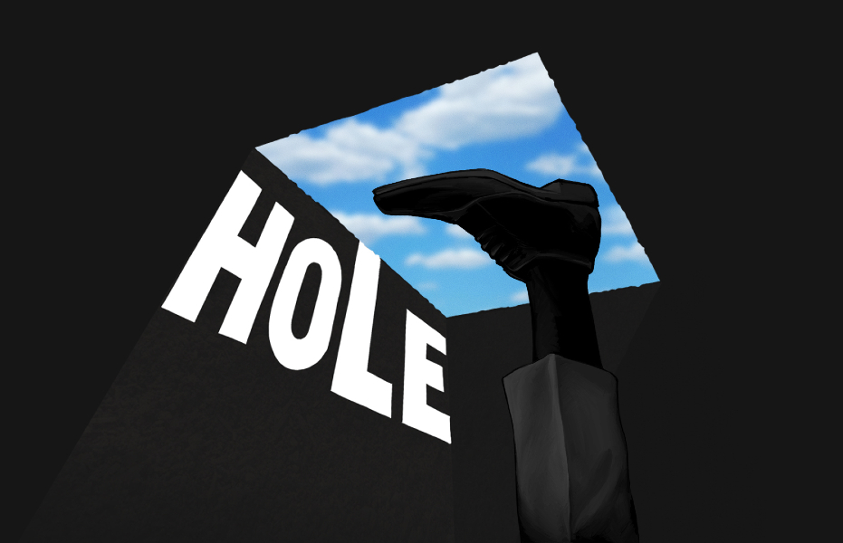

It’s time for Ludum Dare (Latin for “give a game”), speed game development competition, which was first held by Geoff Howland back in 2002. There are certain rules for Ludum Dare: you have three days to create a well-functioning game, the theme is picked beforehand, etc. Quality multiplied by speed, one might say.

And just like before, <a href="https://ldjam.com/" rel="noreferrer noopener" target="_blank">we decided to take a shot</a>… The theme picked this time was “Delay the inevitable” – in other words, a game where you got into unexpected, unpleasant and difficult circumstances and you got to get out of it. Basically, this idea suits any game. So, after long and painful brainstorms, we agreed on the actual concept.

The project suffered many problems, the prototype wasn’t even ready by the end of the second day of work! And even a built and ready to-do list can’t really help in this case.

<figure class="wp-block-image size-large"></figure>

There is a Russian proverb: “We harness slowly and drive fast” – more than half of the work was done in two hours on the third day! The process went much faster on the third day, and we almost managed to do all the remaining tasks, but the main challenge was yet to come… Sounds, bugs, unfinished mechanics, problems with Web-version, etc.

However, to the end of the third day the project was almost assembled. All we had left was to fix the last problems to make the game get the most similar view to what we actually planned.

<figure class="wp-block-image size-large"></figure>

The main achievement for us was to make the project ready in shortest terms. And as Konstantin Martynenko said, now he’s got “an experience in building Hell in no time” as well! But <a href="https://ldjam.com/events/ludum-dare/50/the-hole" rel="noreferrer noopener" target="_blank">the game is ready</a>, it looks really cool and we’re proud of it. Have a go:

<ul><li><a href="https://github.com/kalkolay/LudumDare50" rel="noreferrer noopener" target="_blank">Source Code</a>;</li><li><a href="https://drive.google.com/file/d/1cveuygUZQ7xM1dsFFi-OnL-YUw1WLudw/view?usp=sharing" rel="noreferrer noopener" target="_blank">Microsoft Windows</a>;</li><li><a href="https://evilsock.itch.io/hole" rel="noreferrer noopener" target="_blank">HTML5 (web)</a>.</li></ul>
<figure class="wp-block-image size-large"></figure>

