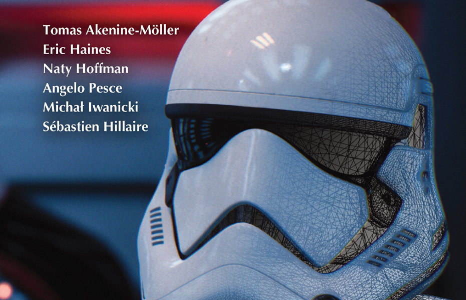
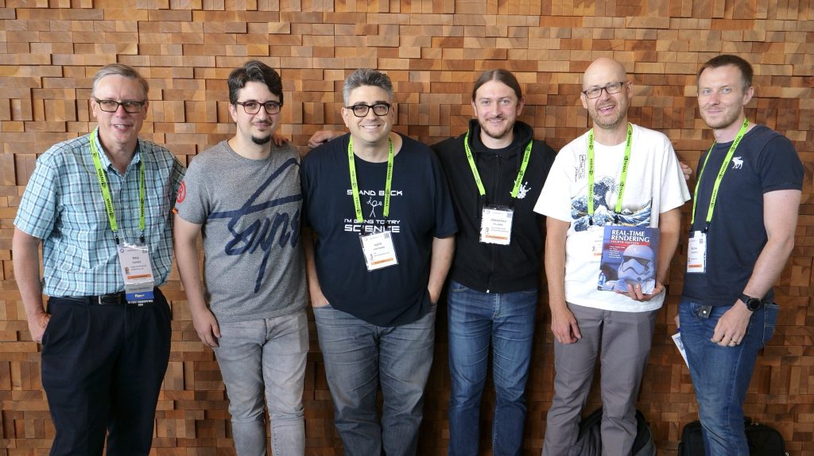
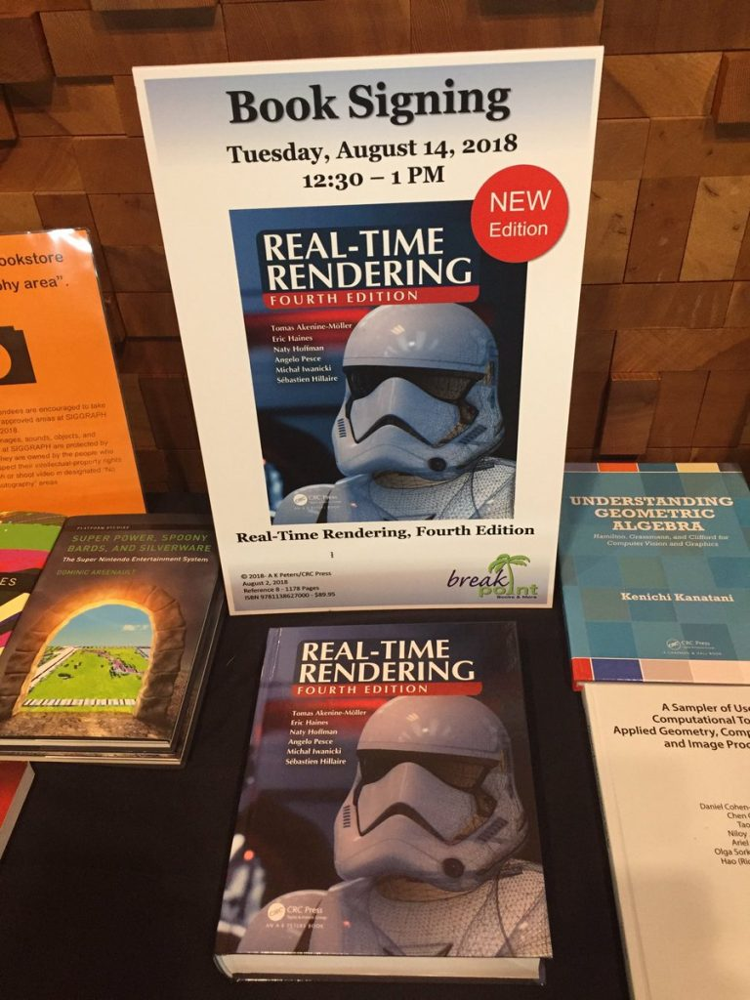
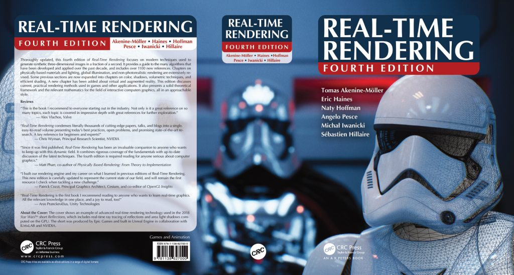

As the next book that will be really useful for developers, we’d like to recommend Real-Time Rendering, Fourth Edition. This is a collective work, and each of those who contributed to writing a hand has reached quite decent heights in the computer industry. Actually, one can already write a separate article about each of them!

Tomas Akenine-Möller, for example, is a professor of computer science with a specialization in computer graphics and image processing at the Faculty of Computer Science at Lund University in Sweden, and the founder and mastermind of the Lund University Graphics Group (or simply LUGG). Since 2016, he has been working for the benefit of NVIDIA Research after moving there from the research department of Intel.

Another one who also works for NVIDIA is a software engineer and computer graphics expert Eric Haines, who at the time of writing the book focused on interactive ray tracing. Haines is the co-founder of Journal of Graphics Tools and Journal of Computer Graphics Techniques, and the creator and lecturer of the Udacity MOOC Interactive 3D Graphics courses.

Of course, there are well-known names in the field of game development in the list of authors. Michał Iwanicki and Angelo Pesce are technical directors of Activision Central Technology, where they are engaged in research related to graphics and rendering. Iwanicki is the one who is responsible for rendering and engine code on projects like The Witcher, The Last of Us and Call of Duty, while Pesce has worked for Milestone, Electronic Arts, Capcom and Relic Entertainment in his time and also had a hand in the Call of Duty series.

Last in line, but certainly not the least ones, are Sebastien Hillaire, Senior Rendering Engineer in the Frostbite team at Electronic Arts, and Naty Hoffman, Principal Engineer and Architect in the Lucasfilm Advanced Development team.

The first one received a PhD in Computer Science from the French National Institute of Applied Sciences in 2010 (the topic was the use of gaze tracking to improve the user experience of virtual reality), and the second used to work on cutting-edge developments in the field of computer graphics at 2K, Activision, SCEA Santa Monica Studio, Naughty Dog, Westwood Studios and Intel.

The title of the book Real-Time Rendering, Fourth Edition can confuse many people — or more precisely, the word that can confuse is “edition”, which, in fact, means this or that version of the same material. But no, Fourth Edition is not just a modified version of what you could have read before, it is completely new and independent content. Which, in general, is not at all surprising, given that the first part of Real-Time Rendering was released 20 years earlier… Games change, graphics change, so the content of the book about this same graphics changes.

At the release of Fourth Edition of Real-Time Rendering, it received a huge amount of positive feedback, and many famous people in the world of computer graphics wrote the best reviews for it. “This is the first book I recommend reading to anyone who wants to learn real-time graphics, — wrote Aras Pranckevičius from Unity Technologies, — All the relevant knowledge in one place, and a joy to read, too!”

The authors of the Fourth Edition, in turn, have repeatedly said that during the writing of the book they tried to cover as many topics as possible, from mathematical foundations to advanced methods used in modern cutting-edge games. In the end we can say there are three main themes of this edition of Real-Time Rendering: case studies, technology-based rendering, and finally, practical rendering for games and details to improve interactive applications.

Also in the preface to the book it is noted that “with the advent of programmable shaders over the past few years, many new algorithms have arisen and developed”, which Real-Time Rendering, Fourth Edition tried to highlight. In particular, this version of the “real-time rendering tutorial” provides a thorough discussion of modern rendering practices used in games and other applications. This is not one hundred percent new work, and the authors don’t forget about everything stated in previous issues, trying to draw parallels and make references to what was said before (“it was like this, now it’s like that, and that’s the reason”).

Something completely new in the Fourth Edition was the chapter on virtual and augmented reality, as well as the fact that the authors paid much more attention to visual design, advanced shading, global illumination, and curved surfaces — in recent years, these aspects of computer graphics really changed very, very much.

The past, however, is also not forgotten. So, the authors of Real-Time Rendering, Fourth Edition note the possibility of downloading the source codes for DOOM and Quake, available under the GPL license, and don’t ignore how they worked with it. For example, enthusiasts have already managed to add a huge number of innovations to the engine of Quake III Arena, which was released in 1999 — including even ray tracing, which was only a dream for developers in the last century.

There are also ports of DOOM to a huge number of platforms, and there is a version Wolfenstein for iPhone. As for slot machine emulators, like MAME, they allow you to port classic games to almost any platform. All of this is covered in Real-Time Rendering, Fourth Edition.

In general, the book interestingly combines fundamental principles with recommendations on the latest technologies, which makes it both interesting and useful at the same time. Some have even dubbed Real-Time Rendering, Fourth Edition “the complete guide to 3D interactive computer graphics”.

“This is the book I recommend to everyone starting out in the industry, — said Valve’s Alex Vlachos, — Not only is it a great reference on so many topics, each topic is covered in impressive depth with great references for further exploration”.

NVIDIA Senior Fellow Chris Wyman, in turn, wrote about the book: “Real-Time Rendering condenses literally thousands of cutting-edge papers, talks, and blogs into a single, easy-to-read volume presenting today’s best practices, open problems, and promising state-of-the-art research. A key reference for beginners and experts!”

Commenting on the release of the book, Tomas Akenine-Möller mentioned several times that the main task of the authors was “to help everyone to increase speed and improve image quality, as well as to study the features and limitations of acceleration algorithms and graphics APIs”. And judging by the reviews, they succeeded…

*Alexander Kurikh*
