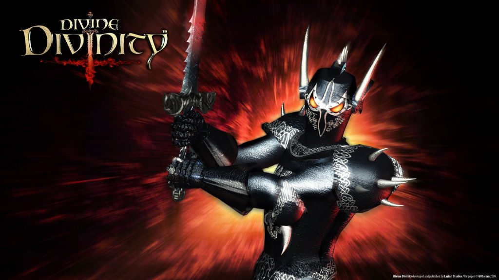
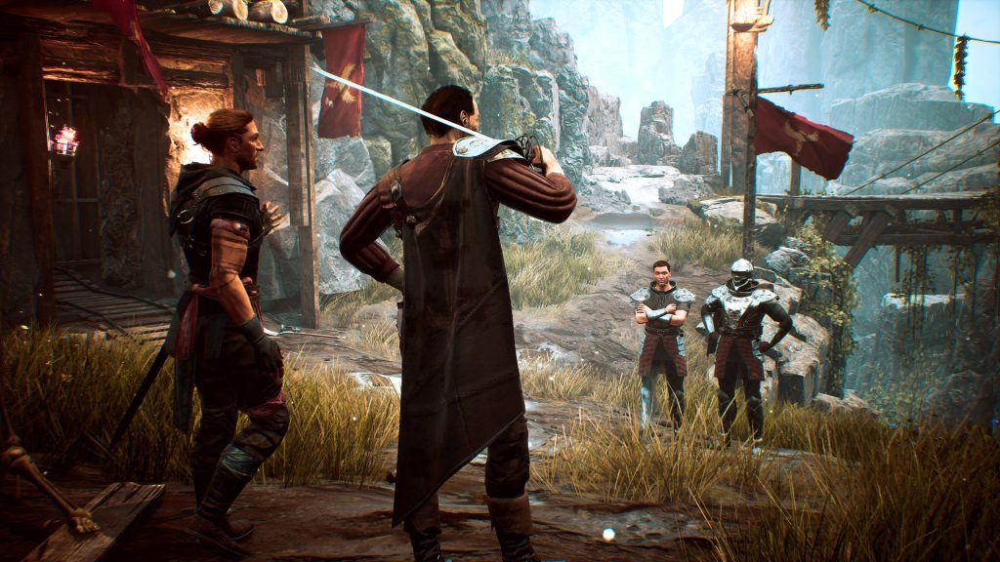

Nowadays, almost everyone, to one degree or another, plays video games. And it goes without saying that many are waiting for some releases – well, or dream of some series to continue. And of course, people in the gaming industry are even more affected by this! So today we would like to talk about those games that we would like to play.

—

For me, the most expected game is definitely Forza Horizon 5. Generally, I’m not too fond of racing games, but I love Forza Horizon 4. It’s very relaxing. You can just roam around the map and ignore races. And after what Microsoft showed at the E3 event, I was even more excited about the next game in that series. I hope it plays as good as it looks 🙂



*Gennadii, The Mastermind*

—

Recently, I haven’t had a chance to play too many video games. However, the Outer Wilds took a special place among them. This is a space-based game with pseudo-realistic physics. Can’t say there is some kind of unseen before setting in it, but it has a nice mix of mechanics and some really specific charm. It doesn’t amaze with any huge scale, you can even call it a very miniature game: a small planetary system with tiny planets. But every tiny detail has its own meaning and weight.

But the game is so rich and full, and it seems that there is nothing superfluous in it at all. You will often wander the same places, but discover something new over and over again. The main idea is a time loop – you have only 22 minutes to complete the required set of actions until everything starts over. And I assure you, you won’t want to rush anywhere, and rather stop a few more times to fry the marshmallows.

Without revealing the spoilers, I will say that by the end of the game you will have almost no unanswered questions, everything here has a reason and everything has its own explanation. This is facilitated by the fact that there are no clear quests in the game, you just collect information bit by bit, get a picture of the world and build an intriguing story.

After a couple of dozen of hours, you will probably finish the game, but it leaves an amazing aftertaste. And not so long ago an addon called Echo of Eye was announced. This is another reason to dive headlong into this magnificent world. Explore new hidden corners and answer your remaining questions about the Eye of the Universe. By the way, the developers sldo promise to port the game to Nintendo Switch, and in my opinion, this is the perfect console for this game. Let’s look forward to the new adventures of the four-eyed blue astronaut!

Oh, and the second ELEX was announced recently! That’s something I want to try. And I’d like to see the remake of the first Gothic as well.

*Artyom, Software Engineer*

—

I’m waiting for some of the developers to make a sequel of the game I already love. I’m still waiting for Half-Life 3.

HL was one of my first games when I got a computer. I really liked the atmosphere of the game. Everything in it was excellent – scientists with their experiments in huge experimental installations, a large selection of weapons, aliens, the military… When I played it, I carefully examined every level, killing all the enemies, so I was always short of ammunition. Therefore, I played the game for a very long time, several months. Sometimes I saved the game progress after every successful shot at the enemy and loaded it after every miss.

The second game in the series was at a qualitatively better level. Excellent graphics, gravity gun, interesting characters… Right now I’m playing Half-Life: Alyx, and I believe it is the new standard for VR gaming. If Half-Life 3 will ever come out, I think it will be a new benchmark for video game quality.

I am also looking forward for the release of a new version of AIM: Artificial Intelligence Machine. This is a great game with really unique atmosphere. The first two games in the series were pretty good, so I think it has a lot of potential. A new game of the series, AIM: War Protocol, has already been announced on the developer’s website, which gives hope that I will be able to play it in the foreseeable future.

In 2003, there was a demo version of Unreal 2: The Awakening on Igromania disc. I liked this demo so much that I played it several times, and after played the game itself as well. The game is a pure shooter – you have a lot of good weapons, and you need to go forward killing enemies. In this game, I liked the rather large arsenal of weapons. I think the series has potential, and I would play the sequel.

And another one of my favorite games is Command & Conquer: Generals Zero Hour. I’m waiting that maybe someone will buy the rights and make a sequel. I liked this series of games because it has some kind of realism. The units were quite realistic. The game has infantry as well as tanks and aircraft that could really exist. Realism was also in graphics, which didn’t look like a cartoon, as most of nowadays games. There were also quite a few really destructive superweapons in the game. I look forward to see more games from the Command & Conquer: Generals series.

*Yuri, Senior Software Engineer*

—

Give me Divinity 3! I’ve been waiting for years for Larian to return to the origins of old-school RPG. Divine Divinity at one time impressed me so much with its volume and detail of the elaboration of quests that it kept me for hours, playing nonstop. Divinity 2 with a third-person perspective was a logical round in the evolution of the series, even though it was one big studio experiment at the time.

Neither of Divinity: Original Sin games impressed me that much.

*Alexei, Software Engineer and RE Specialist*

—

In fact, I’m looking forward to a lot of games, I can’t list everything. Even the most expected ones are difficult to isolate. Therefore, the sample is random.

The unexpected announcement of Disciples: Liberation immediately riveted my interest and appealed to feelings of nostalgia. Many people recall Heroes of Might and Magic III with rapture, but another turn-based strategy of 1999 is closer to me – Disciples. First of all, I am really impressed by its dark art design, images of units, buildings and even interface elements. The combat system is also closer to me than the one in Heroes. Large army is replaced by a small detachment of 4-6 units, where it is necessary to take care of each. And I was delighted with the system of unit progression. The sequel was good as well, improving all the aspects. But the ambiguous triquel in its turn looked like the end of the series to me. So the announcement of Disciples: Liberation made me excited, I’m looking forward to the release with a little caution and impatience.

My interest in Xenonauts 2 also has its roots in my early years. But the announcement of the game was made in 2016, and the release is still postponed time after time. Before the release of Phoenix Point, I thought the original Xenonauts was the closest project to my beloved X-COM: UFO Defense. The sequel is promised to be 3D, the number of mechanics will increase and the developers have creative freedom – they are not tied to the events already shown in the original game.

And the last one is another part of the annual rally car simulator WRC 10. I won’t feel nostalgic for the old games, of course, since I got my passion for this discipline relatively recently. I don’t expect any revelations from this game, the project is being developed for championship fans, which is a rather narrow circle. The only thing I would like to add is that the era is leaving, because this is the last game of the series, which is made by KT Racing. Further, the WRC license goes back to Codemasters, who lost it in the middle of the 2000s.

*Mikhail, QA Specialist*

—

Gothic was one of my first games, along with the second part, Heroes of Might and Magic III and Knights and Merchants, and the first games, I suppose, stay in mot players’ memory and souls. Therefore, I look forward to returning to the unique atmosphere of the mining colony on the island of Khorinis with modern graphics in a remake.

I want to meet with old acquaintances again, but this time to see their facial expressions in dialogues. Evaluate detailed versions of monsters from lurkers to trolls, watch the wolves hunt mole rats.

By the way, these hunting scenes added life to the game world and made me very happy. And this game was also remembered for a unique opportunity to rob someone without killing. I hope that remake will also bring improvements to Gothic in terms of quests and plot, especially I would like to see a slightly greater influence of the choice of faction on the development of the story.

*Alexander, Senior Software Engineer*

—

Perhaps the only game I’m really looking forward to right now is the new part of BioShock. And by the way, I belong to a rather small part of the fans of this series – I only got acquainted with it starting from the third part, and therefore the iron gait of Big Daddies causes much less nostalgia than “Let the circle be unbroken” performed by Elizabeth or Booker’s phrase “I am not I’m afraid of God, I’m afraid of you”.



Moreover, when after BioShock Infinite I tried to play the first two parts, neither of it impress me at all (don’t throw stones at me!)… And so I would really like a new BioShock game to be made in the same style as BioShock Infinite. I suppose when the game promised back in 2019 will finally be realeased, I will have to forget about sleep for a while 😉

*Alex, The Writing Machine*
