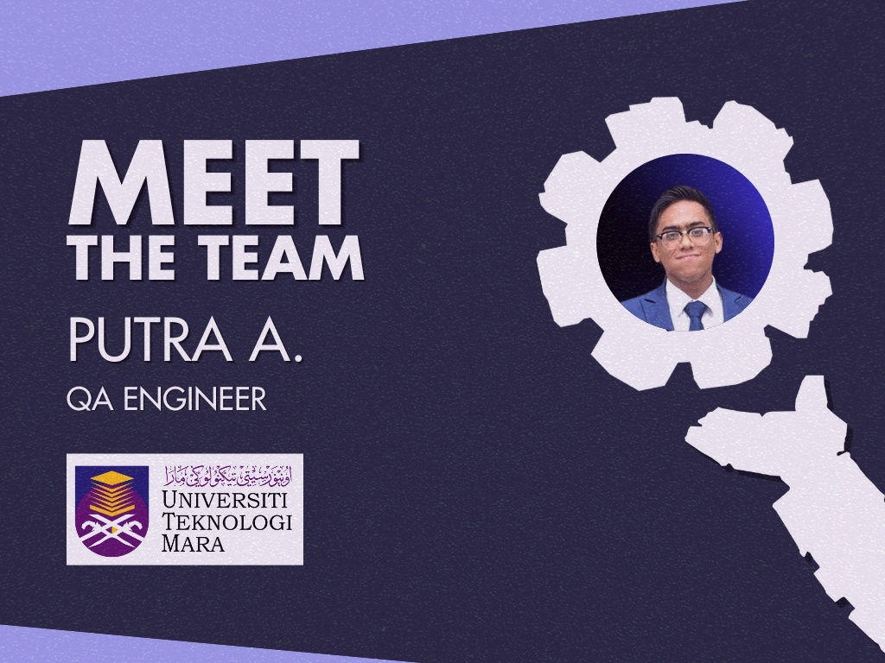

Putra’s foray into the technology sector began with a distinguished academic background in Information Technology, earned with Honors from the <a href="https://uitm.edu.my/index.php/en/">University of Technology Mara</a> in Shah Alam. Inspired by his love for gaming, he set his sights on the gaming industry and joined General Arcade as a QA Engineer. Here, he’s making waves by ensuring the quality of the games we port to various platforms. His job involves testing games, hunting down bugs, and making sure everything meets industry standards. A typical day for Putra involves addressing technical requirements for PlayStation while collaborating closely with the development team to report issues and verify fixes, all aimed at enhancing the overall gaming experience.

What really stands out for Putra at General Arcade is the collaborative vibe and the chance to work with a diverse team from around the globe. 

<em>“Working alongside people from different cultures and backgrounds broadens my perspective and helps me grow both personally and professionally.</em>

<em>The dynamic learning process here allows me to exchange ideas and gain insights into different approaches to problem-solving, which is something I truly value.”</em> — Putra.

When he’s not busy with work, Putra dives into the gaming world. He’s a fan of competitive games like <a href="https://www.mobilelegends.com/">Mobile Legends: Bang Bang</a>,<strong> </strong><a href="https://www.honorofkings.com/my/">Honor of Kings</a>, and <a href="https://playvalorant.com/en-us/">Valorant</a>, where he thrives on fast-paced strategies and teamwork. His love for gaming kicked off with RPGs, and <a href="https://www.kingdomhearts.com/home/au/">Kingdom Hearts</a> by <a href="https://www.square-enix-games.com/en_EU/home">Square Enix</a> was a major influence that sparked his passion for storytelling and immersive experiences.

Looking ahead, Putra has his sights set on becoming a game producer or designer. Inspired by industry legends, he dreams of creating innovative gaming experiences that resonate with players. He’s focused on honing his skills in game development, project management, and creative design, with aspirations of directing projects that push the boundaries of storytelling and gameplay.

For anyone looking to break into the gaming industry, Putra recommends <a href="https://schellgames.com/art-of-game-design">“The Art of Game Design: A Book of Lenses”</a> <em>by Jesse Schell.</em> He finds it offers valuable insights into the game design process. He also suggests “Game Testing All in One” <em>by Charles P. Schultz and Robert F. Brooks</em>, praising it as a comprehensive guide to essential techniques and best practices in game testing.

We wish Putra the best on his ambitious journey and can’t wait for the innovative ideas he will bring to our company.

