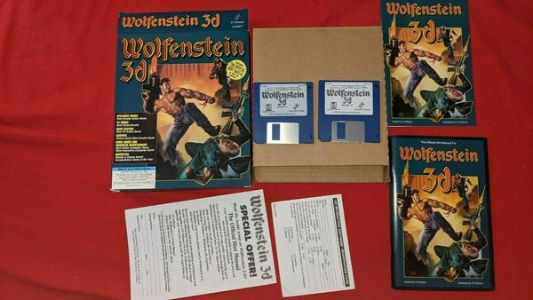
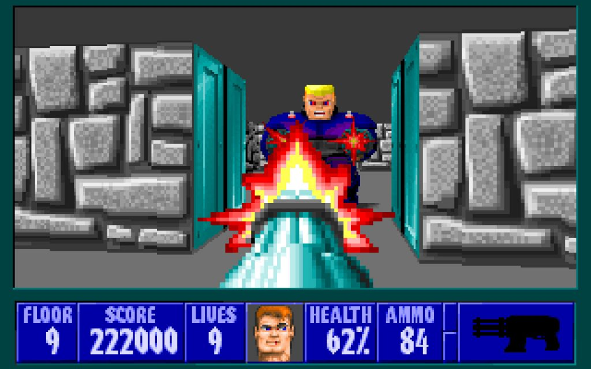
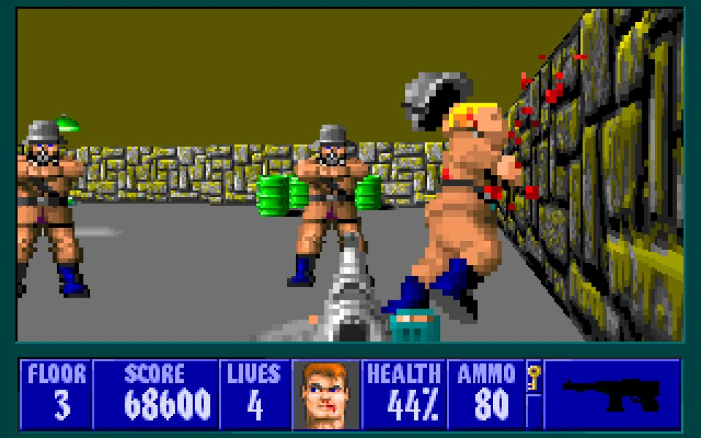
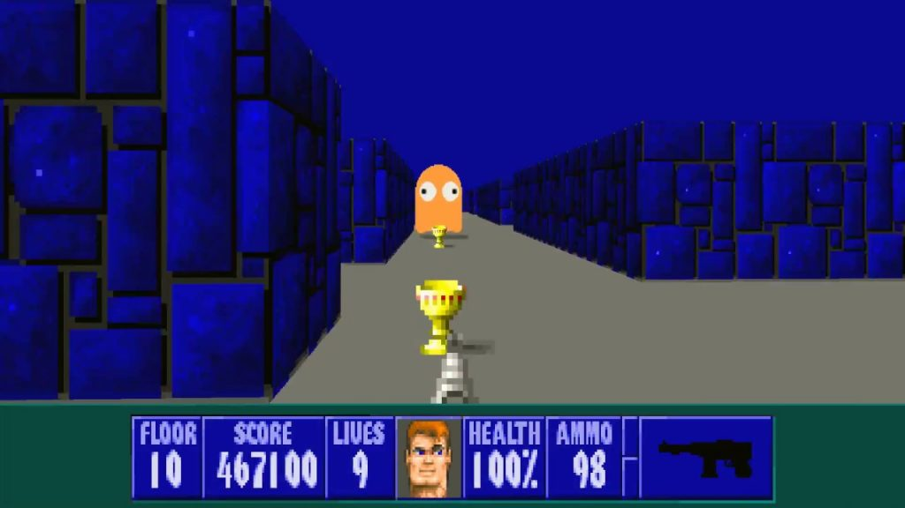

Up until May 5, 1992 the shooter genre had very little to offer. Sure, there were games with shooting episodes, there were even first-person shooter games, but it was Wolfenstein 3D that brought some order to a genre that no one had yet invented, albeit unknowingly. John Carmack and John Romero loved a) fast console games; b) dynamic arcade games; c) the two Castle Wolfenstein games and its creator Silas Warner. The first two points gave the world the Commander Keen series. And thanks to the c) a little later (with Warner’s permission) our birthday boy would be born.

<figure class="wp-block-image size-large"></figure>

We could immediately start discussing B.J. Blazkowicz and his fight against Nazis, but the Commander Keen series was mentioned for a reason, because its achievements are the basis of the aforementioned cult shooter. Someone may find it strange that the shooter is based on a platformer for the young audience, but believe me, that’s not the most interesting thing. The most important things here are the details and the process of technology implementation.

The story of id Software’s rise is so famous and interesting that there are several books and dozens of video essays devoted to it. One of the books, Masters of DOOM, by David Kushner was going to be adapted as a TV series. We’ll definitely discuss that book one day in our book section, but right now we’ll cover a small slice of the team’s history. So, during the early 90s, the future id guys worked at Softdisk and developed shareware games. John Carmack, John Romero, Tom Hall and Adrian Carmack were gamers and geeks who tried to play every single outcoming cool game. Moreover they always wanted to bring something new to their projects, but a monthly batch of games for the publisher couldn’t satisfy the ambitions of young creators.

<figure class="wp-block-image size-large"></figure>

When John Carmack recreated side-scrolling technology for PC, his colleagues from development team were shocked and amazed — but not the bosses. The id guys understood that those people don’t know a single thing about games or technology, and simply don’t deserve such technology. They decided to take matters into their own hands and started taking the tech out of the office to work at night on the PC port of Super Mario Bros. 3, the game that mesmerized millions of gamers of all ages. The port looked incredibly authentic, everyone could comfortably play it on PC. The guys mailed the game to Nintendo’s U.S. office, asking them to show their project to the Japanese head office.

After a while, a reply came back. Nintendo praised the devs, but turned them down because the company didn’t want to release their game on other platforms. The guys realized they had a great card up their sleeve, and so they had to make a game which would please themselves. As a result they created id Software and started developing Commander Keen.

Commander Keen got a very warm welcome. id developed two full-fledged trilogies and a couple of other games (one of them was made for Softdisk). Devs were forced to make games for Softdisk for a while because they were caught taking the equipment out of the office. So Hovertank 3D and Catacomb 3-D, first person games, were made for the publisher along with other games. Catacomb 3-D used texture mapping. For the first time a game with first-person POV had incredible immersion.

<figure class="wp-block-image size-large"></figure>

Wolfenstein 3D required a lot of work, so id Software expanded the staff up to eight people. The development started in January 1992 and lasted four months. Carmack repeatedly confirmed in interviews and comments that there was no version control system at id until Quake 3. Romero described version control as follows: the game was burned to disk/floppy and simply numbered with a marker. That was it. However, the company also had a file server, but it was not always used.

id made a decent amount of money from past games, so the company didn’t hesitate to buy the best computers and software the market had to offer. Wolfenstein 3D was developed on a 386-DX 33MHz with 4MB RAM. The game was programmed in Borland C++ 3.1 (but in C) which ran in VGA mode 3 by default. Romero developed a map editor, music packer and other supporting tools. Jason Blochowiak (a man rarely mentioned, as he left the company before the development was finished) created the game’s subsystems.

You can read more about the development process in the book Game Engine Black Book Wolfenstein 3D, <a href="https://generalarcade.com/game-engine-black-book-wolfenstein-3d/" rel="noreferrer noopener" target="_blank">which was reviewed before</a>. There are a lot of interesting facts and illustrations in the book that will help you better understand what parts of the game are made of.

The titular Castle Wolfenstein was based on a real German castle called <a href="https://en.wikipedia.org/wiki/Wewelsburg">Wewelsburg</a>. It gained its notoriety during World War II as it was thought of as “the place where SS gained their lieutenants” and the occultists’ residence. id decided to create a story about a brave saboteur, William B.J. Blazkowicz, who was imprisoned by the Nazis.

<figure class="wp-block-image size-large"></figure>

Don’t expect any military authenticity from this game, as nobody described the game as a work based on real war experience. id always appreciated simplicity – and here we have a simple game with shooting at the Nazis in a German castle. That approach worked then, and it works now. Given the successful distribution model, Wolfenstein 3D was a huge success. Players were won over by the colorful mazes with the portraits of Hitler, dog-shooting (the cause of a great controversy up to the point where the SNES-versions had rats replacing the dogs), and the death shouts of dying enemies. There were also a couple of minimalistic texts and unique bosses at the end of each episode, and, as a result — a tangible progression and immersion in history.

Wolf 3D’s arsenal is scarce by today’s standards. The canonical set of first-person shooter’s weapons will not be introduced until a year later in DOOM, so B.J. had to kill hordes of enemies with a knife, pistol, MP-40 submachine gun, and a hand-held six-shot Vulcan machine gun.

<figure class="wp-block-image size-large"></figure>

Thirty years is an honorable age for the video game. If a game is remembered 10 years later, it’s definitely a good game. 20 years? A great game. 30 years later, Wolf 3D can be called nothing less than a legendary game that brought life to an entire genre and started its own franchise. Up to this day, fans create mods and new maps and even hold Deathmatch championships — a rare thing for a shooter game. So as long as these things keep happening, the game can be considered a living legend.

Happy Birthday, Wolfenstein 3D!

