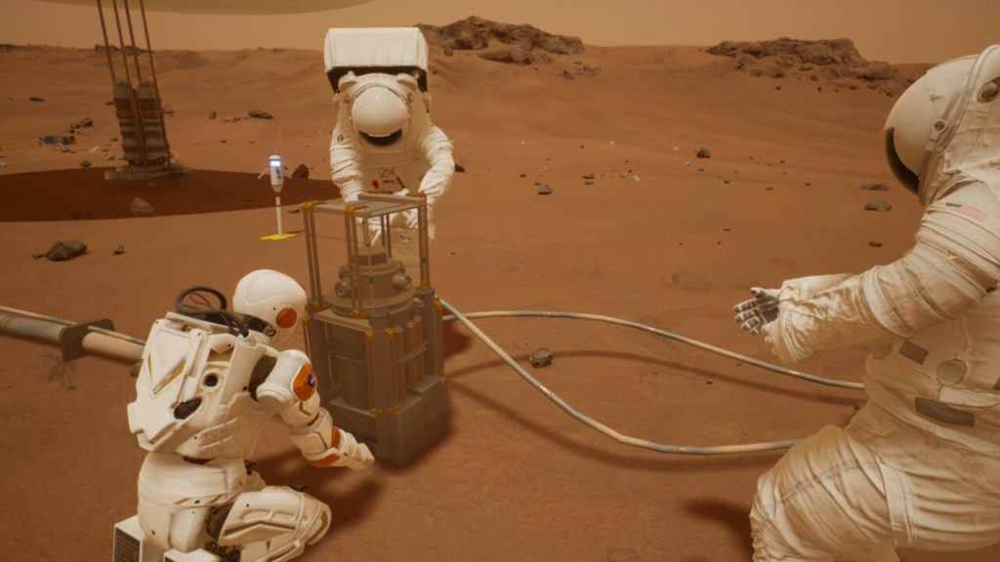
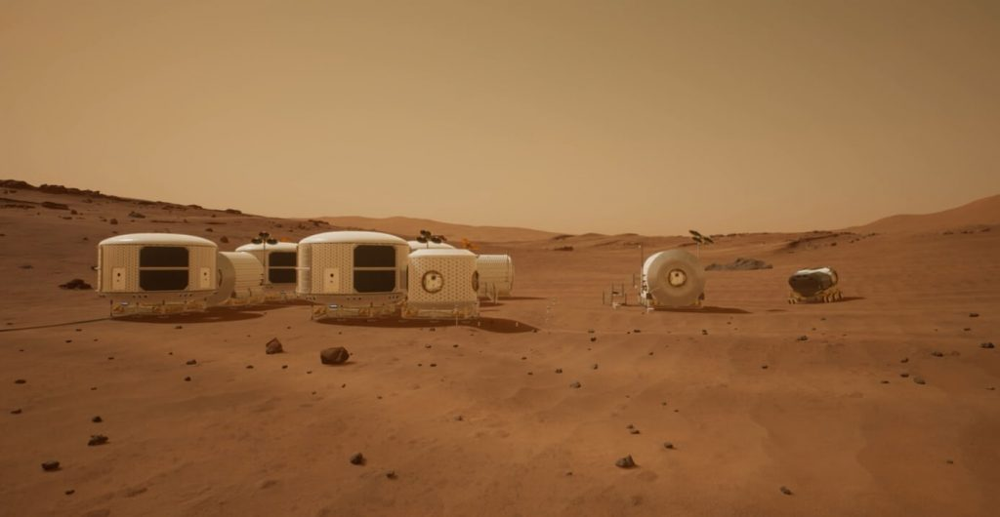
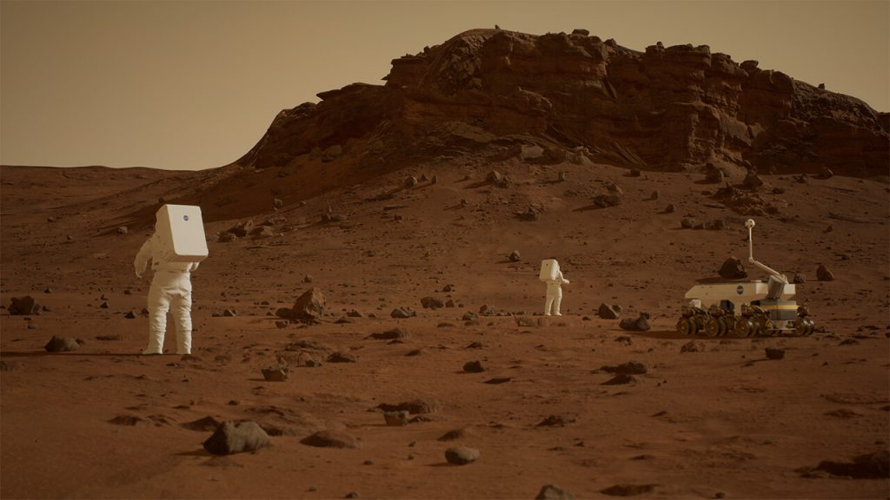

The crossover we deserve — [NASA has created a “virtual Mars” on Unreal Engine 5](https://www.nasa.gov/help-nasa-develop-vr-for-mars-missions).

Sounds like an idea for a game, but no, this is serious. The XOSS MarsXR virtual environment allows astronauts to create the conditions humanity will experience on Mars in the future. In virtual reality (but at the same time being on Earth) scientists will study the red planet, its weather, “sights” and their impact on Earth technology.

[You can download the asset editor for free](https://store.epicgames.com/ru/p/nasa-xoss-marsxr-editor), which also allows you to create your own scripts. Now it is already possible to land in the Ezero Crater, change the time of day and even interact with the rovers!

If you are interested in development, NASA has announced a competition to create assets and scenarios for the MarsXR virtual environment. The agency will select the top 20 developers or teams to create the best content for virtual Mars. And the best of the best works will get into the official version of the project. There are several categories of scenarios, so there is a lot of room for scientific creativity. The prize fund of the competition is 70 thousand dollars.

Applications are accepted until July 27, 2022.
