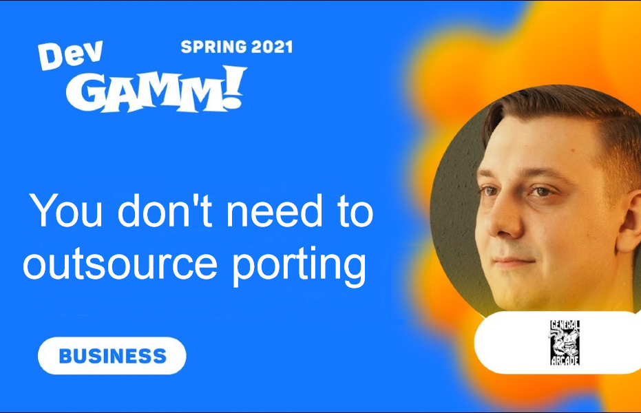
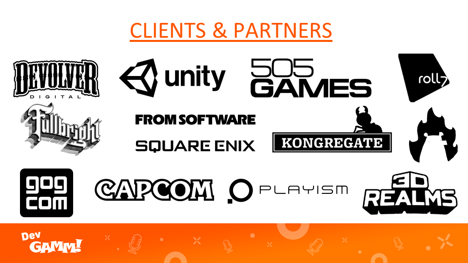
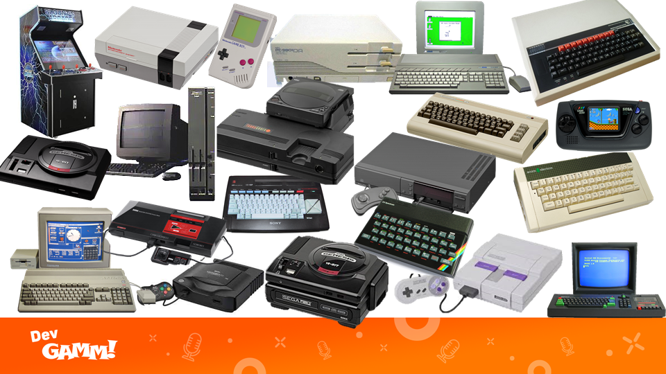
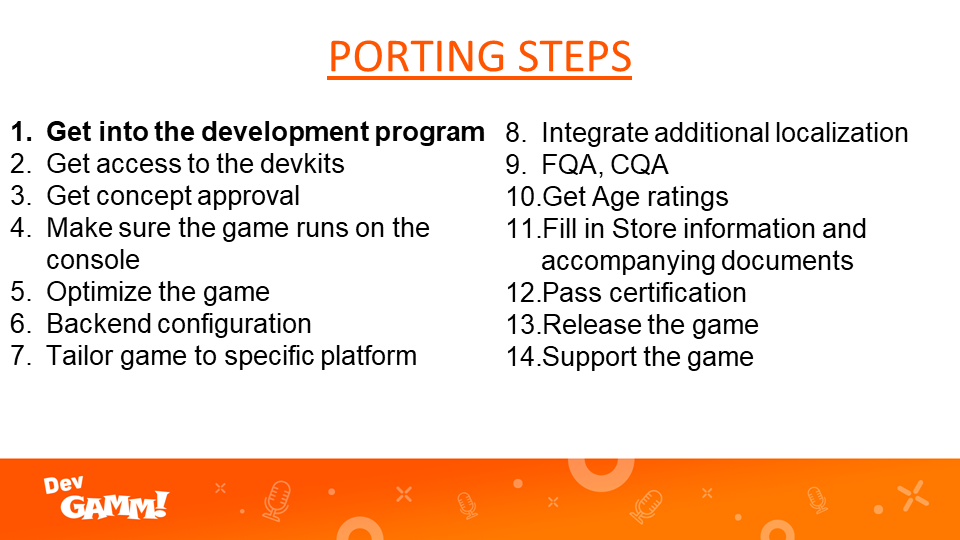
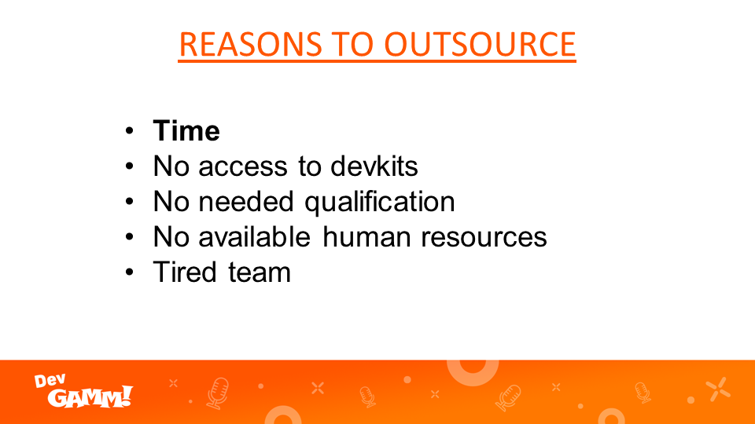
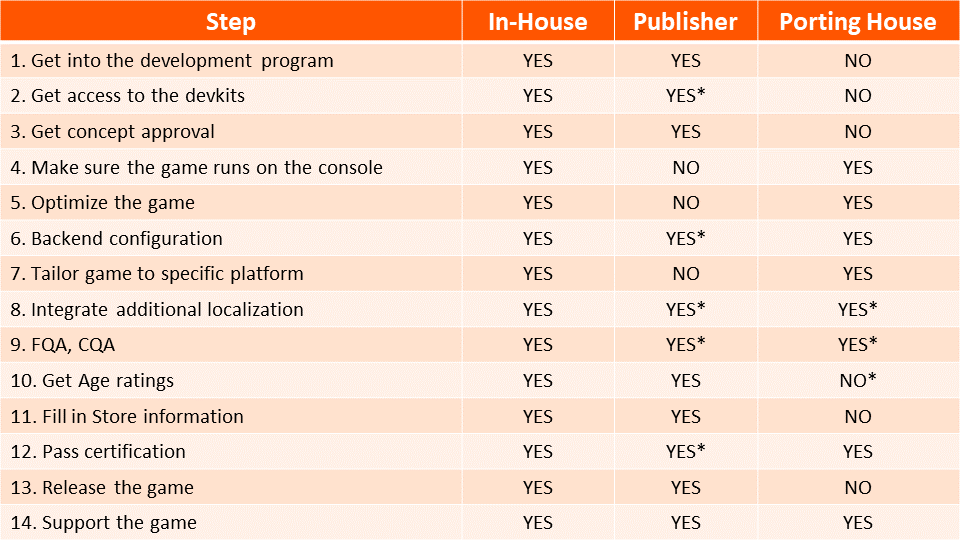
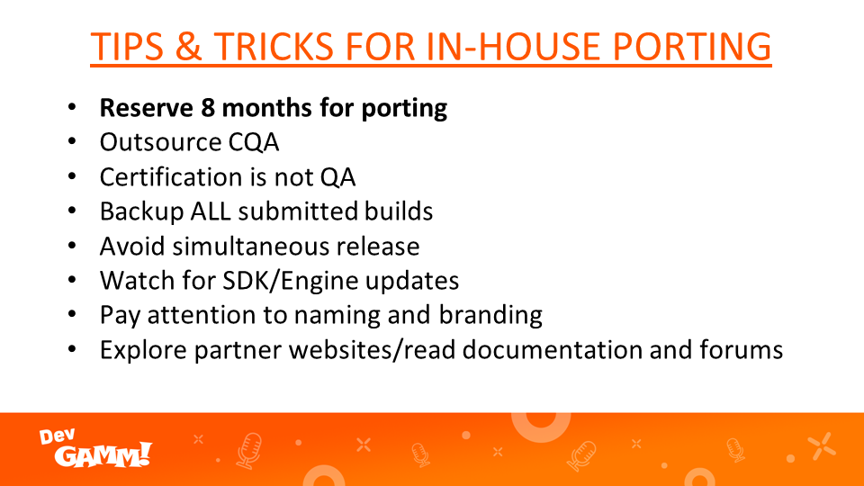
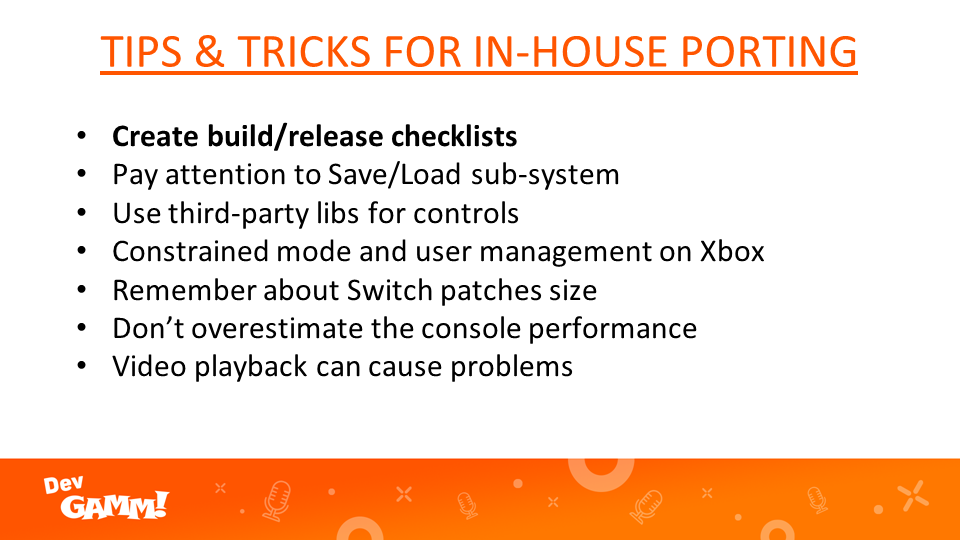
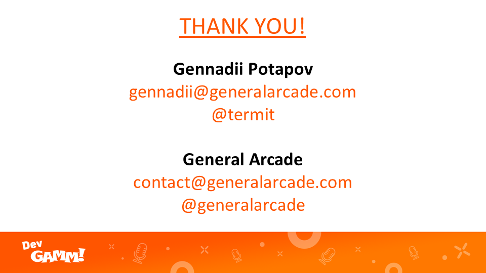

What is porting and what steps does it involve? What are the common pitfalls? What is quality adaptation? Is it possible to make the port on your own or do you need to involve the help of a third-party studio? What are the pros and cons of outsourcing the porting process? Gennadii Potapov, CEO of General Arcade, covers these and related issues in this lecture made at DevGAMM 2021 conference.

If you speak Russian, you can just listen to it while watching the video, or you can read the full lecture in English right here!

<iframe allow="accelerometer; autoplay; clipboard-write; encrypted-media; gyroscope; picture-in-picture" allowfullscreen="" frameborder="0" height="315" src="https://www.youtube.com/embed/gwVe3BW52io" title="YouTube video player" width="560"></iframe>

— Hi Everyone! My name is Gennadii Potapov. I’m CEO and co-founder of General Arcade — a porting house and co-development studio based in Singapore and Russia. The company was founded in 2013. We provide engineering outsourcing, with the main focus on porting.

We provided services to companies like Capcom, From Software, Devolver Digital, GOG, Kongregate, Vlambeer, Fullbright, Pocketwatch Games, and others. General Arcade was involved in work with the following titles and IPs: Metal Wolf Chaos XD, Duke Nukem 3D, Dragon’s Dogma, Shadow Warrior, Cat Quest 2, VA-11 HALL-A, Tooth and Tail, Tacoma, Hotline Miami 2, Gone Home, Luftrausers, etc.

<figure class="wp-block-image size-large"></figure>

My talk is called “You don’t need a Porting House!”.. I know it’s a cheesy name, it’s a nod towards Devolver Digital’s <a href="mailto:nigel@devolverdigital.com">Nigel Lowrie</a> talk “You Don’t Need a F-ing Publisher” (if you haven’t seen, it’s great, check it out, <a href="https://www.youtube.com/watch?v=mAI5W7Y5H28" rel="noreferrer noopener" target="_blank">it’s on GDC YouTube channel</a>). My intention for this talk is to pass information, shed some light on porting processes, challenges, common pitfalls, and talk about the pros and cons of in-house porting versus outsourcing to third-party companies.

It is worth mentioning that my presentation is mainly intended for new developers who are working on their first or second title and exploring options on developing console adaptations.

Every time we receive an RFP, we get a lot of questions about our work. And it’s pretty surprising how many developers don’t know much about console porting and the processes involved. Not only new devs, but people with experience as well. It’s not bad, just a bit unexpected. A few years ago at GDC, nonetheless, at the networking party. Remember the time when we had physical events? After I introduced myself and what I do, one person asked me: “Aren’t your company services obsolete because we have Unity now? You just press one button and the port is done…” Not gonna lie, I was shocked for a few minutes. And we need to compliment the Unity marketing team here. Even though it maybe was not correct to write off the whole porting industry just because of Unity’s existence. He is kind of right in one thing —  in many cases, you don’t need a Porting House and can produce ports yourself.

But let’s start from the beginning. What is porting? Porting is the process of adapting software for the purpose of achieving some form of execution in a new environment that is different from the program was originally designed for (e.g., different CPU, operating system, or third party library). In the context of this presentation, we are talking about the process of porting games to consoles.

<figure class="wp-block-image size-large"></figure>

Obviously, game porting and porting houses are not a new concept. If we look back in the late 80s and mid-90s, there were so many different platforms. Many of these systems found favor in regional markets. Both hardware and software were very different in those systems.<em> </em>Making the development and porting games incredibly hard. And of course, there were no cross-platform engines and tools<em>.</em> That’s why there were companies — porting houses. Did you know that the first company John Romero founded before id Software was a studio called Out Software, and it was a porting house, which mainly did Apple II ports?

Today we basically have only 5 platforms (PS, XB, Switch, PC and iOS, and Android) and more importantly access to powerful cross-platform engines and tools that are very easy to use. Platforms themself are very similar to each other. So how is it nowadays to port a game? Is it as simple as pressing one button in Unity? Let’s go step by step through the process of bringing a game to current or next-gen consoles.

<figure class="wp-block-image size-large"></figure>
<ul><li><strong>Get into the development program</strong>. First, you would need to apply to become a registered developer or partner for platforms you would like to release the game. This can take some time with all paperwork and approvals. Some platforms are stricter than others, so be patient. “Be patient” is actually a common theme in porting.</li></ul>
<ul><li><strong>Get access to the devkits</strong>. Next, you need to get devkits, a special version of consoles used for development and testing. In some cases, you can rent those, but most of the time you have to buy those and they are not cheap. Delivery will take a while and you might face problems with delivery to your country, especially if your company is located in Eastern Europe… Sometimes publishers can help you with this.</li></ul>
<ul><li><strong>Get concept approval</strong>. For concept approval, you will have to lay down details of your game for platform holders to review your application. It’s a straightforward process and shouldn’t take long.</li></ul>
<ul><li><strong>Make sure the game runs on the console</strong>.<strong> </strong>I guess this is self-explanatory step.</li></ul>
<ul><li><strong>Optimize the game</strong> to run it smoothly with a good framerate and acceptable loading time. Important to understand that this process not only involves working with code but with game assets as well.</li></ul>
<ul><li><strong>Backend configuration</strong>. Trophies, leaderboards, hero stats, DLCs, whatever features you use in your game. This sounds simple but still can take a lot of time to do it right.</li></ul>
<ul><li><strong>Tailor game to a specific platform</strong>. Tailoring means implementing support for console-specific features, like HD Rumble on Switch, Adaptive triggers on PS5 or Quick Resume on Series X.</li></ul>
<ul><li><strong>Integrate additional localization</strong>. Sometimes people forget that while porting you will introduce new text strings and those would need to be localized as well. Also, there is a common practice to introduce new languages for a console release.</li></ul>
<ul><li><strong>FQA, CQA</strong>. FQA is a functional QA, for testing game logic. And CQA is a compliance QA, to make sure that your game complies with all rules of a platform and passes certification.</li></ul>
<ul><li><strong>Get Age ratings (CERO, ESRB, PEGI)</strong>. You need to receive an age rating from rating agencies like ESRB, PEGI, CERO. Nowadays this is mostly needed for physical releases. Additional content, like DLCs, might need to get ratings as well.</li></ul>
<ul><li><strong>Fill in Store information and accompanying documents</strong>. Nothing special here, just a bazillion of forms and docs.</li></ul>
<ul><li><strong>Pass certification</strong>. Certification is the most<strong> </strong>crucial and complicated process. It has different names for each console FQA for Sony, CERT for Xbox, Lotcheck for Switch. For certification you need to prepare release builds for each region. This is important. Book a slot for platform QA to go through all requirements and see if the game comply and also that all your documents are in order. For each platform, there are hundreds of rules. Some are very simple like the game should be stable and not crash. Others are more complicated, describing a proper logic for working with user-generated content or displaying user tags in cross-platform networking. If you are doing certification for the first time you most likely will fail it and you will have to go through the whole process again. Big and complex games have more chances to fail, as more requirements need to be covered. DLCs need to go through the certification process as well. For patches too, but they have simplified processes and sometimes it’s even automated and can be delivered to customers in a few hours.</li></ul>
<ul><li><strong>Release the game</strong>. Work with marketing teams on a platform’s side to receive coverage and event exposure.</li></ul>
<ul><li><strong>Support the game</strong>. Work on updates and DLCs.</li></ul>

That’s a lot of steps. So where can Unity or other cross-platform engines help you? Only in Make sure the game runs on the console and Optimize the game. And even that is a bit of a stretch. You are most likely to face issues with shaders, memory allocation, resources loading, and others. Those are not hard to fix, but you need to know where to look. Don’t get me wrong it’s still a huge timesaver to use cross-platform engines, but unfortunately, it’s not just a press of one button.

Anyway, as I said before, that’s a lot of steps but everything is doable. It’s not rocket science. So why do people outsource porting?

<figure class="wp-block-image size-large"></figure>
<ul><li><strong>Time</strong>. You can save a lot of time by hiring a third-party studio, who already worked on dozens of ports and knows what they are doing.</li></ul>
<ul><li><strong>No access to devkits</strong>. The team simply might not have access to devkits or not enough time to get those.</li></ul>
<ul><li><strong>No needed qualification</strong>. The company doesn’t have programmers who are familiar with low-level APIs for those platforms and can’t afford to spend time learning them.</li></ul>
<ul><li><strong>No available human resources</strong>. It’s common when after the release of the game a studio will immediately start working on the next project. And they need all members of the team dedicated to it.</li></ul>
<ul><li><strong>Tired team</strong>. After working on the game for multiple years the team often can get tired of their own creation and don’t work on it anymore. Outsourcing further work on ports can be an option.</li></ul>

Most studios can do ports in-house. And we’ve seen a lot of indies do that. We also see that many studios don’t want to do it themself because porting houses can do it more efficiently, while they can concentrate on making more content or new games.

<figure class="wp-block-image size-large"></figure>

Let’s look at the pros and cons of porting in-house. It’s basically the same slide but more structured.

<figure class="wp-block-image size-large"></figure>

If you decide to work with a porting house what do you need to know?

<figure class="wp-block-image size-large"></figure>
<ul><li><strong>How much time does it take to make a port? </strong>Time of course depends on a project’s complexity. In a most simple case, let’s say a single-player game made on Unity. It will take about 3 months from the time code received to the moment the game passed certification. Doing it faster is almost impossible. For multiplayer games, you can easily double the time because of the increased complexity and amount of QA needed to be done.</li></ul>
<ul><li><strong>How much does it cost? </strong>The cost again depends on the project and on the studio you are working with. It can go from $15,000 to half a million dollars for one platform.</li></ul>
<ul><li><strong>What does the process of working with an outsourcing studio look like?</strong> You approach a studio with a request for a quote describing details of the project. Sign a mutual NDA and share the source code of the game. It will take from a few weeks to a month for a porting house to prepare a quote for you. Among the other things, the quote would include the cost, proposed schedule, and payment scheme. If you are satisfied with the quote you’ll sign the agreement and the porting house would start the work according to the schedule.</li></ul>
<ul><li><strong>How to choose a porting studio?</strong> There are different types of companies that provide porting services. Some companies only do porting, others provide additional services like 2d and 3d art, localization, etc. There are also companies that will publish this game as well. Pick the company according to your needs. Another important thing to look at is the size of the projects that the company is working on. If you have a small indie game there is no point to ask for a quote from big studios like Iron Galaxy or Virtuous who mostly work on AAA games. There are companies that specialized in specific engines like Headsup Studios is the biggest contributor to Monogame or Ethan Lee is a creator of FNA, Lone Wolf Technology is known for making Godot ports. You got the idea. And the last thing when choosing a studio is to go on their website, find the list of the clients and reach out to some of them to get feedback about the porting work. Most of them would be willing to share their experience. And based on that you can make a decision if you want to work with that company or not.</li></ul>
<figure class="wp-block-image size-large"></figure>
<ul><li><strong>Reserve 8 months for porting</strong>. If it’s your first time developing for consoles, make sure that you have at least 8 months before the release. So you have enough time to figure everything out and if needed to re-submit builds for certification. If you are bringing a multiplayer game, account for at least 12 months.</li></ul>
<ul><li><strong>Outsource CQA</strong>. If it’s possible, outsource compliance QA. This will save you a lot of time and nerves reducing or completely eliminating certification issues.</li></ul>
<ul><li><strong>Certification is not QA</strong>.<strong> </strong>This is a common mistake to treat Certification as FQA. Platforms only check against their checklist and would not do functional QA for you. They might find and report some bugs, but it’s not their purpose.</li></ul>
<ul><li><strong>Backup ALL submitted builds</strong>. Don’t forget to backup all builds that passed cert. You will need those for creating future updates and patches. Also very useful to have those for reference.</li></ul>
<ul><li><strong>Avoid simultaneous release</strong>. Launching the game on one platform is already a challenge, launching the game on all major platforms and trying to line up all releases on the same date can be a nightmare. My suggestion is to start with one or two platforms. Let’s say Steam and PS4, or PS4 and Switch. And do other platforms a few months later. Some platform holders may not like it, but you will save your and your team’s sanity.</li></ul>
<ul><li><strong>Watch for SDK/Engine updates</strong>. Keep an eye out for SDK updates and engine versions associated with it. Platforms have a very short SDK life cycle. During the development it’s very likely that the SDK you started developing with will be deprecated and game build would not be accepted for submission. Don’t wait ’till the end of development to update it. You don’t want to end up in situations where you have new unexpected bugs caused by SDK or Unity update right before submission. The general rule is to stick to LTS versions of engines.</li></ul>
<ul><li><strong>Pay attention to naming and branding</strong>. The single most common issue that causes certification failure is not using the right names when referring to products or part names. For example, if on PS4 you refer to the controller as “gamepad” instead of “DUALSHOCK®4 wireless controller”. Or describing the vibration of the controller as “haptic feedback” instead of “HD rumble” in Switch games. Or missing a proper trademark symbol in product names.  You will fail the certification. To avoid this use Naming Conventions guidelines that are available for each platform.</li></ul>
<ul><li><strong>Explore partner websites/read documentation and forums</strong>. All platforms have different submission processes and following those for the first time can be quite confusing. So spend some time exploring partner websites and reading documentation and forums before the time comes for submission. You can find answers to 99% of questions in the documentation. For the rest 1% contact your account manager or support. Oh, and read newsletters or updates from platforms, there is a lot of useful information and promotion opportunities.</li></ul>
<figure class="wp-block-image size-large"></figure>
<ul><li><strong>Create build/release checklists</strong>. Create detailed step-by-step checklists for the creation and verification of the builds for each platform. And most important, keep those updated. It’ll save you all a lot of headaches.</li></ul>
<ul><li><strong>Save/Load systems</strong>. Another common reason for certification failure is the incorrect implementation of the save/load sub-system. Most consoles have slow storages (not next-gen though), so you would need to implement proper asynchronous loading/saving functionality. Be mindful of the number of write cycles as it can be a problem with certification as well. Also, pay attention to error handling, situations like no free space left on storage, or corruption of a save file. Handle it and show the appropriate message.</li></ul>
<ul><li><strong>Use third-party libs for сontrols</strong>. Save yourself time and use third-party libraries for gamepads. For Unity you can use Rewired and InControl, there are similar libraries for Unreal as well. That would help a lot on Switch because it has so many different joycon and gamepads configurations.</li></ul>
<ul><li><strong>Constrained mode and user management on Xbox</strong>. Make sure you dedicate enough time to implement and test the handling of Constrained mode and user management on Xbox, even if you have a single-player game. On PS the same task is done by simply clicking one checkbox, but for Xbox, you will have to write a lot of code to cover all scenarios for user switching and game exiting and entering Constrained mode.</li></ul>
<ul><li><strong>Switch patches size</strong>. There is a known restriction for patches on Switch, those can’t be more than 512MB in size. Few things to avoid crossing the limit. First, use asset bundles in Unity or similar techniques in other engines. Second, if you plan to do DLC, do be lazy and put full content in the DLC, instead of adding content as an update and unlocking entitlement in DLC. Yes, it’s a bit harder to implement, but you will not bloat the size of your game and would not need to rely on waivers when the patch size is too big. And the last experiment with a patching tool while you develop the initial version of the game. You can make a few small changes and try to make a patch and note its size.</li></ul>
<ul><li><strong>Don’t overestimate the console performance</strong>. Consoles are quite powerful, considering their cost. But using their power to make a game that runs great is not an easy task. Even small games can be hard to optimize for good performance. Another thing important to understand is that the same types of GPU and CPU workload can affect the performance of PCs and consoles in different ways. So don’t expect that if the game works well on a PC with a similar hardware configuration as a console, that the game would perform well on the console too.</li></ul>
<ul><li><strong>Video player</strong>. One last technical hurdle with consoles is video playback. It looks like a simple task, but there are always issues with it. Rad’s Bink video playback library costs that much for a reason. So don’t underestimate this task.</li></ul>

<strong>What makes a great port?</strong> It is the last topic I want to cover. I believe it’s very important to understand what makes a great adaptation. Let’s go with reversed logic and remember a very bad console port to PC. You know what kind of games I’m talking about.

<ul><li>Frequent crashes</li><li>Frame rate is not stable or game statters</li><li>Many game bugs</li><li>No proper keyboard/mouse support</li><li>Missing DLCs</li><li>No option to pick a different resolution or higher refresh rate</li></ul>

So based on this we can easily get a recipe for a great port.

<ul><li>Stability</li><li>Good performance</li><li>Well tested</li><li>Adopted console input scheme</li><li>Content parity</li><li>Platform tailoring</li></ul>

There can be other things, but I think those are the main ones. If you can nail all those, your port would be great.

Unfortunately, the realities of the game industry are that we often operate on a tight schedule and budget, and the wrong choice can cause significant damage, which sometimes could even lead to an end of the studio. I didn’t provide an answer or solution in my talk, but I hope I gave enough details to make an informed decision that would work in your situation and your game.

<figure class="wp-block-image size-large"></figure>

