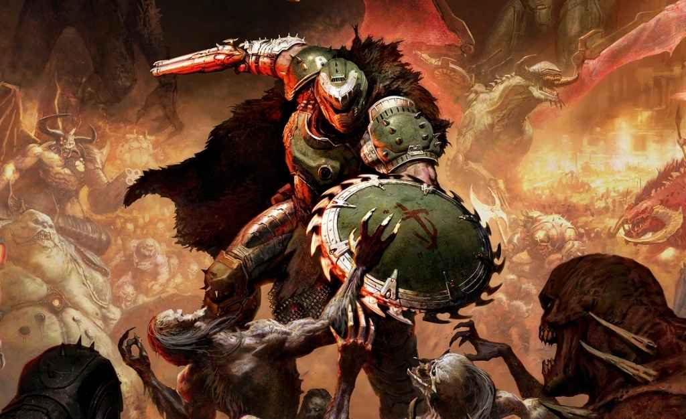

The game development industry is always buzzing with exciting updates, fresh ideas, and innovations. At General Arcade, we’re here to keep you in the loop with our Weekly Game Development Industry Digest, whether you’re a gaming enthusiast or a developer.

**Captain Blood is Coming on May 6th!**



Look out for [Captain Blood](https://store.steampowered.com/app/3040220/Captain_Blood/) as it’s finally set to hit your consoles on May 6th, 2025. Originally developed by Seawolf and remastered by [General Arcade](https://generalarcade.com/), this pirate themed game involves hand-to-hand combat using epic combos, pirate weapons, and engaging in ship battles. Definitely looking forward to this one!

[**Balatro and Luck Be a landlord: How One Game Inspired the Other**](https://screenrant.com/luck-be-a-landlord-console-balatro-inspiration/)

[Balatro](https://store.steampowered.com/app/2379780/Balatro/) and [Luck be a Landlord](https://store.steampowered.com/app/1404850/Luck_be_a_Landlord/) stand tall as smash hits among niche gaming audiences. But what many don’t know is how similar the core design philosophies of both these games are. Luck be a Landlord was a big influence on Balatro with both games sharing similar unique deck-building mechanics, emphasizing luck and strategy, as well as roguelike features. [LocalThunk](https://www.reddit.com/user/localthunk/), the developer of Balatro stated:

_“The one largest influence on Balatro was Luck Be a Landlord. I watched Northernlion play for a few videos and loved the concept of a non-fantasy themed score attached roguelike a ton, so I modified the card game I was working on at the time into a roguelike.”_

[**Trainers, Get Ready! Pokemon Go’s “Steeled Resolve” Event is Here**](https://screenrant.com/pokemon-go-steeled-resolve-event-guide/)

The [**Pokemon Go’s**](https://pokemongolive.com/?hl=en) latest event ‘Steeled Resolve’ is kicking off 2025 in style from the 21st – 26th January 2025. Apart from a new Pokemon ‘Rookidee’ and its evolutions making their debut, players can expect boosted spawns with wild encounters and more bonus rewards. Plus, players are also offered special Magnetic Lure bonuses which attract an alternative range of Pokemons. Now go get one more into your Pokemon Go collection!

[**Here’s Why You Should Check Out Steam’s First Sale of 2025**](https://www.pcgamer.com/games/strategy/s-ts-about-to-get-real-the-first-steam-sale-of-2025-is-live-and-its-all-about-strategy-games/)



Valve has launched its first Steam sale [**‘Real Time Strategy Fest’**](https://store.steampowered.com/category/strategy_real_time), happening from now until 27th of January 2025. The event is offering significant discounts on a variety of strategy games, some of which are:

- Warhammer 40,000: Dawn of War 2 Anniversary Edition – 80% off
- Iron Harvest – 85% off
- Age of Empires 4 Anniversary Edition – 50% off
- Homeworld Remastered Collection – 90% off
- Company of Heroes 3 – 50% off

Additionally, for those who would love some free stuff, check [here](https://store.steampowered.com/points/shop/event/sale_real_time_strategy) for avatar frames and ‘RTS Tank’ animated avatar.

[**Manipulate, Haunt, Repeat : A Game You Must Try**](https://dev.ua/en/news/the-demons-told-me-to-write-this-news-1737473597)



The Kyiv based [Haunted Dude](https://haunteddude.com/) is coming up with a narrative adventure game titled [The Demons Told Me to Make This Game](https://store.steampowered.com/app/2835690/The_Demons_Told_Me_to_Make_This_Game/), inspired by [Disco Elysium](https://discoelysium.com/buy-now) and [Slay the Princess](https://store.steampowered.com/app/1989270/Slay_the_Princess__The_Pristine_Cut/). What’s exciting about this is that players would assume the role of a demon that advises incompetent exorcists in a demon-infested town. Focussing on mind-bending conversations and time manipulation, players would need to influence the minds of the characters in the game.

[**How Citizen Sleeper 2 was created without coding**](https://www.creativebloq.com/3d/video-game-design/game-development-is-more-accessible-than-ever-how-citizen-sleeper-2-was-created-without-coding)

Gareth Damian Martin, the creator of [Citizen Sleeper 2](https://store.steampowered.com/app/2442460/Citizen_Sleeper_2_Starward_Vector/) has made impressive games without using much coding. Instead, he uses tools such as Playmaker, Dialogue System for Unity and ink scripting language to build them. He admits modern tools make game development much simpler but also risky at the same time as it relies too much on specific softwares.

[Civilization 7 Has Officially Gone Gold](https://gamerant.com/civilization-7-gone-gold/#:~:text=The%20team%20at%20Firaxis%20Games,and%20is%20ready%20for%20release)

[Firaxis Games](https://firaxis.com/) and 2K have announced that [Sid Meier’s Civilization 7](https://linktr.ee/civgame) has gone gold, indicating the game is ready for its February 11, 2025 launch. This milestone means the final development phase is complete, with manufacturing and packaging underway.

[Nintendo Switch 2: Game Developer Explains How It is More Powerful Than Ever.](https://www.gamespot.com/articles/why-switch-2-is-significantly-more-powerful-according-to-a-game-dev/1100-6528921/)



The [Nintendo Switch 2](https://www.nintendo.com/successor/en-us/index.html?srsltid=AfmBOorARdo9ImN1GonFuFJ5K4kG2W8R9VQuiiuQz-DGtHNrI6E2t5Zj) might appear to be a game-changer according to Jerrel Dulay of Sungrand Studios. Based on his analysis of the [Mario Kart 9](https://www.gamespot.com/gallery/every-mario-kart-9-racer/2900-6141/#1) running on the upcoming console, Dulay highlighted that it looks like there will be some jaw dropping visual enhancements in the Nintendo’s next system such as true volumetric lighting, realistic dynamic shadows, and highly detailed textures. Plans are underway to share more about Switch 2 at the April 2 Nintendo Direct, with public demos available in select cities starting in April.

Also, check out this analysis on the Switch 2 by Digital Foundry [here](https://www.youtube.com/watch?v=9Pdx4GK4PSw).

[**How to create a real-world train exterior in Substance 3D Designer**](https://80.lv/articles/realistic-weathered-train-exterior-recreated-with-substance-3d-designer/)

Dave Miragliotta, a Senior Environment Artist at [Respawn Entertainment](https://www.respawn.com/) with over a decade of experience, recently shared his process for creating a real-world inspired train exterior material in [Substance 3D Designer](https://www.adobe.com/my_en/products/substance3d/apps/designer.html), later finalized in [Marmoset Toolbag](https://marmoset.co/?gad_source=1&gclid=Cj0KCQiA7se8BhCAARIsAKnF3rwFDhOjBkt1Sh9HXRbS8qPBEEdUepflUCttNFIaBKZ0gjQGV2ATRMQaAgMEEALw_wcB). Drawing inspiration from holiday photos taken on a train, Dave focused on capturing painted metal damage, rust, and weathering details.

[**Doom: The Dark Ages’ development details shine light on the state of modern triple-A production**](https://www.gamedeveloper.com/design/doom-the-dark-ages-development-details-shine-light-on-the-state-of-modern-triple-a-production)

[Doom: The Dark Ages](https://store.steampowered.com/app/3017860/DOOM_The_Dark_Ages/) by [id Software](https://www.idsoftware.com/en) continues the franchise’s tradition of reflecting the current trends in first-person shooters, with a focus on innovation and audience needs. Unlike its predecessors, it opts for slower, more visceral gameplay reminiscent of the original 1990s [Doom](https://en.wikipedia.org/wiki/Doom_(1993_video_game)).

[**Patch 2.21 for Cyberpunk 2077 is being rolled out on PC, PlayStation 5 and Xbox Series X|S**](https://www.cyberpunk.net/en/news/51296/patch-2-21)

This update adds support for DLSS 4 on PC and introduces various fixes, notably to SmartFrames on Xbox and Photo Mode across all platforms.

[**Warhammer: Vermintide 2 – Verminous Dreams: Devious Delvings**](https://www.vermintide.com/news/devious-delvings-patch-6-3-0)



This new map has arrived on January 23rd, free for all owners of Vermintide 2!

[**Think you can’t play Doom Inside a PDF reader?**](https://80.lv/articles/you-can-now-play-doom-in-microsoft-word-document/)

Think again! [Github](https://github.com/wojciech-graj/doom-docm) user ading2210 got you covered.

Inspired by [DoomPDF](https://doompdf.pages.dev/doom.pdf), Wojciech Graj is the person behind this project who ported Doom to a standalone Word document. However, it’s worth noting that there is no sound (yet) in this game release.
