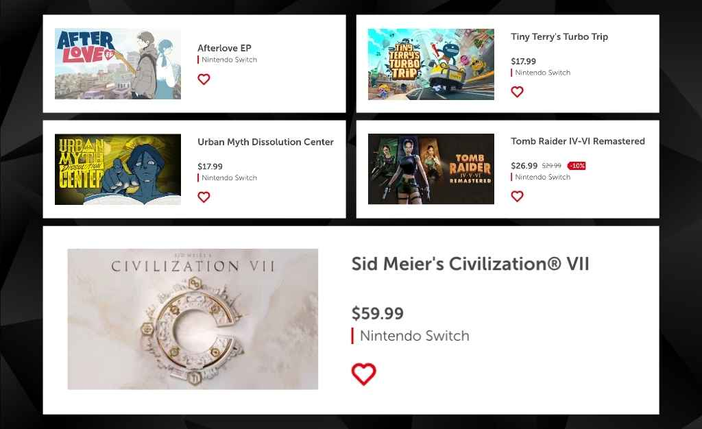
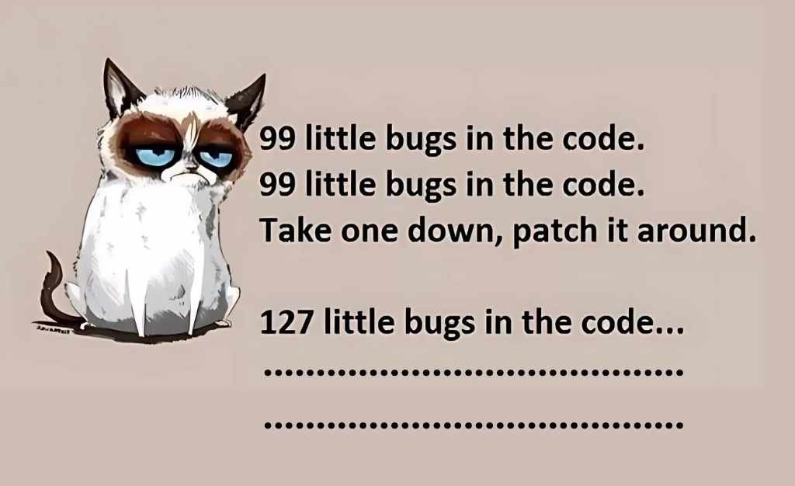
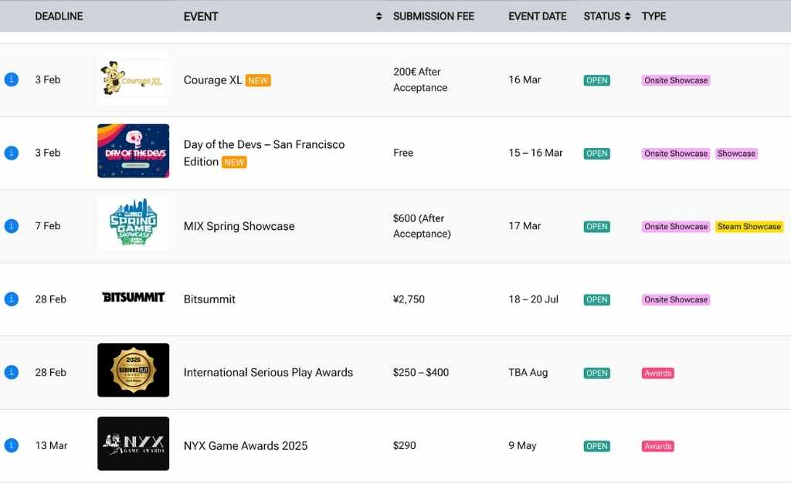

The game development industry is always buzzing with exciting updates, fresh ideas, and innovations. At General Arcade, we’re here to keep you in the loop with our Weekly Game Development Industry Digest, whether you’re a gaming enthusiast or a developer.

[**Blender Powered The Award-Winning Movie: Flow**](https://80.lv/articles/award-winning-flow-s-director-breaks-down-how-blender-made-the-film-possible/)



Blender has enabled the creation of an award winning short film, Flow. What’s noteworthy is that the director of Flow has appreciated its cost-effective, integrated workflow and its ability to produce a cinematic quality of visuals.

[**Upcoming February 2025 Nintendo Switch Games**](https://www.nintendo.com/us/whatsnew/coming-soon-nintendo-switch-games-arriving-in-february-2025/?srsltid=AfmBOorb-ua0EIcwnHjavVTL0cBSJ7NE-uJG3aMe14gQ9G28JfKd8hfW)

Civilization 3-nintendo-switch-february-release-game development digest
February 2025 seems to gear up for many exciting games, showcasing a mix of new titles and highly anticipated sequels. Action adventures, RPGs and family-friendly games are just some of the diverse lineups. Let’s stay tuned for more updates!

[**Did Someone Say Grand Theft Auto VI Is Releasing?**](https://80.lv/articles/breaking-possible-release-date-for-grand-theft-auto-6-revealed/)

GTA 6-when-game-release-date
A potential release date for the GTA 6 is being talked about based on recent leaks and speculations in the gaming industry. While the developer, Rockstar Games, has not yet officially announced the release date, fans shall stay tuned for an official announcement.

[**Trend Domination of the Game Industry in 2025**](https://pune.news/gaming/top-trends-that-will-rule-the-gaming-industry-in-2025-beyond-298524/)

VR&AR-mobile_gaming_growth-payment-methods-innovations
What are some top trends that might be dominating the gaming industry in 2025 and beyond? Well, this article discusses some of the top trends such as the rise of cloud gaming, virtual and augmented reality advancements, and also increasing popularity of cross-platform plays. These trends are said to be shaping the future of gaming, making it more accessible for players worldwide.

[**Is Sony PlayStation 6 launching in 2027?**](https://www.digitaltrends.com/gaming/playstation-6-ps6-everything-we-know-so-far/#dt-heading-ps6-release-date-speculation)

November 2027 might be witnessing the launch of PlayStation 6, aligning with the company’s typical 7 year console lifecycle. It’s also anticipated to feature advanced chip technology with AMD, which brings console gaming to new heights. Let’s wait and watch for further developments in their production.

[**Mastering Unit Testing in Unity**](https://dev.to/virtualmaker/unit-testing-for-unity-developers-52lp)

bugs in the code meme
Beginner Unity developers who are looking for a guide in unit testing shall check out this page where you can find the basics of setting up and writing unit tests along with some practical tips for integrating testing.

[**Game Related Events**](https://gameconfguide.com/deadlines/)

game development events
Check out this list of upcoming deadlines of game development conferences, events and submission opportunities. If you’re a fellow developer or designer, this list is helpful as it helps to stay updated on important dates for networking, project showcases and many industry related trends.

[**How Do We Market a Game?**](https://howtomarketagame.com/2025/01/20/steam-vs-people-algorithms/)

How-to-market-my-game-digest
This page has excellently laid out how games could be marketed by using Steam’s algorithm and direct audience engagement. The goal is to help game developers maximize visibility on Steam.

[**A One Stop Resource Guide: The Digital Dev Library**](https://www.gamedeveloper.com/production/video-game-history-foundation-digital-dev-library)



The Video Game History Foundation initiates to come up with a Digital Dev Library focusing on preserving and providing access to game development documents. This could benefit researchers, developers and also game enthusiasts as it offers insights into the evolution of game design.

[DEVsday #39](https://generalarcade.com/your-weekly-game-development-industry-digest-devsday-39/)