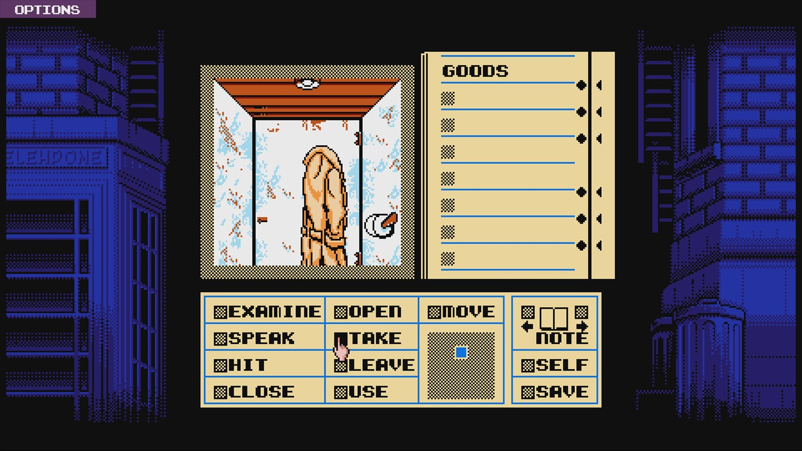
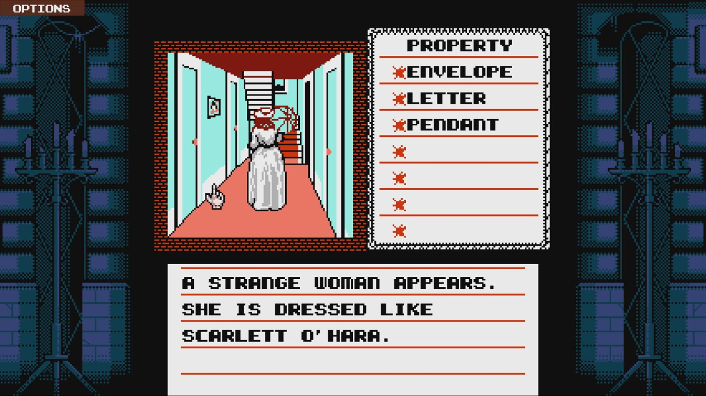
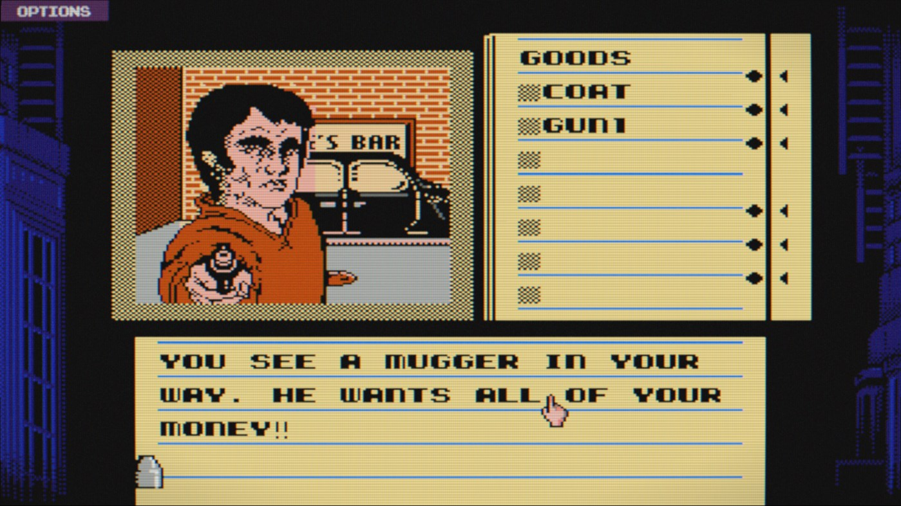
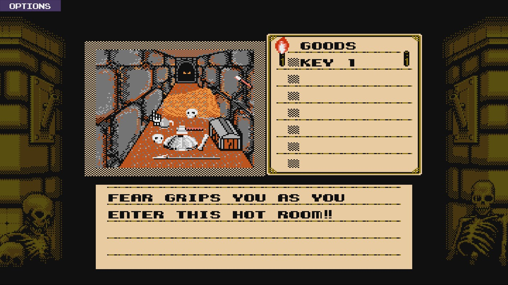

---
title: "8-bit Adventure Anthology: Volume 1"
weight: 17
platforms: ["DRM Free", "Linux", "OSX", "Playstation 4", "Windows", "Xbox One"]
client: "Abstraction Games"
developer: "General Arcade, ICOM Simulations"
publisher: "Reverb Inc"
website: "http://portal.reverbinc.com/project/8-bit-adventure-anthology-volume-1/"
featured_image: "featured.png"
draft: false
---

8-bit Adventure Anthology is a compilation featuring faithful remakes of three of the best 8-bit point & click adventure games ever made. Originally released between 1987-1991, each stand-alone adventure features the same mind-blowing puzzles, graphics and music that mesmerized generations of console gamers!



Now is your chance to play &#8220;Shadowgate™&#8221;, &#8220;The Uninvited™&#8221; and &#8220;Déjà Vu™&#8221; the way they were supposed to be played, with a controller in hand and worlds waiting to be explored! Set within the realms of fantasy, horror and film noir, these three fantastic stories are a must have for those who enjoy traditional adventure games made of tougher stuff.

And those, who brought you this chance are three of our Software Engineers, our QA Engineer and our Artist. That's the right people to bring the classic adventures to consoles and PC. To be honest, that wasn't such an easy task - the guys needed two months! But Unity, C# and MOS6502 ASM helped them.


  
  
  
  
  
  

