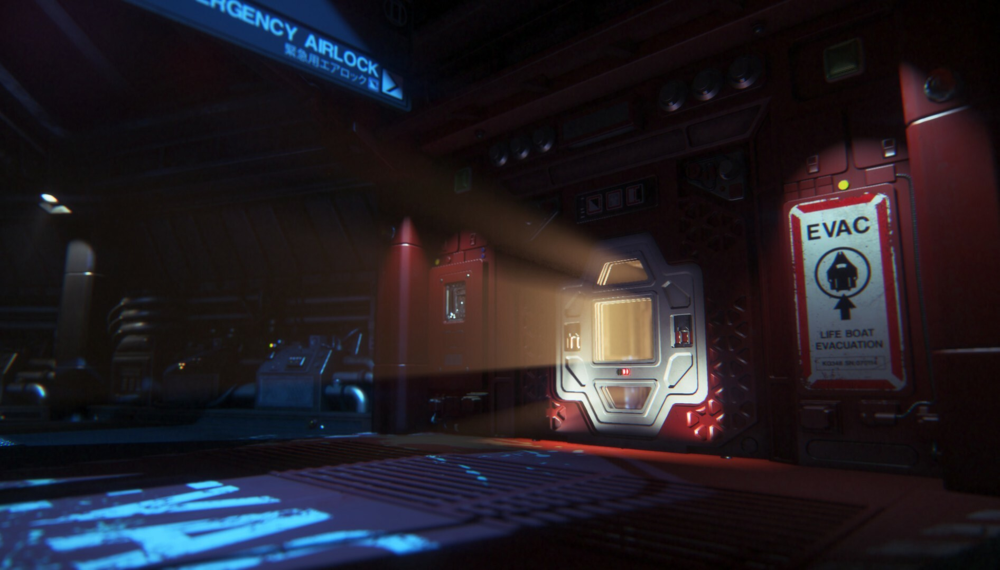
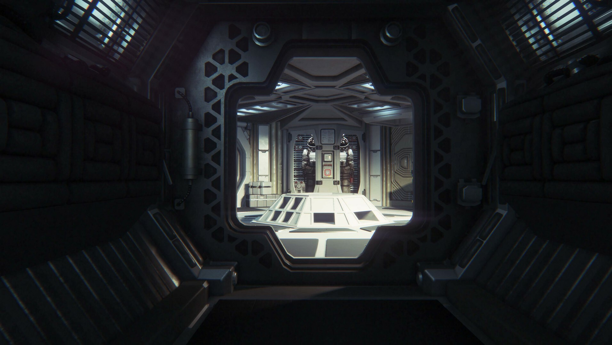
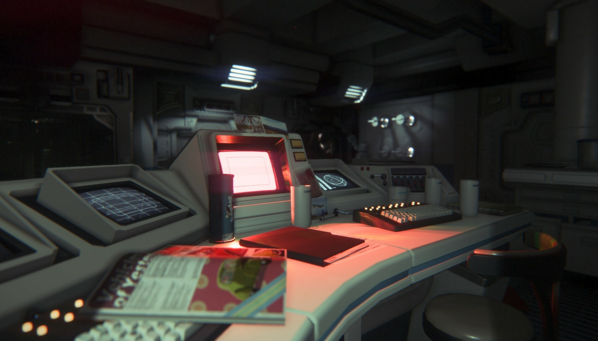
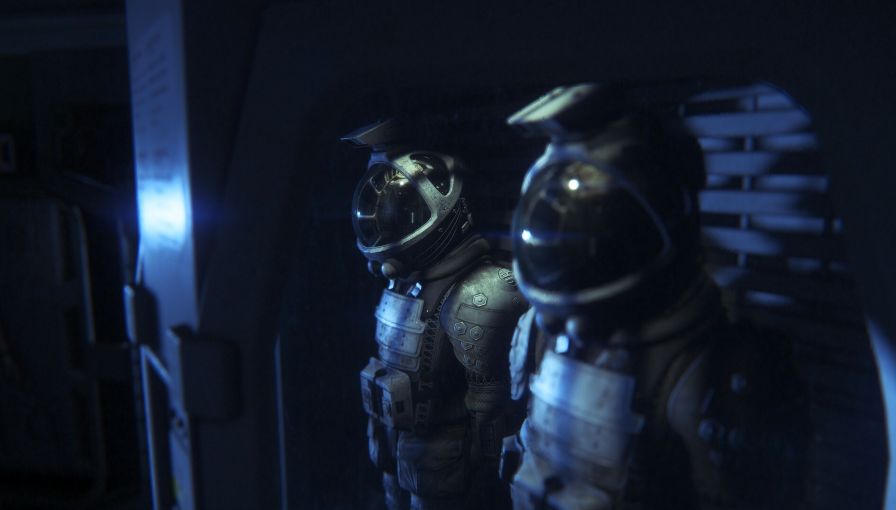
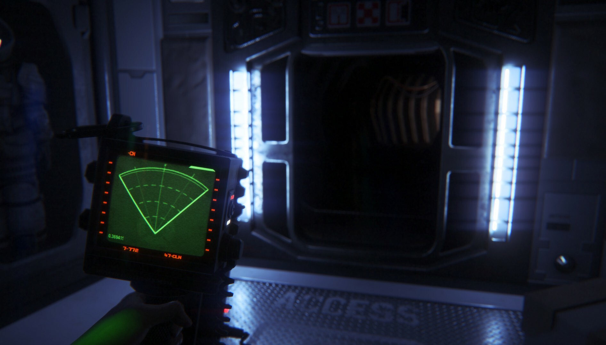
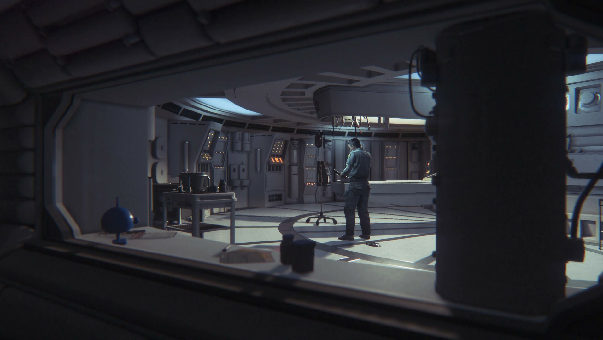

---
title: "Alien: Isolation Collection"
weight: 49
platforms: ["GOG Galaxy"]
client: "GOG"
developer: "Creative Assembly"
publisher: "SEGA"
featured_image: "featured.png"
draft: false
---

Discover the true meaning of fear in Alien: Isolation, a survival horror set in an atmosphere of constant dread and mortal danger. Fifteen years after the events of Alien™, Ellen Ripley’s daughter, Amanda enters a desperate battle for survival, on a mission to unravel the truth behind her mother's disappearance.

As Amanda, you will navigate through an increasingly volatile world as you find yourself confronted on all sides by a panicked, desperate population and an unpredictable, ruthless Alien.

Underpowered and underprepared, you must scavenge resources, improvise solutions and use your wits, not just to succeed in your mission, but to simply stay alive.



One Software Engineer and one QA Engineer from the General Arcade team worked on the port. The goal was to make a complete integration of the Galaxy services and of course to keep the game DRM-free. The custom engine was written in C++, so the appropriate toolkit was used. It took approximately a month to complete the work.


  
  
  
  
  
  

