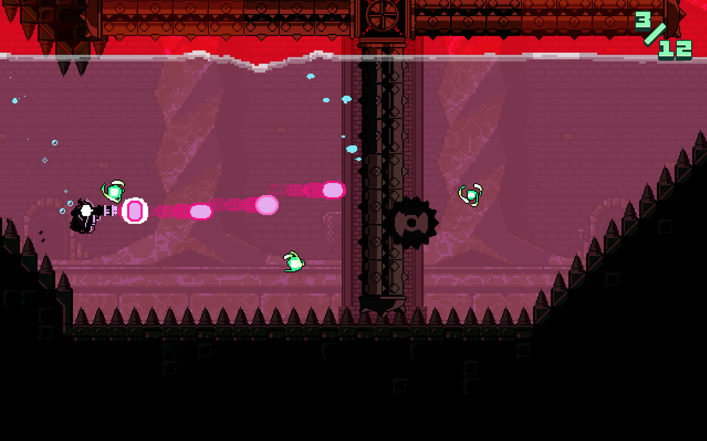
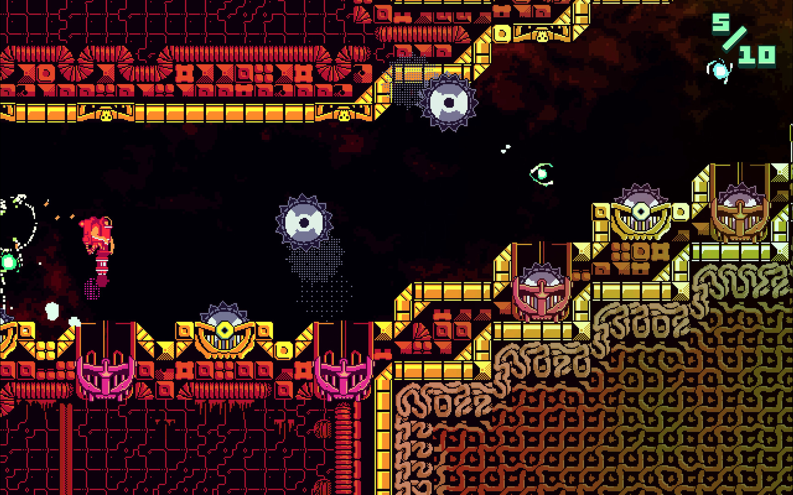
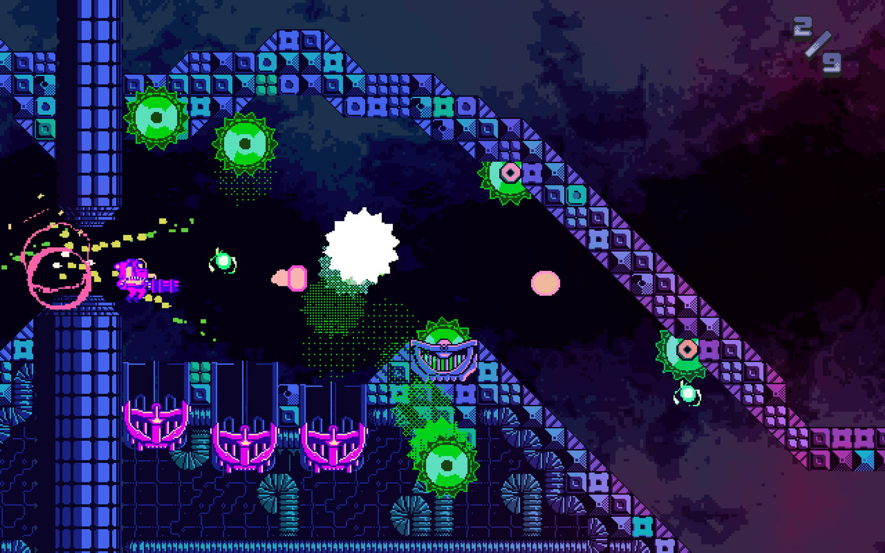
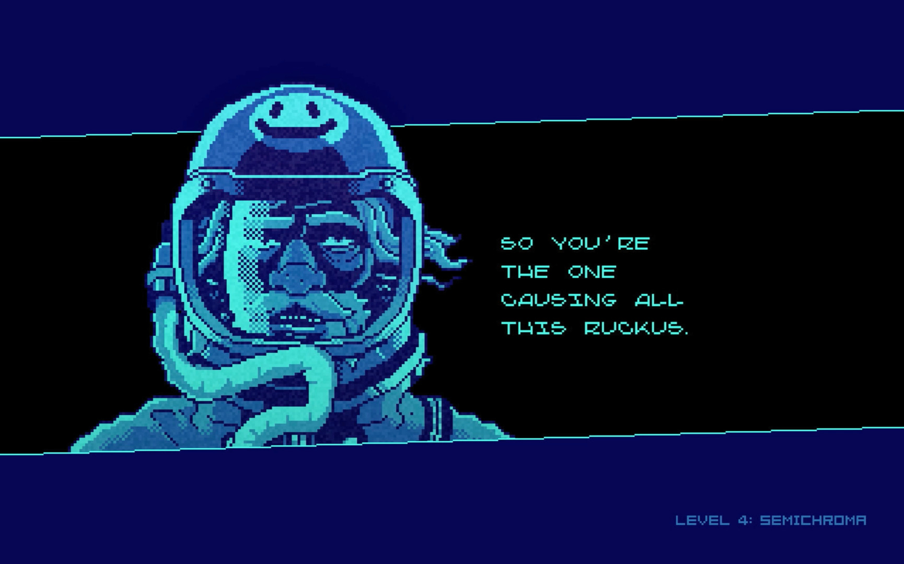
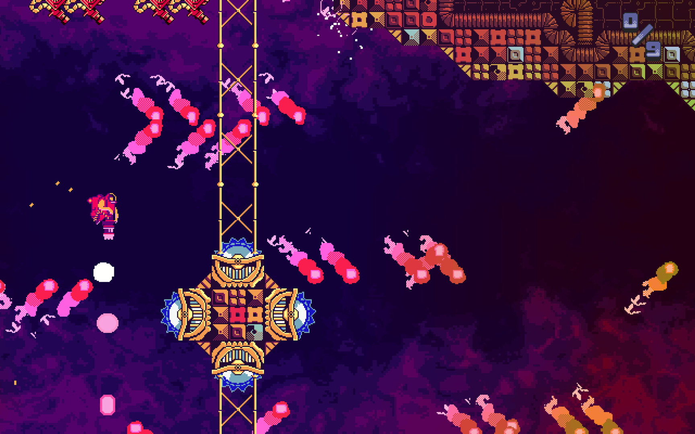
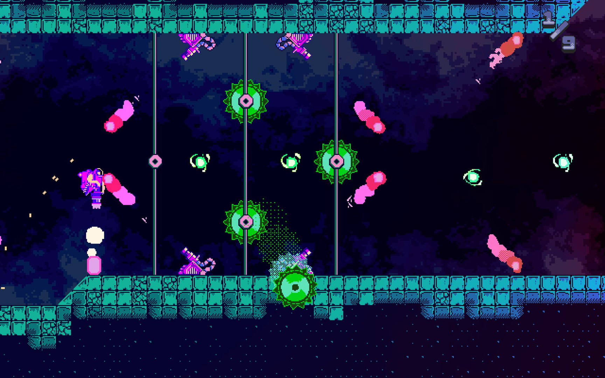

---
title: "ATOMIK: RunGunJumpGun"
weight: 14
platforms: ["Apple TV"]
client: "Good Shepherd Entertainment"
developer: "ThirtyThree"
publisher: "Good Shepherd Entertainment"
website: "https://itunes.apple.com/us/app/rungunjumpgun/id1117166919?mt=8"
featured_image: "featured.png"
draft: false
---

ATOMIK: RunGunJumpGun is a tough as nails game that puts a gravity-defying weapon in your hands. One button lets you fly, the other blasts obstacles out of the way. With a cast of crazed characters, challenging gameplay, and a pulsing musical score, it delivers twitchy platforming goodness.



It took three weeks of our Software Engineer's time to developed AppleTV port using Unity and C#.


  
  
  
  
  
  

