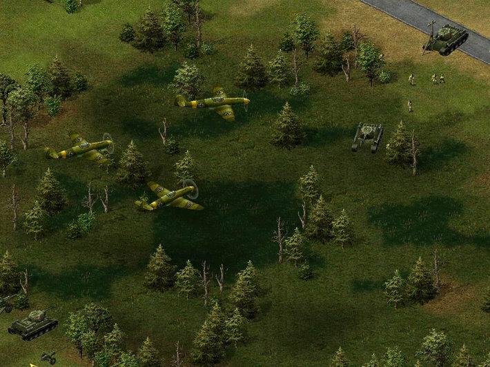
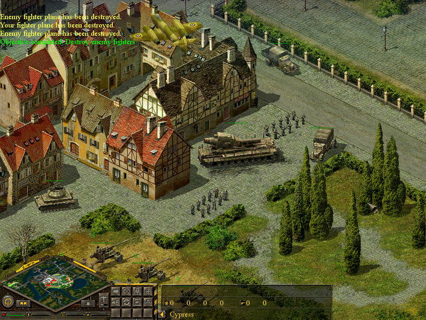
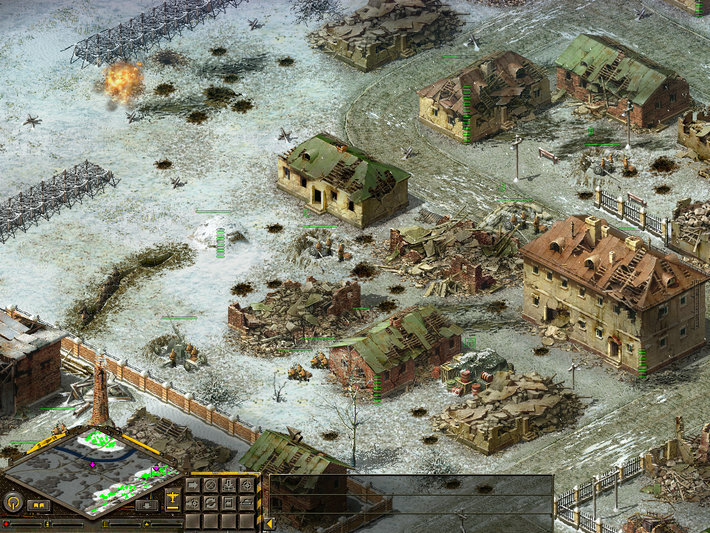
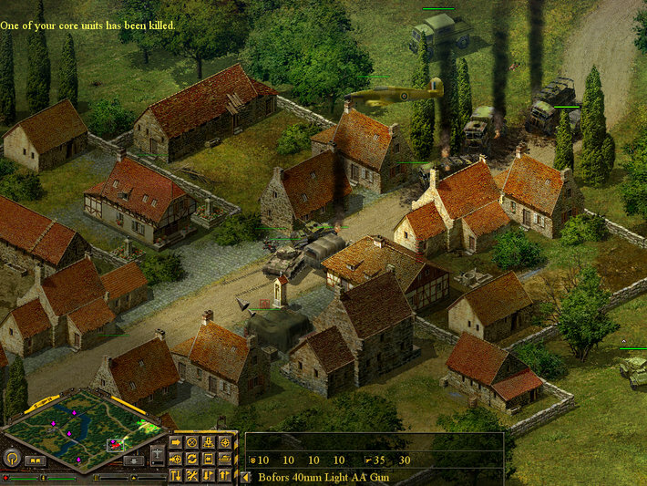
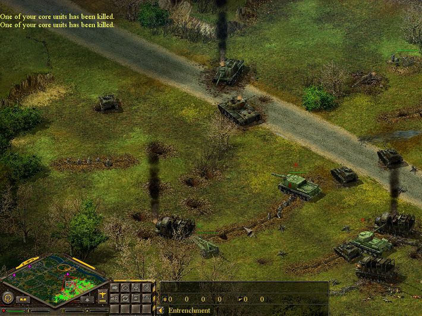

---
title: "Blitzkrieg Anthology"
weight: 13
platforms: ["DRM Free", "GOG Galaxy", "Windows"]
client: "GOG"
developer: "Nival Interactive"
publisher: "Nival Interactive"
website: "https://www.gog.com/game/blitzkrieg_anthology"
featured_image: "featured.png"
draft: false
---

Get ready for war and use the subtle art of strategy to mount an attack on your enemy! Whether it involves intelligence and finesse or stamina and brute force, the Blitzkrieg Anthology is your theater of operations where you’ll showcase your strategic style. Launch surgically precise attacks to cripple your foe with strategic tank and air assaults while maintaining your offensive momentum.



Ever wanted to see if you are a better strategist than General Erwin Rommel? Or would you prefer to side with the American legend General George S. Patton? Take the fight to authentic and painstakingly researched historical campaigns such as Tripoli, El Alamein, or even the famous Battle of the Bulge!

Our Software Engineer needed three months and such tech stack as Custom engine and C++ to implement GOG Galaxy Crossplay support (online multiplayer between GOG and Steam).


  
  
  
  
  
  
