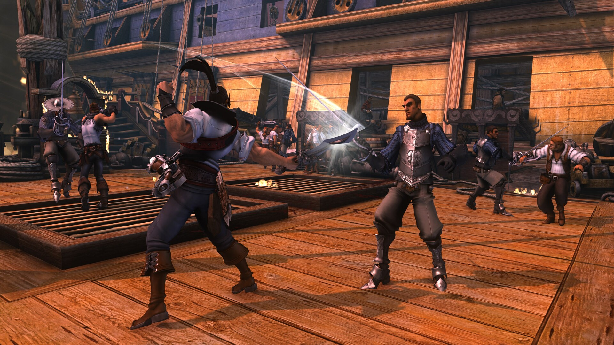
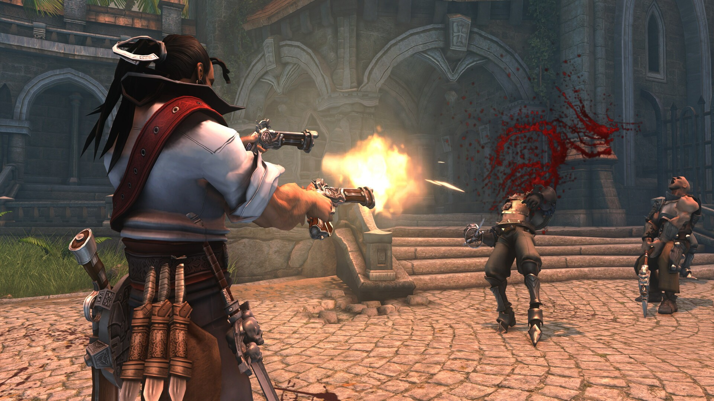
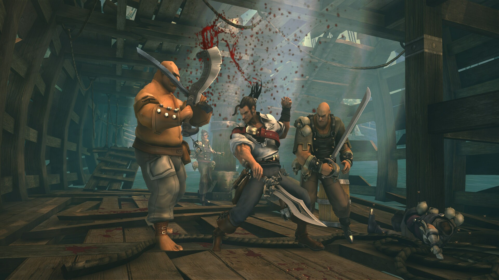
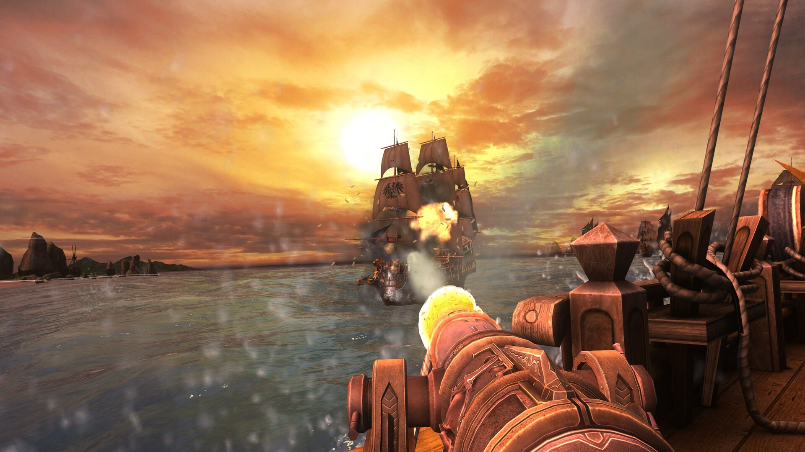
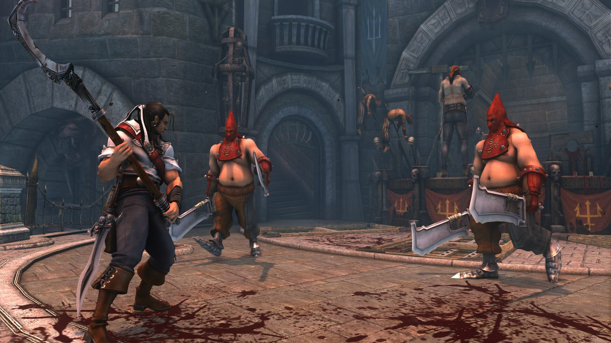
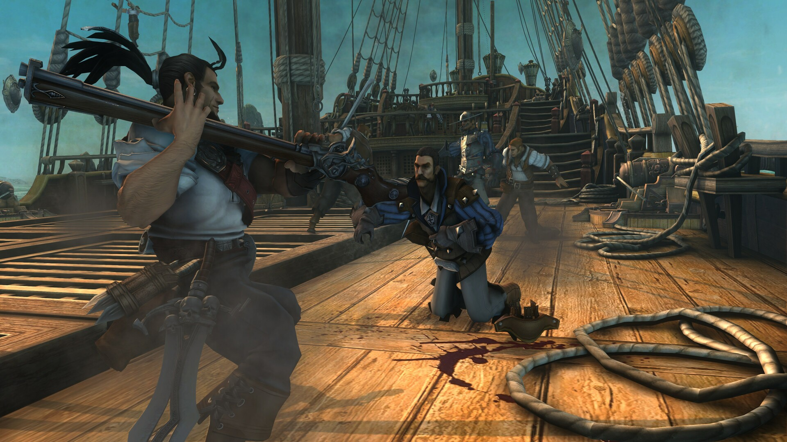

---
title: "Captain Blood"
weight: 75
platforms: ["DRM Free", "Epic Games Store", "Mac App Store", "Nintendo Switch", "OSX", "Playstation 4", "Playstation 5", "Steam", "Windows", "Xbox One", "Xbox Series X/S"]
client: "SNEG"
developer: "Seawolf Studio"
publisher: "SNEG"
website: "https://store.steampowered.com/app/3040220/Captain_Blood/"
featured_image: "featured.jpg"
draft: false
---

__Resurrecting a Lost Classic — Captain Blood__

Captain Blood was one of those infamous titles — announced in 2003, nearly completed, then shelved indefinitely. It languished in Development Hell for over a decade. That is, until SNEG partnered with us to finish what had been left behind.

Over 15 months, our team at General Arcade — including producers, engineers, artists, and QA — dove deep into the game’s outdated codebase and tools. We rebuilt, modernized, and optimized the entire experience for today's players.

### Engineering the Impossible

Captain Blood was originally a 32-bit title built around long-defunct tools. Here's what we tackled:

- **64-bit Conversion** — Full codebase upgrade to modern x64 systems.

- **Physics Overhaul** — Transitioned from PhysX 2.8.0 to PhysX 5.3 for compatibility and performance.

- **Graphics Engine Rewrite** — Replaced DirectX 9 with our own cross-platform renderer, Rendozer.

- **Custom Toolchain Development** — Reversed proprietary formats and built new pipelines to upscale and integrate assets across platforms.

We released the game on nearly every major platform: PlayStation 4/5, Xbox One/Series, Nintendo Switch, Steam (including Steam Deck), macOS, GOG, Epic Games Store, and Windows Store.

### Bringing it to Modern Players

Beyond technical work, we introduced a wide range of quality-of-life improvements:

- Reworked QTEs for clarity and responsiveness.

- Haptic feedback added for immersive gameplay.

- Full achievement support across platforms.

- Revamped UI — stats, tutorials, an updated shop with combo videos.

- New control schemes and expanded settings menu.

- Widescreen and multi-display support.

- Localization into 17 languages.

### Visual Enhancements

We didn’t just modernize the code — we gave the visuals a full upgrade:

- Upscaled over 60 weapon models, 40 characters, 600 environments, and 1,000+ textures.

- Fully redrawn HUD and backgrounds for 4K resolution.

- Added HDR, motion blur, ambient occlusion, and anti-aliasing.




  
  
  
  
  
  

