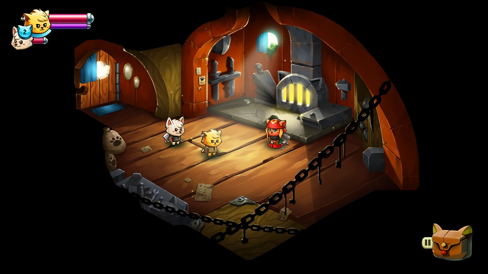
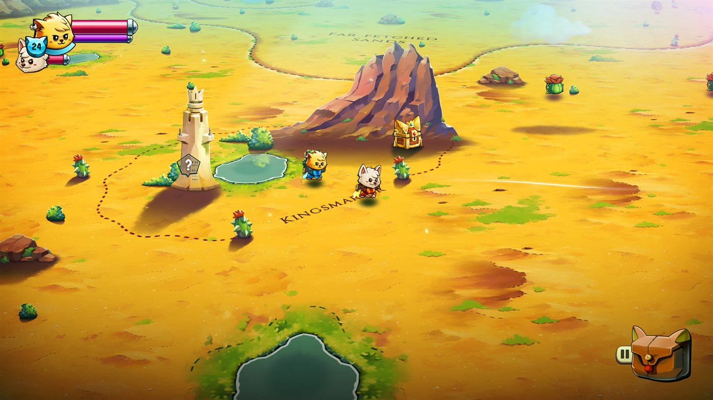
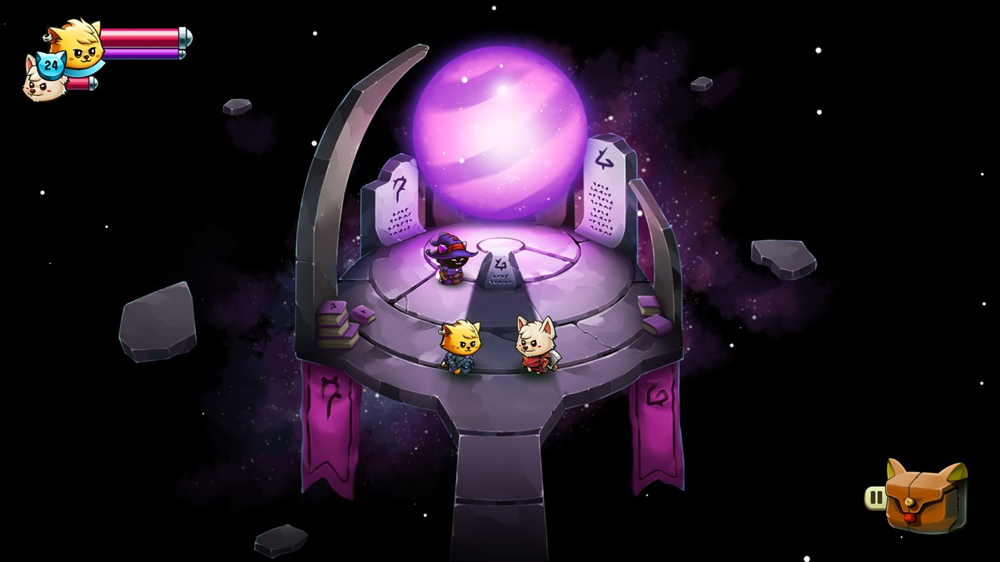
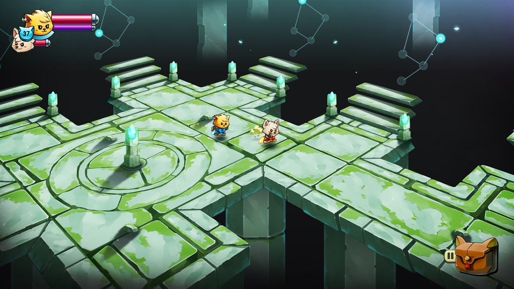
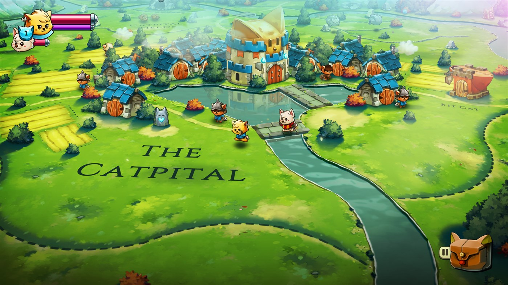
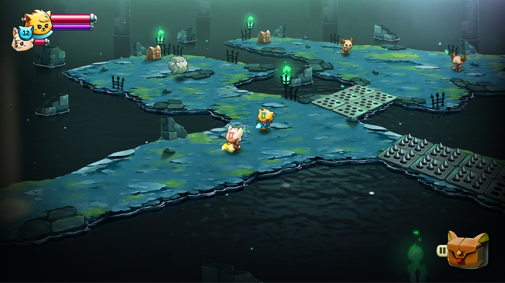

---
title: "Cat Quest II"
weight: 23
platforms: ["Nintendo Switch", "Playstation 4", "Xbox One"]
client: "The Gentlebros"
developer: "The Gentlebros"
publisher: "PQube"
website: "https://thegentlebros.com/catquest2/"
featured_image: "featured.jpg"
draft: false
---

CAT QUEST II is a 2D open-world action-RPG set in a fantasy realm of cats and dogs. Under threat from a continuing war between the cats of Felingard and the advancing dogs of the Lupus Empire, CAT QUEST II tells the tail of two kings, brought together against their will, on a journey of paw-some discovery to reclaim their thrones.



As for us, we ported a pawsome co-op adventure to consoles. Three Software Engineers and one QA Engineer worked on this game for two months using Unity and C# to get everything ready. So now you can play as both a cat and dog as you explore their kingdoms solo or with a friend on any console! Quest in a world filled with magic, curious monsters, and go on a catventure like never before!

Following the success of the acclaimed CAT QUEST, developers The Gentlebros return to the world of Felingard to expand on the original with more explosive spells, expanded weapon options, an exciting new character switch mechanic, and local co-op!


  
  
  
  
  
  
