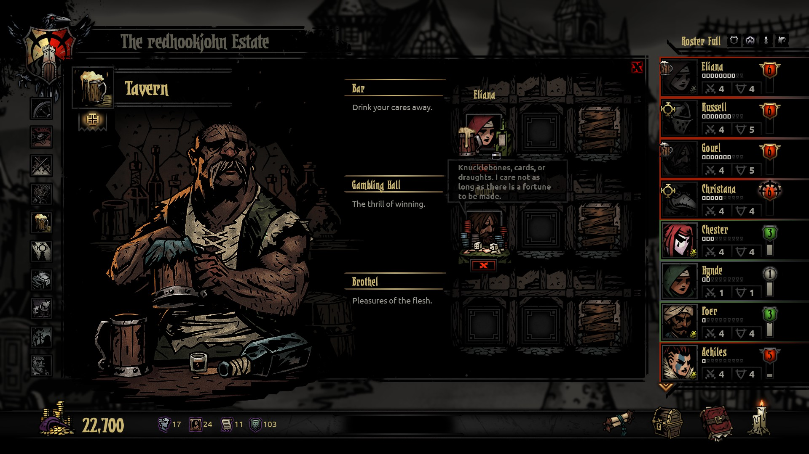
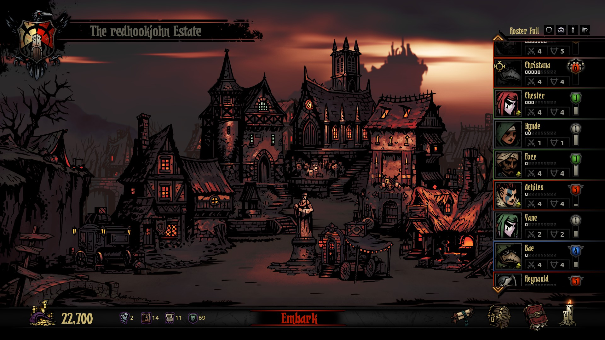

---
title: "Darkest Dungeon"
weight: 43
platforms: ["Gamepass", "Windows"]
client: "Red Hook Studios"
developer: "Red Hook Studios"
publisher: "Red Hook Studios"
featured_image: "featured.png"
draft: false
---

Darkest Dungeon is a challenging gothic roguelike turn-based RPG about the psychological stresses of adventuring. Recruit, train, and lead a team of flawed heroes against unimaginable horrors, stress, famine, disease, and the ever-encroaching dark. Can you keep your heroes together when all hope is lost?



General Arcade worked on Microsoft Gamepass for Windows (GDK) version. Our programmer and QA team worked nonstop for three months making modifications for Redhook's proprietary C++ engine and game code.


  
  
  
  
  
  
