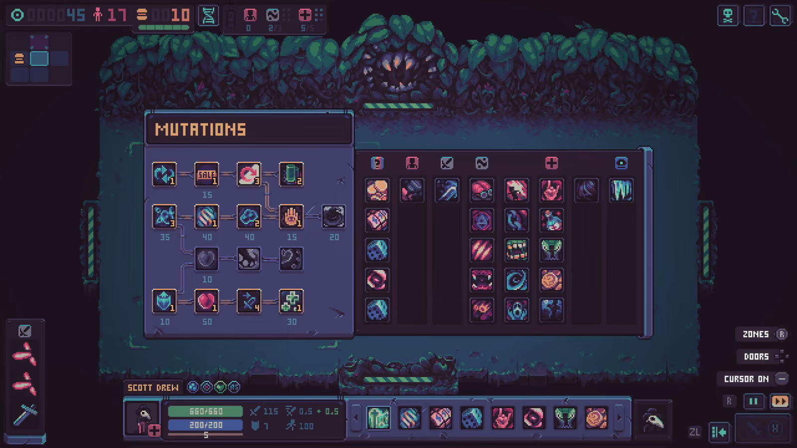
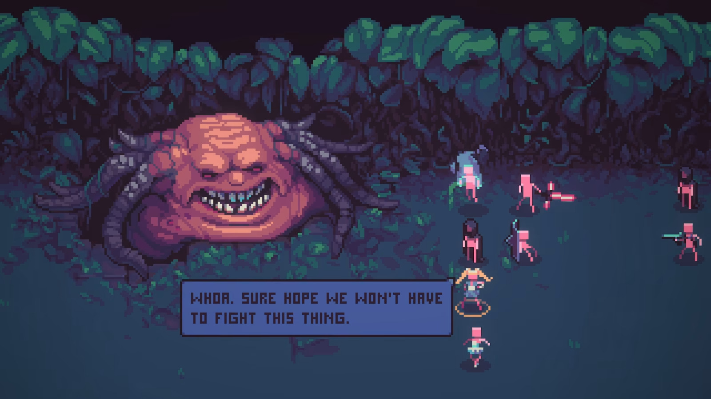
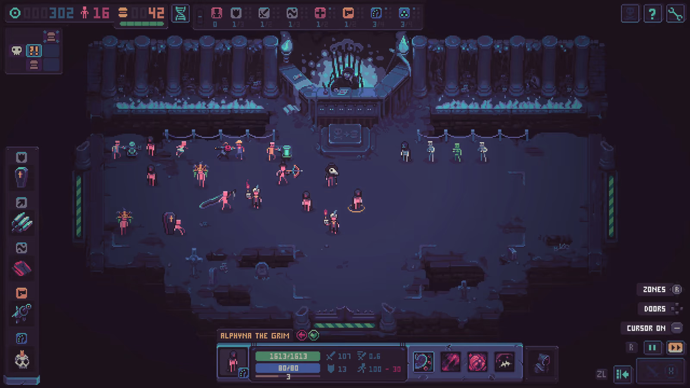
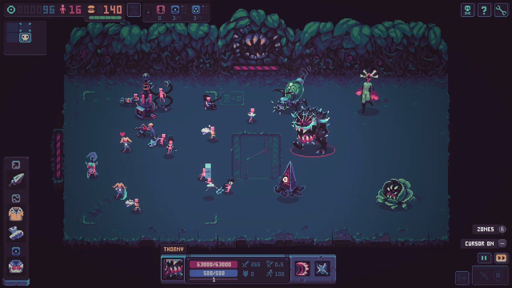

---
title: "Despots Game"
weight: 57
platforms: ["Gamepass", "Nintendo Switch", "Playstation 4", "Playstation 5", "Xbox One", "Xbox Series X"]
client: "tinyBuild"
publisher: "tinyBuild"
website: "https://www.despotsgame.com/"
featured_image: "Despots-Game.jpg"
draft: false
---

**Roguelike, auto-battler, deep progression, gratuitous violence, pretzels!**

Let's play a game: I'll give you some puny humans, and you try to help them make it through my labyrinth. No, you won't be controlling them in battles - they'll fight automatically! My game is about strategy and praying to RNGesus, not mashing buttons. You can buy items for the humans: swords, crossbows, coffins, stale pretzels. Plus, I'll let you give them cool mutations! A few Topochlorians in the blood and some Crocodile Skin never hurt anyone. There's one catch, though: if you die, you have to start over entirely, and the whole world will be generated again from scratch. Yes, my game is a roguelike game. Well, roguelite, if you're a nerd who loves compartmentalizing us creators into strict genres.

I almost forgot: my game has a multiplayer mode, too! But I'm not going to tell you anything about it, because King of the Hill is a special secret multiplayer mode that only unlocks once you beat the game.

* sincerely, with disrespect for puny humans, your local evil AI:

d'Spot


  
  
  
  
