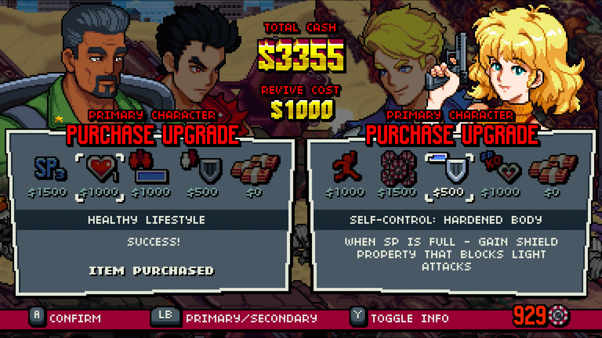

---
title: "Double Dragon Gaiden: Rise Of The Dragons"
weight: 65
platforms: ["Steam"]
client: "Secret Base"
developer: "Secret Base"
publisher: "Modus Game"
website: "https://store.steampowered.com/app/1967260/Double_Dragon_Gaiden_Rise_Of_The_Dragons/"
featured_image: "featured.png"
draft: false
---

*The Secret Base development team hired General Arcade to support the making of the PC version. Our specialists have implemented gamepad support, a Mac version, integrated Steam features, and added various improvements that will make the player experience even better.*


  
  
  
  
  
  

