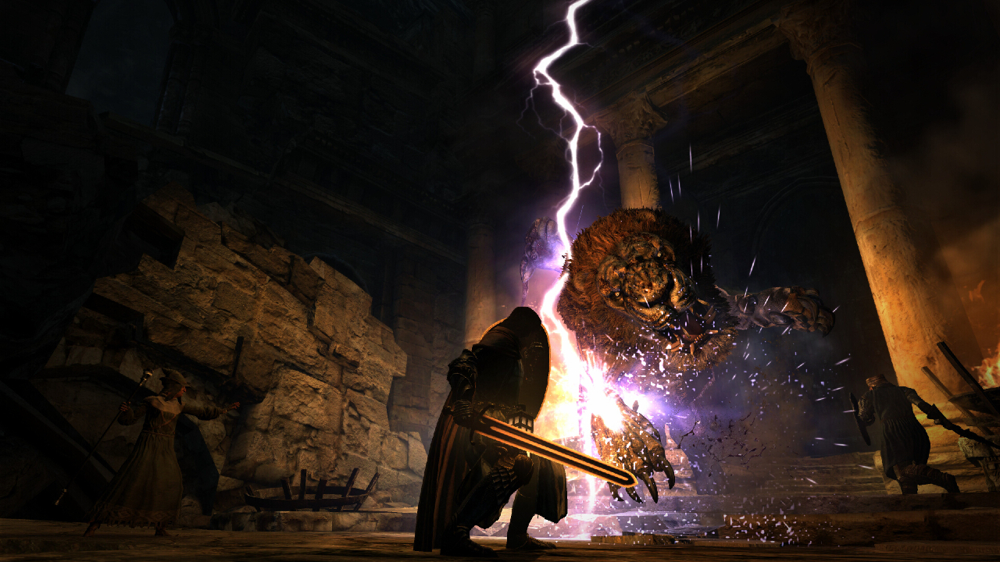
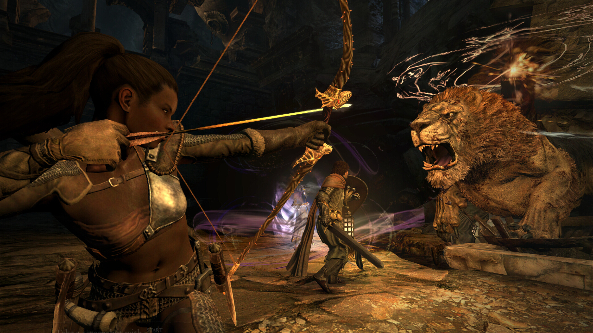
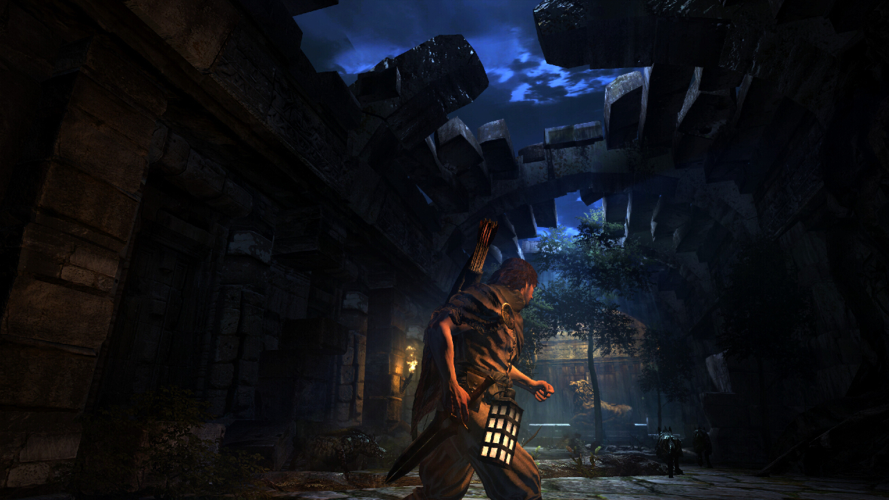
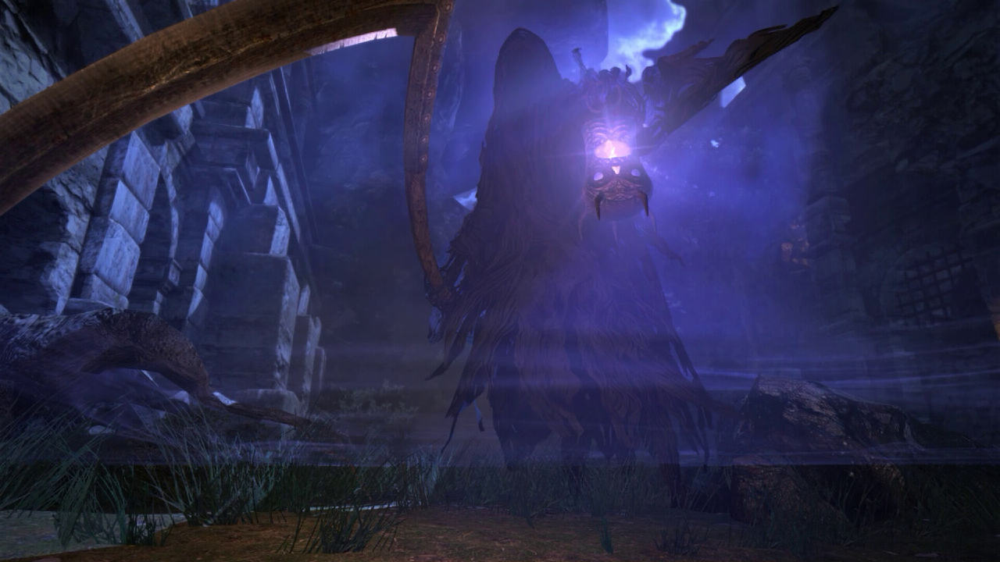
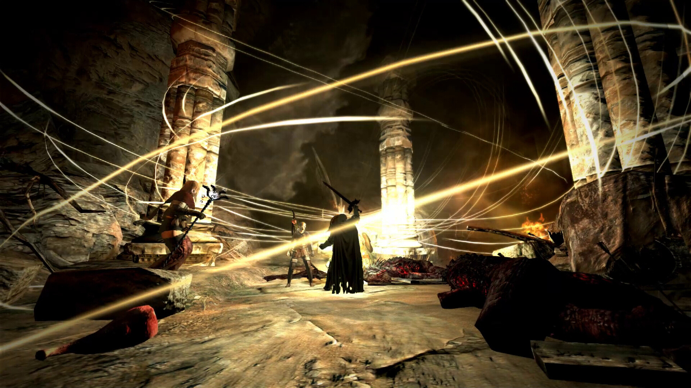
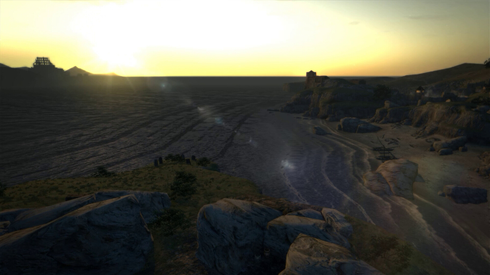

---
title: "Dragons Dogma: Dark Arisen"
weight: 16
platforms: ["DRM Free", "GOG Galaxy", "Windows"]
client: "Capcom, GOG"
developer: "Capcom"
publisher: "Capcom"
website: "https://www.gog.com/game/dragons_dogma_dark_arisen"
featured_image: "featured.png"
draft: false
---

Dragon's Dogma: Dark Arisen was a project when we worked closely with GOG Galaxy team to implement the latest version of GOG Galaxy SDK into both client and server side of the game. As with all GOG games, we made sure that Dragon's Dogma can be played offline or without Galaxy client completely DRM-free. Software Engineers worked scrupulously for two months, and Custom engine, C++ as well as C were just the right things to use.



Set in a huge open world, Dragon’s Dogma: Dark Arisen presents a rewarding action combat experience. Players embark on an epic adventure in a rich, living world with three AI companions, known as Pawns. These partners fight independently, demonstrating prowess and ability that they have developed based on traits learned from each player. Players can share these Pawns online and reap rewards of treasure, tips and strategy hints for taking down the terrifying enemies. Pawns can also be borrowed when specific skills are needed to complete various challenging quests.


  
  
  
  
  
  
