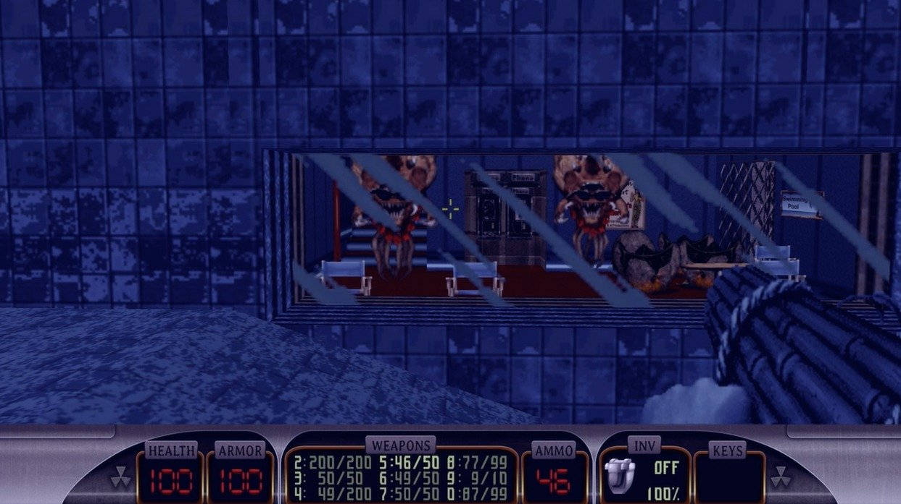
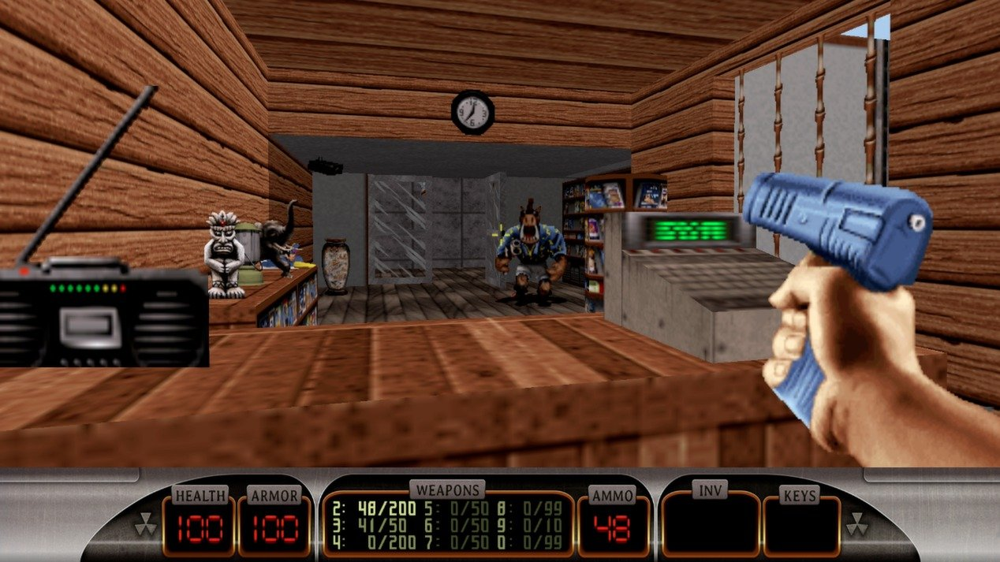
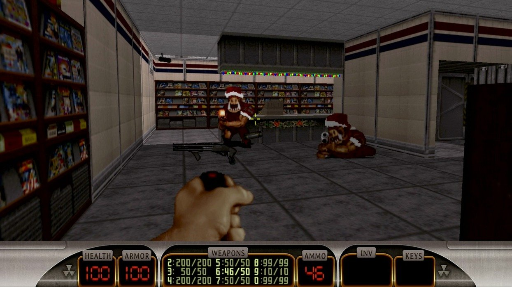
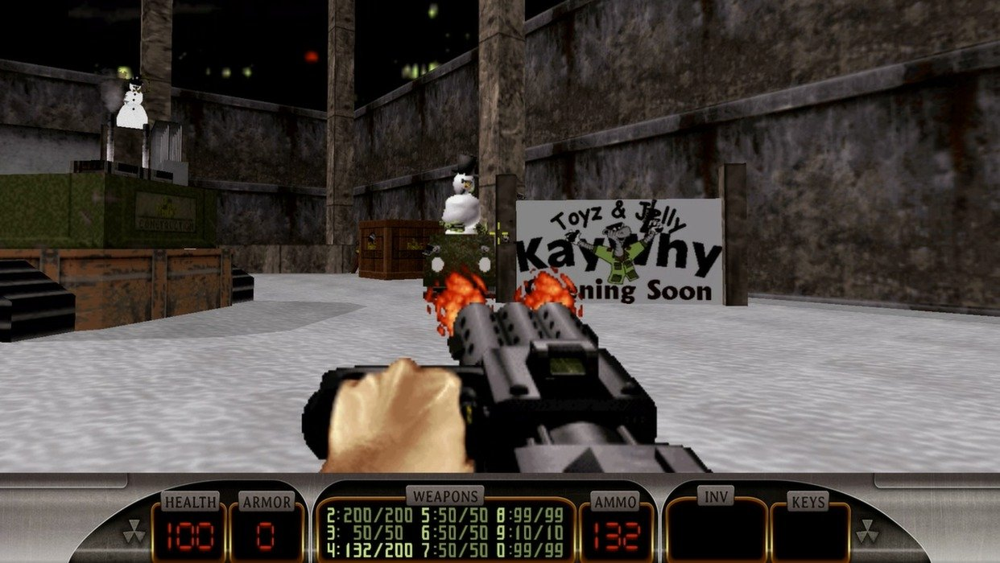
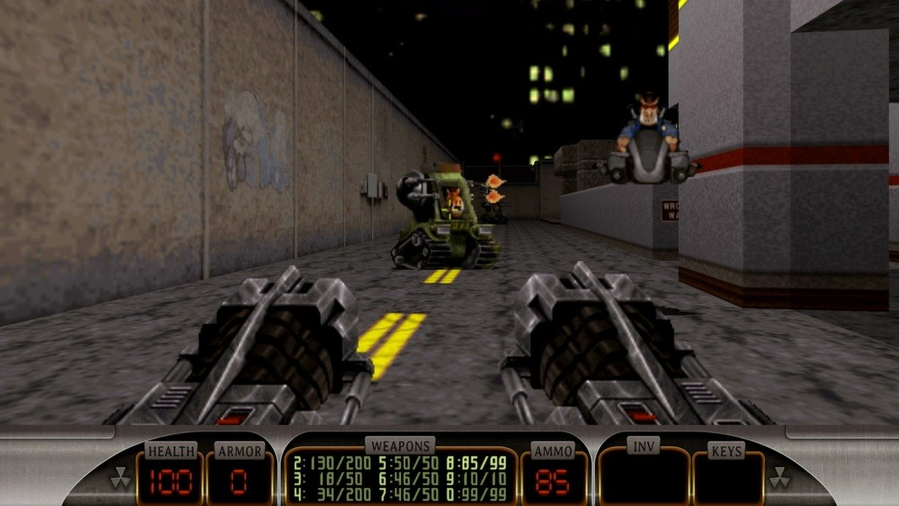

---
title: "Duke Nukem 3D: Megaton Edition"
weight: 1
platforms: ["Linux", "OSX", "Steam", "Windows"]
client: "Devolver Digital"
developer: "3D Realms, General Arcade"
publisher: "Devolver Digital"
website: "https://dukenukem.fandom.com/wiki/Duke_Nukem_3D:_Megaton_Edition"
featured_image: "featured.png"
draft: false
---

There is no need to talk a lot about Duke Nukem 3D - everyone knows what it is. And Duke Nukem 3D: Megaton Edition is a Duke Nukem 3D compilation that was available for purchase from March 20, 2013 until February 15, 2016. It was sold via Steam for Windows, Mac OS X, and Linux. In 2015, it was also made available on consoles via PlayStation Network for the PlayStation 3 and handheld PlayStation Vita.



Our studio developed OpenGL based port for Windows, Mac and Linux. We also redesigned the game UI to meet Steam Big Picture requirements and integrated Steamworks features (achievements, steam cloud, trading cards, workshop, multiplayer). It was a big project - five months and two Software Engineers and Artist working with BUILD, C, C++ and OpenGL. Big and great project.


  
  
  
  
  
  
