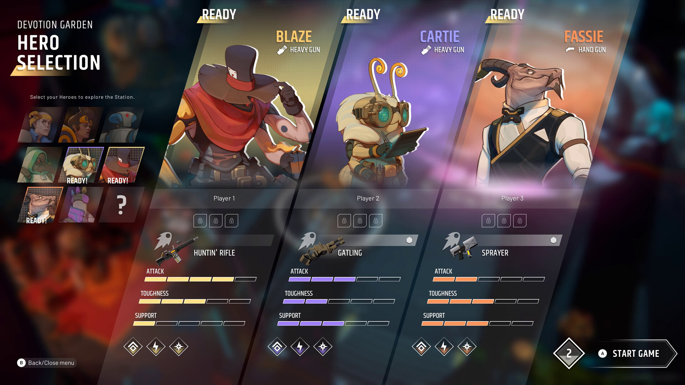
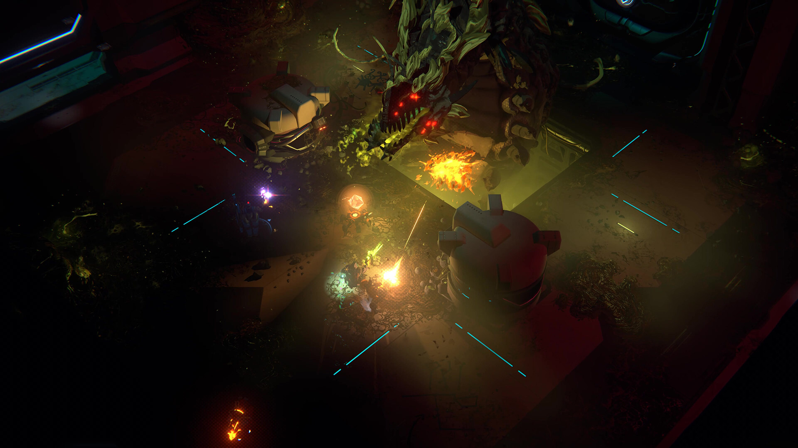
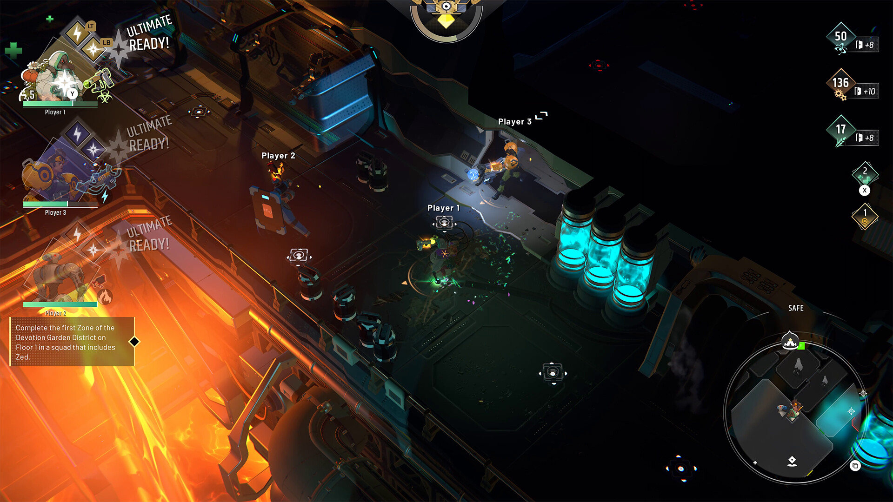
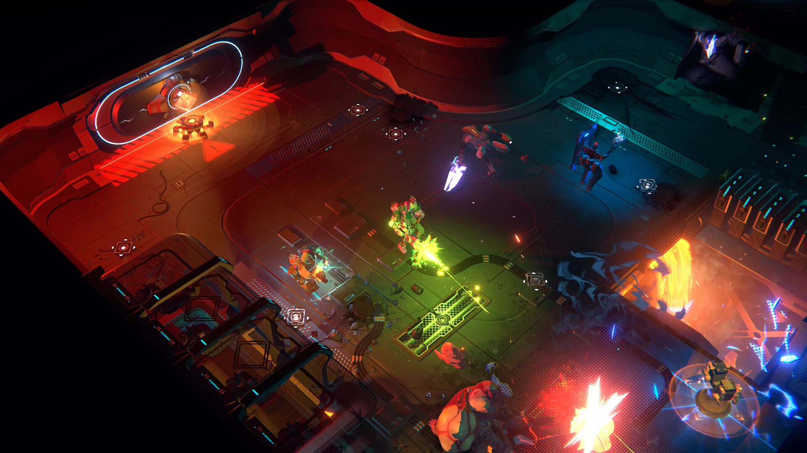
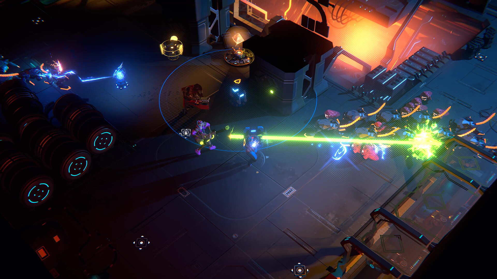

---
title: "ENDLESS™ Dungeon"
weight: 70
platforms: ["Cross Play", "Nintendo Switch", "Playstation 4", "Playstation 5", "Steam", "Xbox One", "Xbox Series X"]
client: "Abstraction Games"
developer: "AMPLITUDE Studios"
publisher: "SEGA"
website: "https://asia.sega.com/endlessdungeon/en/"
featured_image: "featured.jpg"
draft: false
---

ENDLESS™ Dungeon is a unique blend of roguelite, tactical action, and tower defense set in the award-winning ENDLESS™ Universe. Plunge into an abandoned space station alone or with friends in co-op, recruit a team of shipwrecked heroes, and protect your crystal against never-ending waves of monsters&#8230; or die trying, get reloaded, and try again.

General Arcade was brought on to the project to help with the following tasks:

- EOS integration
- XB1/XSX/PS4/PS5 tailoring and online features
- Optimization
- Bugfixes




  
  
  
  
  
  
