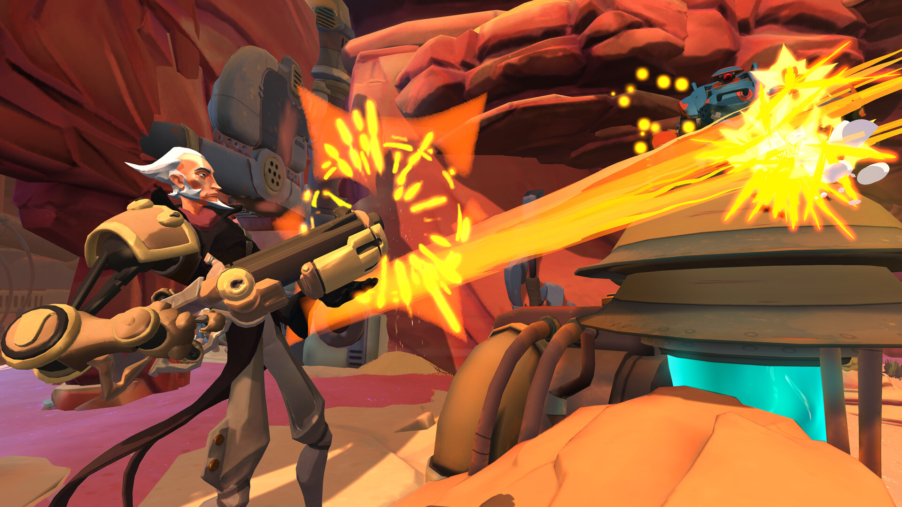
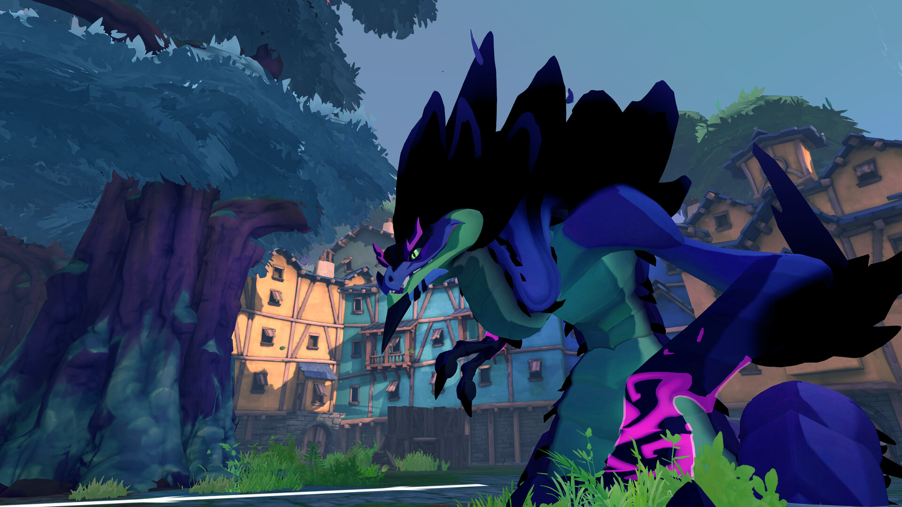
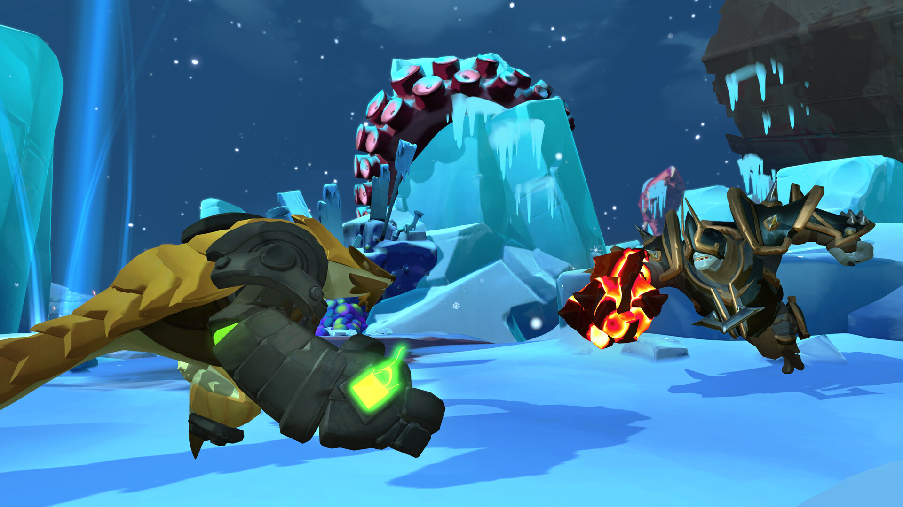
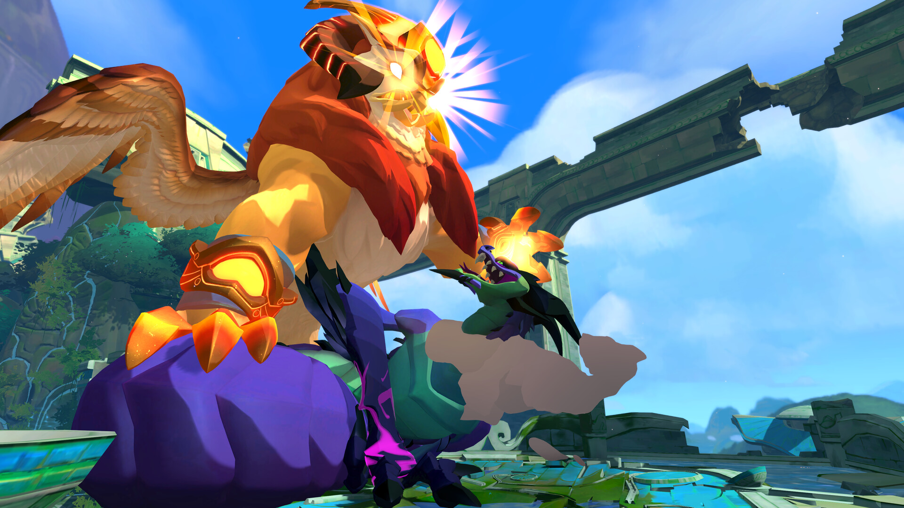
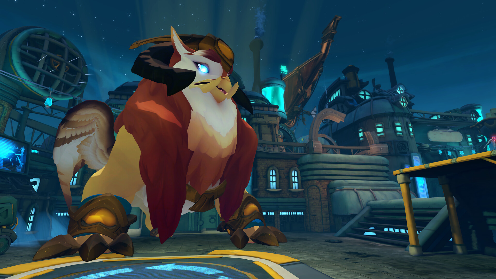
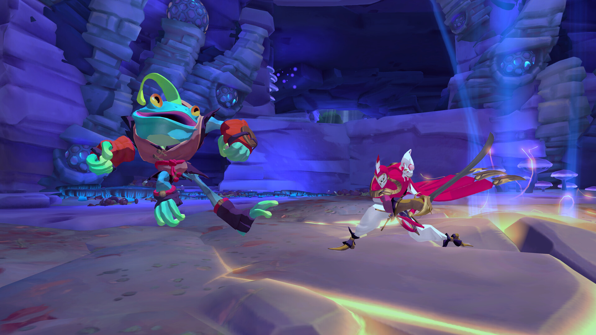

---
title: "Gigantic: Rampage Edition"
weight: 71
platforms: ["Cross Play", "Playstation 4", "Playstation 5", "Xbox One", "Xbox Series X"]
client: "Abstraction Games"
developer: "Abstraction Games"
publisher: "Arc Games"
website: "https://www.gogigantic.com/en/"
featured_image: "featured.jpg"
draft: false
---

**GIGANTIC: RAMPAGE EDITION** is a premium and definitive release of the original 5v5 MOBA Hero Shooter, GIGANTIC, that provides a dynamic and exciting team-based multiplayer experience for fans of both genres. Choose from a diverse roster of unique heroes, each with a set of upgradeable abilities, and team up with four other players to control objectives and take down the opposing team’s mighty Guardian, all while protecting your own. **GIGANTIC: RAMPAGE EDITION** includes a new game mode, cross-platform play, new heroes, new maps, and gameplay improvements that give fans a bigger and more complete GIGANTIC experience than ever before, while welcoming new players to the action and fun-filled world of a Hero Shooter.

Our engineers help with the following tasks:

- Backend development
- Common tasks for XB1/XSX/PS4/PS5 porting
- GDK online subsystem implementation
- ranked mode (client and backend side)
- UI development
- Tutorial improvements
- Bugfixing




  
  
  
  
  
  
