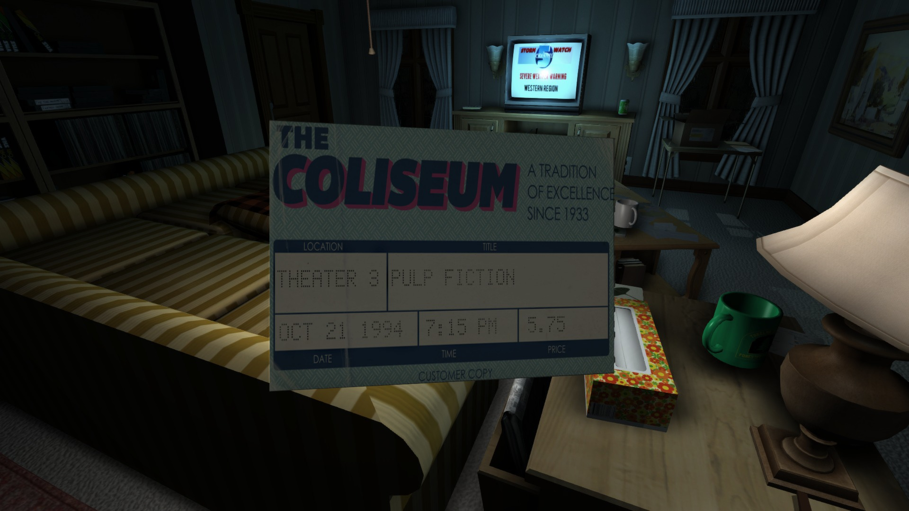
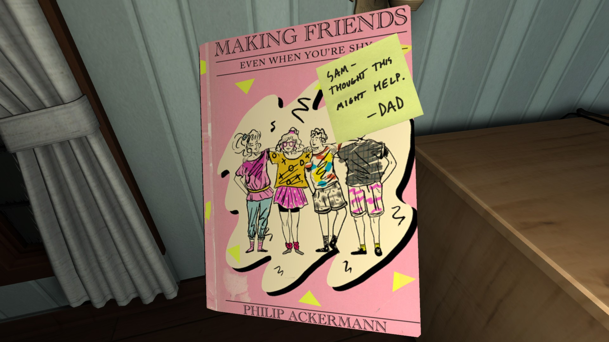
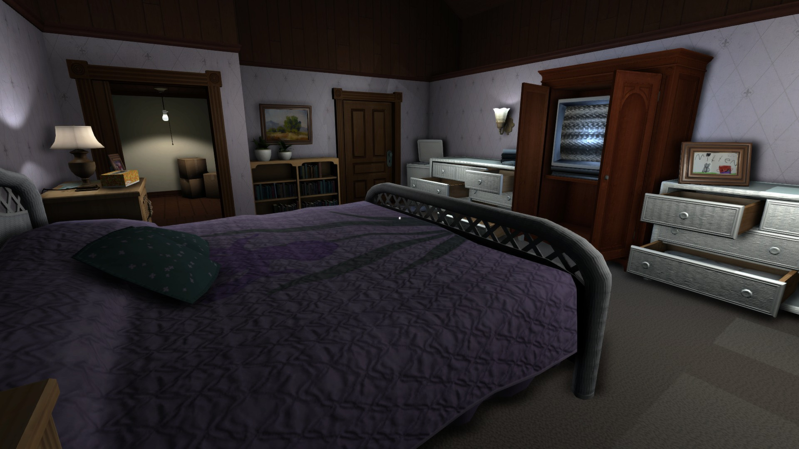

---
title: "Gone Home"
weight: 18
platforms: ["DRM Free", "Linux", "Mac App Store", "OSX", "Windows"]
client: "Fullbright"
developer: "Fullbright"
publisher: "Fullbright"
website: "https://gonehome.game/"
featured_image: "featured.png"
draft: false
---

You arrive home after a year abroad. You expect your family to greet you, but the house is empty. Something's not right. Where is everyone? And what's happened here?



Gone home is an interactive exploration simulator. Interrogate every detail of a seemingly normal house to discover the story of the people who live there. Open any drawer and door. Pick up objects and examine them to discover clues. Uncover the events of one family's lives by investigating what they've left behind.

Go home again. And we are the ones to take you there&#8230; General Arcade's Software Engineer backported features and optimization code from the console version and prepared Steam, Mac App Store and DRM-free update releases. Two months and Unity tohether with C#, that's what he needed to get home.


  
  
  
  
  
  
