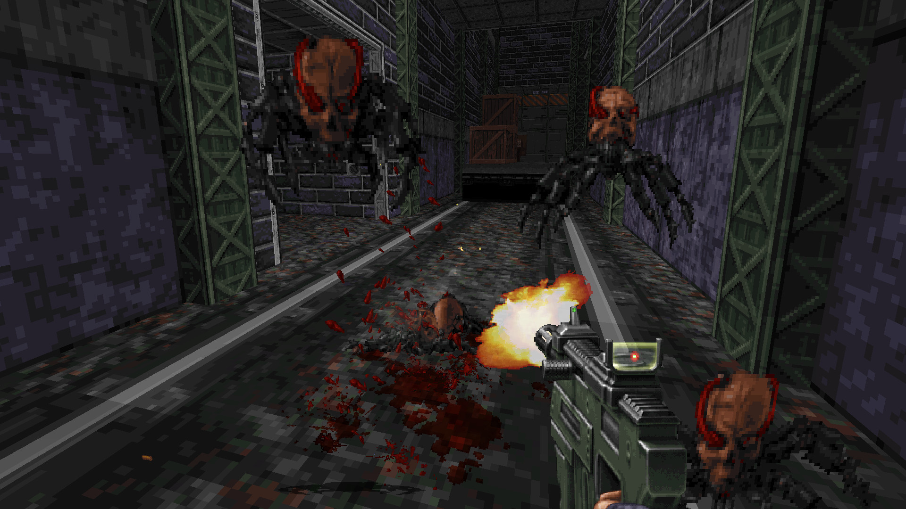
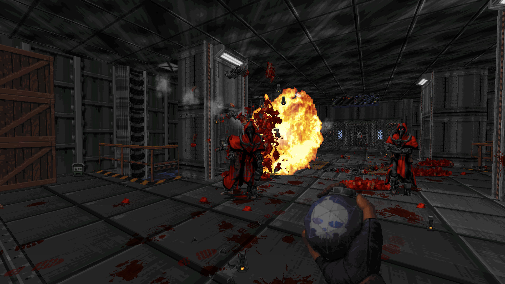
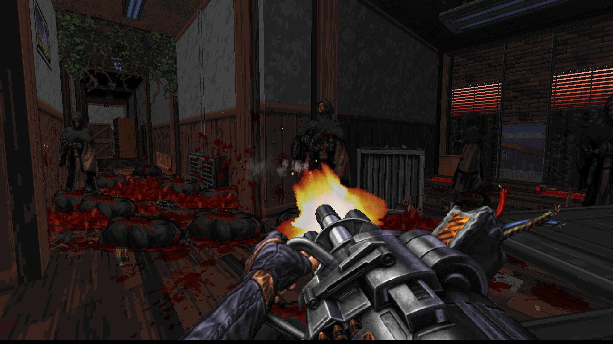
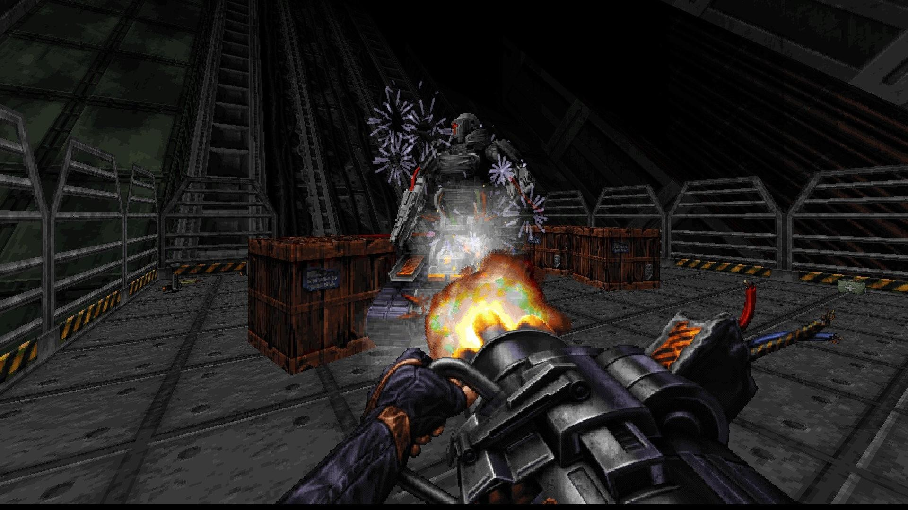
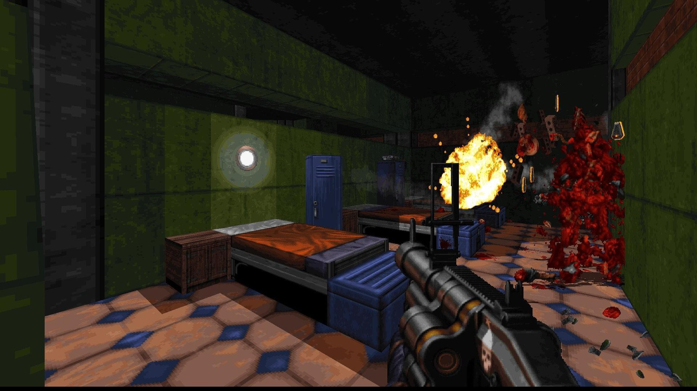

---
title: "Ion Fury"
weight: 28
platforms: ["Nintendo Switch", "Playstation 4", "Xbox One"]
client: "3D Realms"
developer: "VoidPoint"
publisher: "1C Publishing EU, 3D Realms"
website: "http://www.ionfury.com/"
featured_image: "featured.png"
draft: false
---

For sever months we developed console adaptations for Ion Fury, a game with a 20-years-old engine. And this project was huge! Since we worked with different consoles, three Software Engineers, two QA Engineer, Producer and Part-time artist from the working group had to use different tech stack: Direct3D 11 for Xbox One version, OpenGL for Switch and GNM for PlayStation 4 - as well as BUILD, C and C++ for all the versions, of course.



Ion Fury is a true old-school first-person shooter from legendary 3D Realms, publisher 1C Entertainment and indie studio Voidpoint, set in a cyberpunk metropole. Blast your way through enemies like it’s 1990's again.

Shelly &#8220;Bombshell&#8221; Harrison takes on a quest to slay evil transhumanist mastermind Dr. Jadus Heskel in the streets of Neo DC. She leaves a trail of carnage throughout huge, multi-path levels filled with gigantic explosions, more secret areas than we can count, and inhuman foes behind every corner. There’s no regenerating health here; stop taking cover and start running and gunning.

Shelly's crusade to take down Heskel’s army will see her leave destruction in her wake with a wide arsenal of weapons, complete with alternate fire modes and different ammo types.


  
  
  
  
  
  
