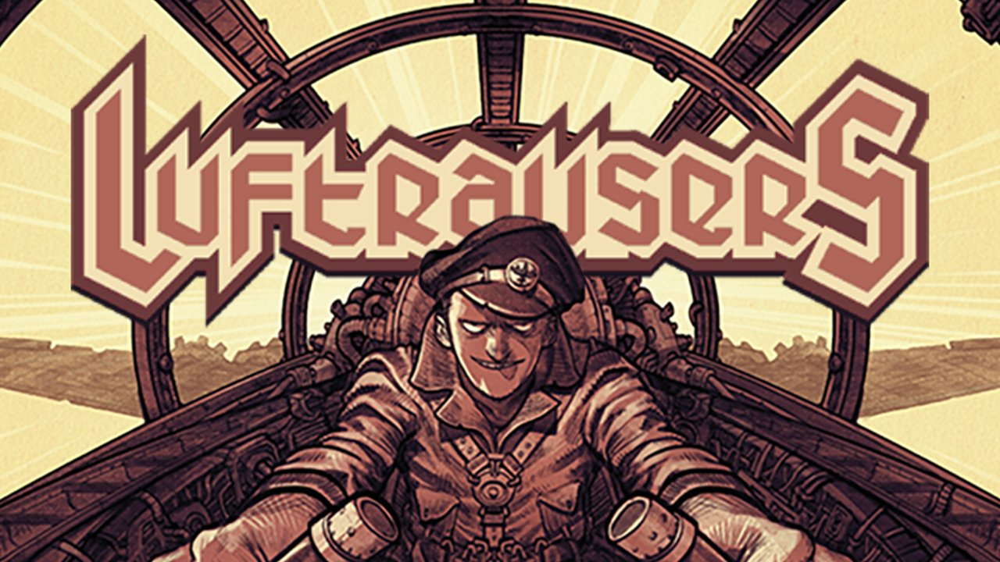
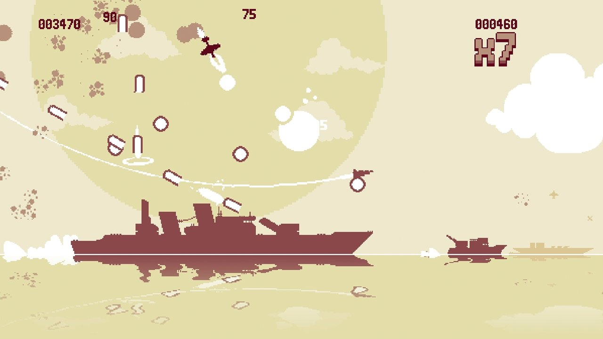
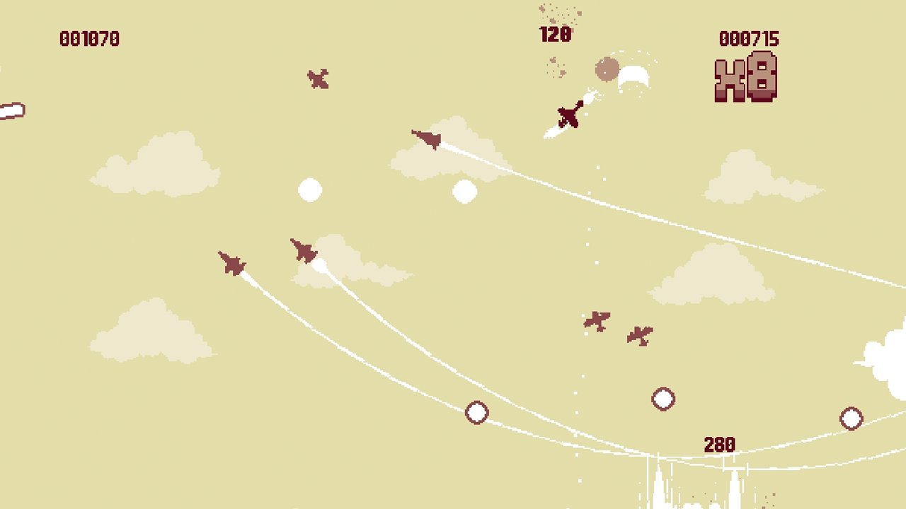
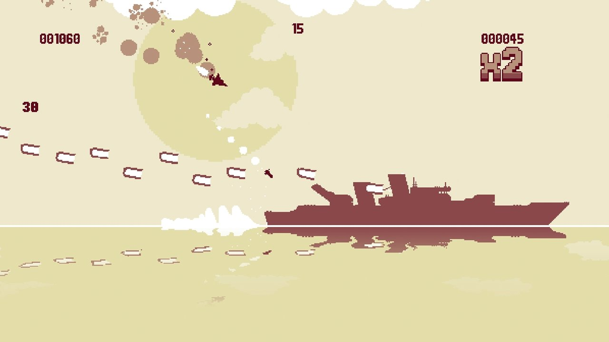
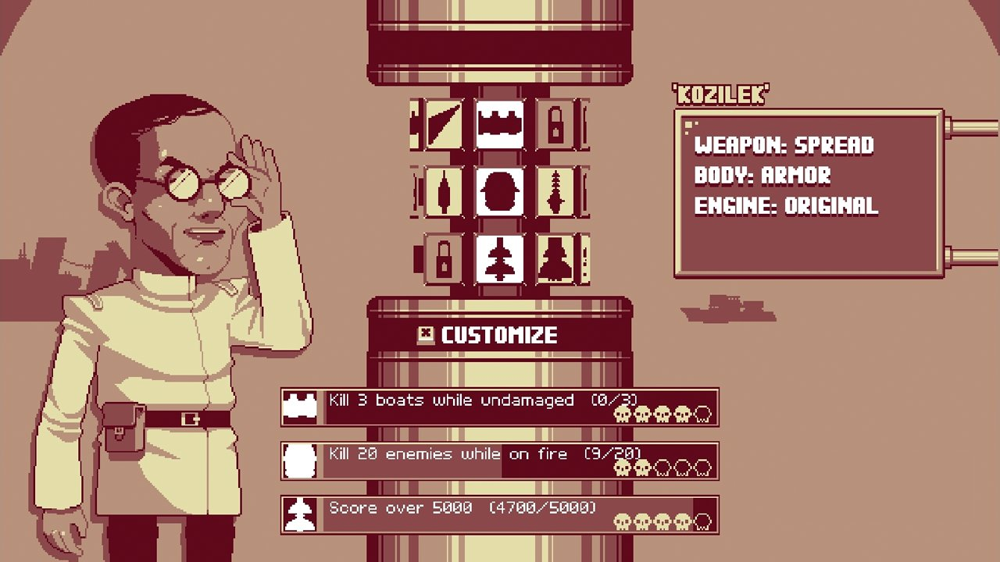
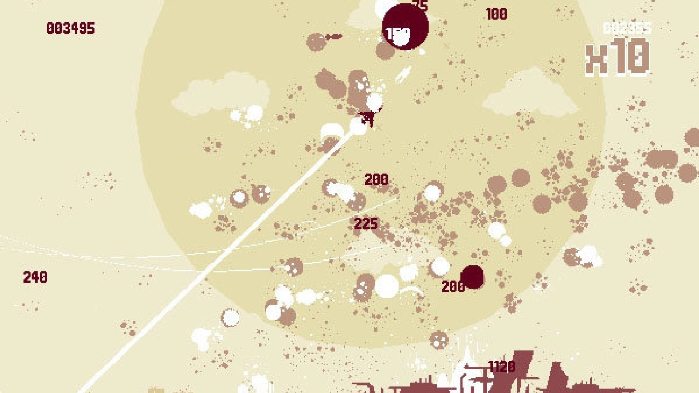

---
title: "Luftrausers"
weight: 5
platforms: ["Android"]
client: "Devolver Digital"
developer: "Vlambeer"
publisher: "Devolver Digital"
website: "http://www.amazon.com/gp/product/B00QXC133W"
featured_image: "featured.png"
draft: false
---

General Arcade's Software Engineer spent two months to port this desktop game to Android platform (Nvidia Shield, Amazon Fire TV, Google Nexus TV). Custom engine, C++ and OpenGL/OpenGLES2 were the tools.



The skies will be set aflame and the seas will overflow with wreckage in Vlambeer’s stylish arcade shooter LUFTRAUSERS! Select from over 125 combinations of weapons, bodies, and propulsion systems and take to the skies to battle enemy fighter planes, battleships, submarines, and rival aces for glory, honor, and high scores. Bravely volunteer for one of over 100 daring missions to unlock new Rauser combinations and vibrant color variations and become the most legendary Rauser pilot of all time!


  
  
  
  
  
  

