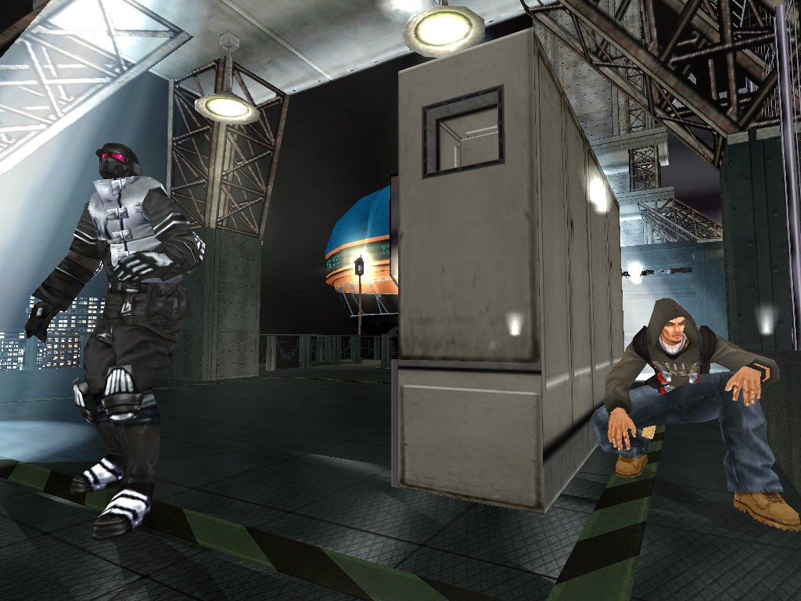
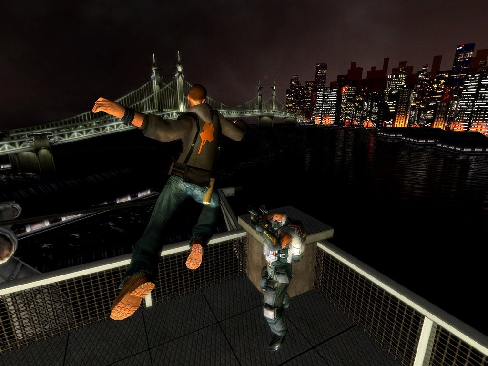
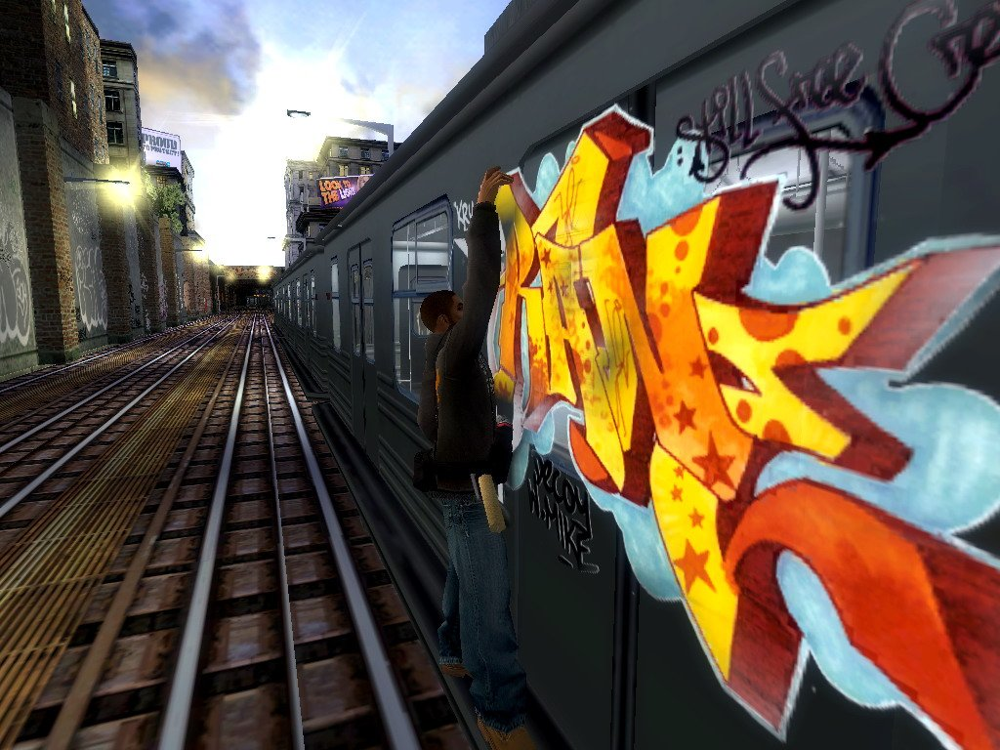
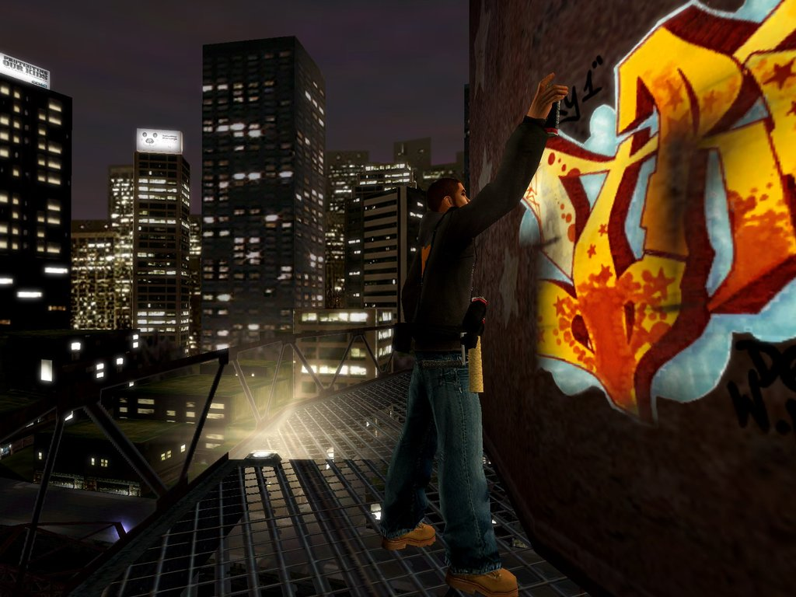
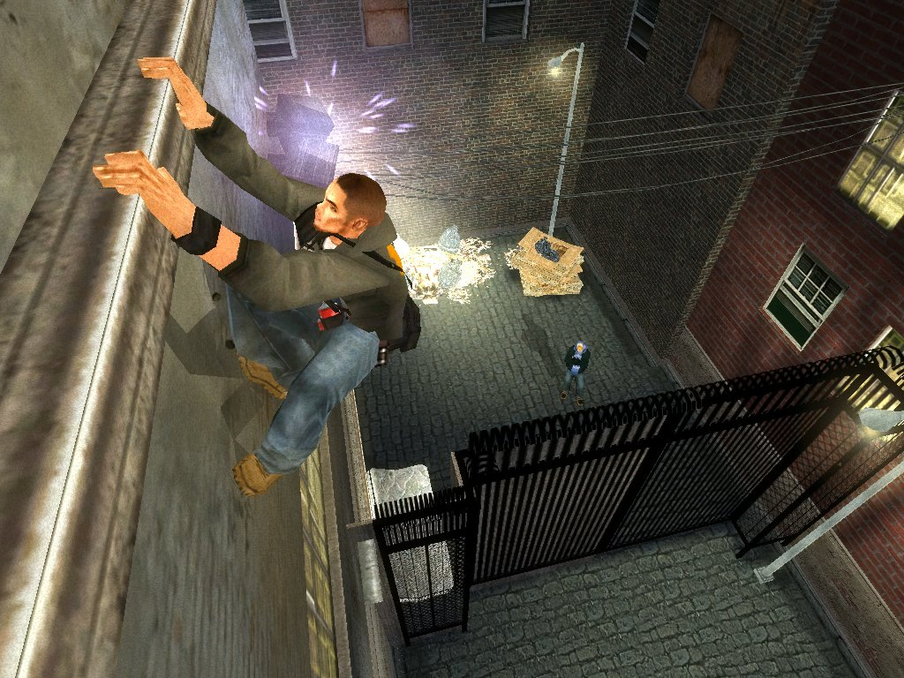

---
title: "Marc Eckos Getting Up: Contents Under Pressure"
weight: 3
platforms: ["Steam", "Windows"]
client: "Devolver Digital"
developer: "The Collective"
publisher: "Devolver Digital"
website: "http://store.steampowered.com/app/260190/"
featured_image: "pr-gettingup.png"
draft: false
---

In Marc Ecko's Getting Up: Contents Under Pressure you play as Trane, a &#8220;toy&#8221; graffiti artist with the street smarts, athletic prowess and vision to become an &#8220;All City King&#8221; - the most reputable of all graffiti artists. Along your quest, uncover the mayor's deep, dark secret and use your fighting talents and high-wire graffiti to expose the city's leader as a corrupt tyrant.



As you struggle to save a neighborhood from an oppressive government, one question stands out: What if graffiti could change the world? Risk your life battling city authorities and rival graf gangs - mere obstacles in your attempt to get your tag up. And in this city, not just any tag will do. You have to &#8220;Get IN, Get UP and Get OUT&#8221;.

General Arcade's two Software Engineers helped you to start the revolution. The guys were working with Custom engine and C++ for two weeks to prepare the game for digital publishing. They also added modern resolutions support, including widescreen ones. All done without access to the source code.


  
  
  
  
  
  
