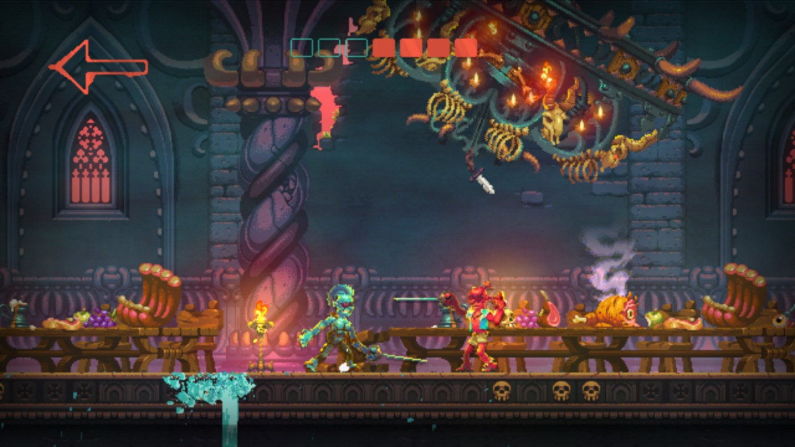
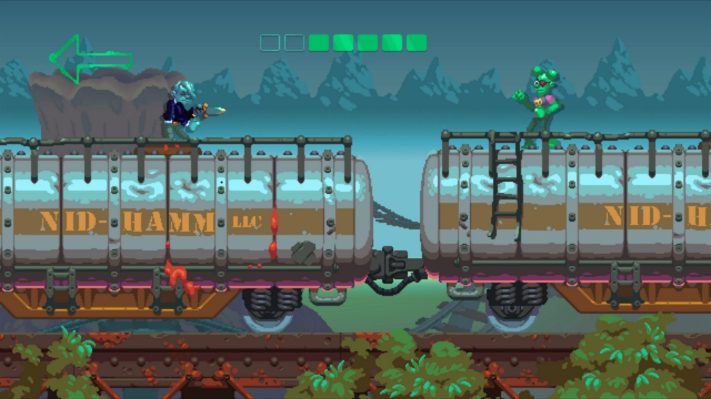
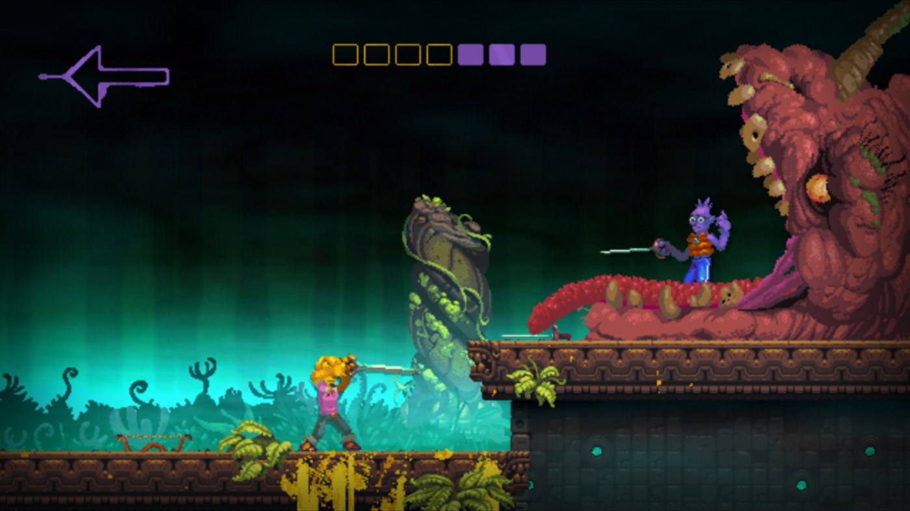
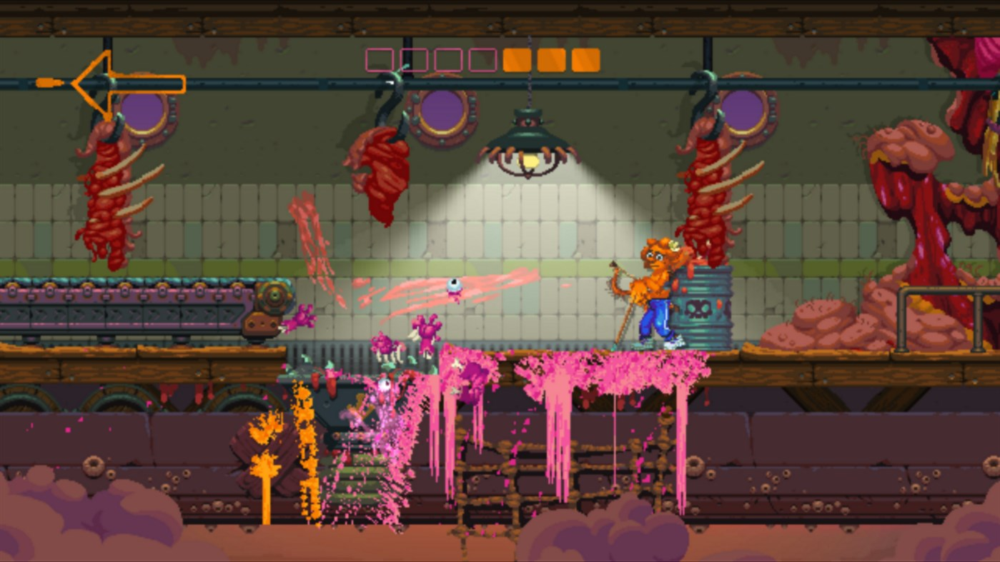
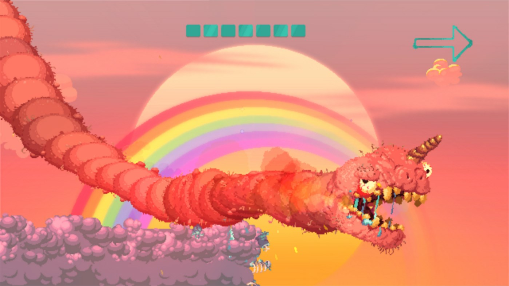

---
title: "Nidhogg 2"
weight: 29
platforms: ["Xbox One"]
client: "Messhof"
developer: "Messhof"
publisher: "Messhof"
website: "http://nidhogggame.com/"
featured_image: "featured.jpg"
draft: false
---

The Wurm has returned and it must feed! Shed your garments and paint the walls with the flesh of your enemies, for only one can be worthy of sacrifice.



The rules are simple. Reach the other side and kill anyone that stands in your way. Deftly parry and rend their throats, riddle their bowels with arrows, or squish their brains between your toes. The Wurm cares not for chivalry.

Sequel to the indie hit of 2014, Nidhogg 2 builds upon the award-winning gameplay of its predecessor with new weapons to wield and levels to master, head-to-toe character customization, and the captivatingly grotesque art of Toby Dixon.

Two of our Software Engineers prepared and tested update for Xbox One version of the game using GameMaker Studio 2. It took them four months to make everything perfect!


  
  
  
  
  
  
