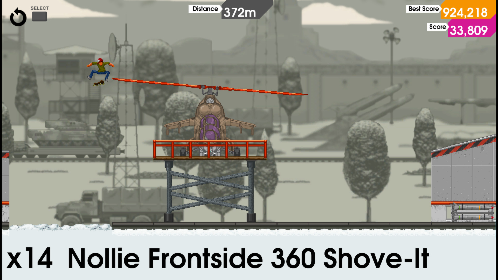
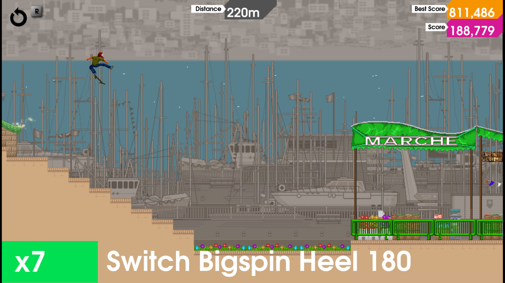
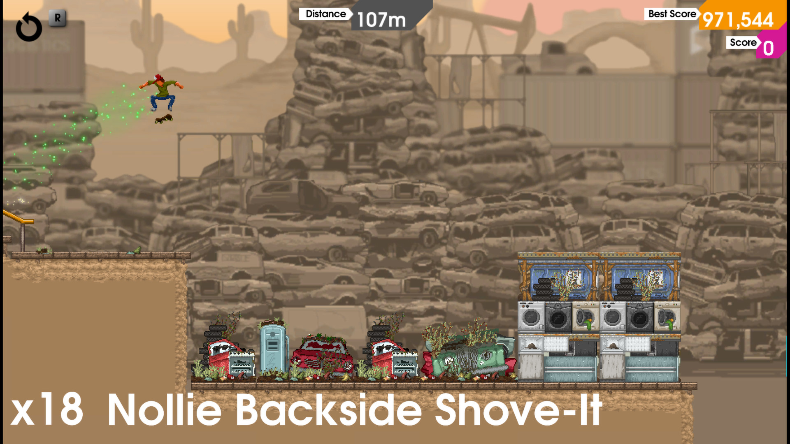
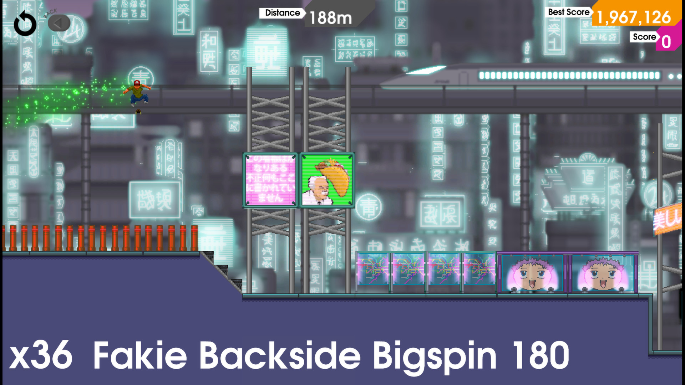
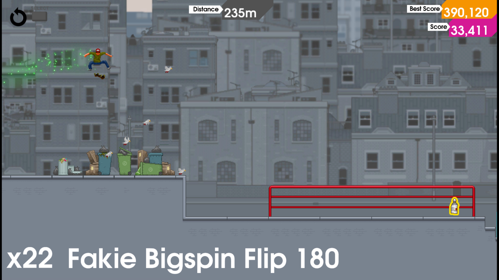
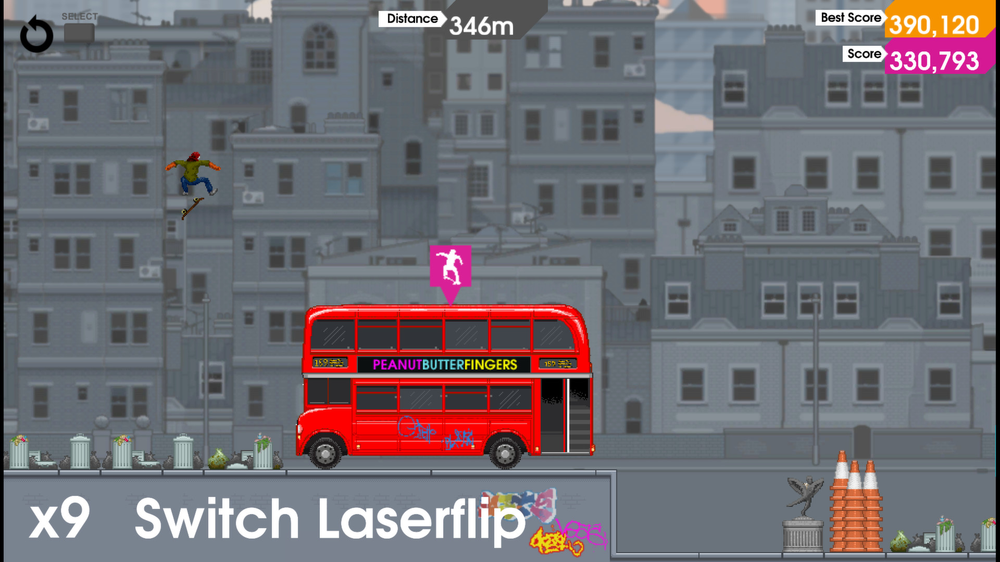

---
title: "OlliOlli"
weight: 4
platforms: ["DRM Free", "GOG Galaxy", "Linux", "OSX", "Steam", "Windows"]
client: "Devolver Digital"
developer: "Roll7"
publisher: "Devolver Digital"
website: "https://store.steampowered.com/app/274250/OlliOlli/"
featured_image: "featured.png"
draft: false
---

OlliOlli mixes addictive one-life gameplay with over 120 tricks and grinds across 50 deviously crafted levels, 250 Challenges, Spots Mode and Daily Grind. Not enough for you? Complete all challenges to unlock the super skillful RAD Mode! Rack up the biggest and coolest combos along the way then time your landing to perfection to rule the leader-boards. Just don't slam on your face! Kidding. You will.



Compete across the world in all modes to get the highest scores on every Level and Spot. Daily Grind gives you 24 hours to challenge the world at a randomly selected Spot. You can practice as many times as you like, but you only get one chance to set your score.

It was General Arcade who was responsible for porting this PlayStation Vita game to PC. Two Software Engineers, three months, Custom engine, C++ and OpenGL - that was the right recipe to make it!


  
  
  
  
  
  
